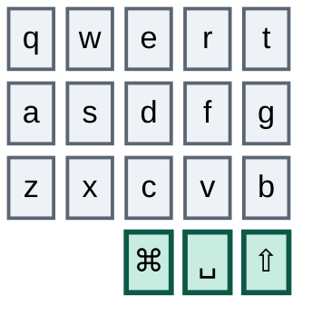
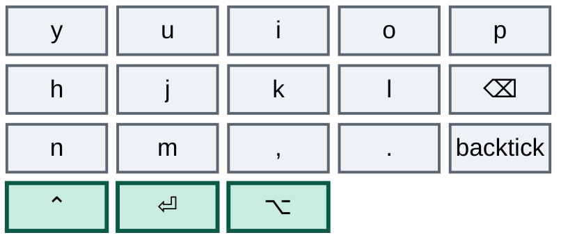
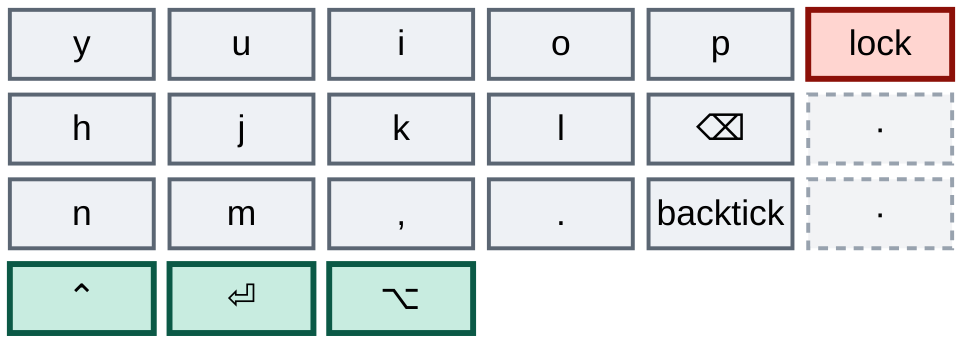
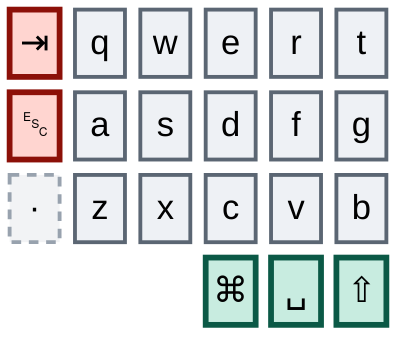
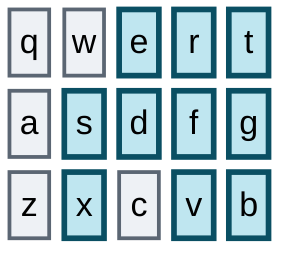
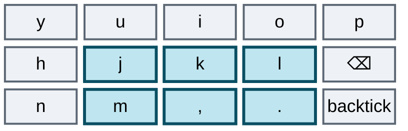
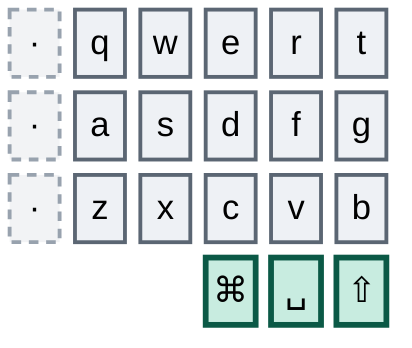
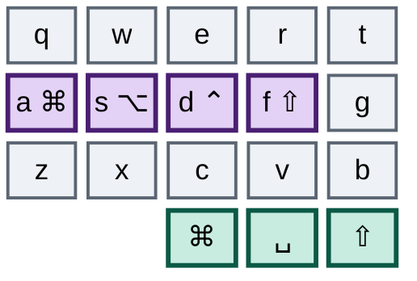
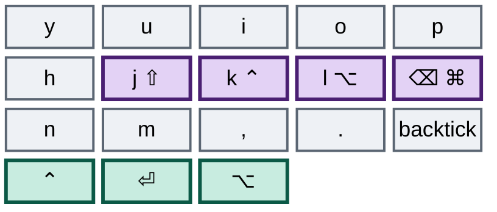

# מקטינים

### פריסה אחת של 36 מקשים, שתי מקלדות, וחומרה שנקנית רק אחרי ששתיהן כבר מריצות אותה

---

זו כבר לא תוכנית. זה דוח מצב עם תוכנית מחוברת בסופו.

ב-**Ximi2**, מקלדת העבודה, העמודה החיצונית הימנית פרושה בכל השכבות. אמולציית העכבר נעלמה מהמקשים — אין תנועה, אין גלילה, לא נשאר כלום חוץ מארבעת קומבואי ההצבעה ששורדים כי שום משטח מגע לא ממפה אותם. הגישה לשכבות נעקרה ונבנתה מחדש כזוג אחיד של רגעי/נעול לכל שכבה, אותה צורה בכל שכבה, נלמדת בערב אחד. הגרש ההפוך מצא בית קבוע על המקש התחתון של הזרת הימנית, וזה פרש את הטילדה באותה תנועה. שני באגים של Vial נמצאו, הובנו ותוקנו. המקש התחתון של העמודה החיצונית השמאלית כבר מת, כלומר בעמודה הזאת נשארו רק Tab ו-Escape ותו לא.

ב-**Corne**, מקלדת הבית, כל זה נחת עכשיו, בישיבה אחת. `config/corne.keymap` הוא העברה עמדה-מול-עמדה של `akiva.vil`: כל שיוך בכל שש השכבות תואם ל-Ximi2, והדברים היחידים שנשארו מאחור הם אלה שאין ל-Corne פיזית — העמודה השביעית החיצונית, אשכול התוספת בכל חצי, ה-encoders, והעכבר המחובר.

הפער הזה היה העובדה החשובה ביותר במסמך, וסגירתו מעולם לא הייתה פרט תיוק שמסדרים בסוף. **האיחוד הוא המטרה, לא מטלה בדרך אליה.** היעד הוא פריסה אחת של 36 מקשים שרצה זהה בשתי המקלדות — ואולי על שתי חתיכות חומרה חדשות, כי גם למקלדת העבודה צריכה להיות תשובה של 36 מקשים: או Ximi חדשה, או פשוט שליפה של המתגים החיצוניים מזו שיש לך. שתי מקלדות, פריסה אחת, זוג ידיים אחד.

כלומר ה-Corne מעולם לא היה תפאורה שנגררת מאחור. הוא חצי מהיעד, וכל ערב על Corne שלא הועבר היה תרגול של הפריסה שאתה מנסה לעזוב. בגלל זה ההעברה שלו עקפה את התור במקום לסגור אותו, ובגלל זה הכלל על אי-התקדמות במקלדת אחת לבד חוזר לתוקף מכאן. מה שנשאר להכריע הוא העמודה השמאלית החיצונית, וזו עכשיו אותה הכרעה בשתי המקלדות בבת אחת.

---

## היעד

שלושים מקשים ועוד שישה אגודלים — שלוש שורות של חמש עמודות בכל חצי, שלושה מקשי אגודל בכל חצי, היסט עמודתי. זו גרסת 36 המקשים של ה-beekeeb Toucan2, פריסת Cantor/Piantor, וזה בדיוק ה-Corne שלך פחות שתי עמודות הזרת החיצוניות, וה-Ximi2 שלך פחות אותן עמודות ופחות אשכול התוספת שלו. כל שישה מקשי האגודל שורדים בכל מקלדת.

חצי שמאל:



חצי ימין:



מקש אחד שם כבר החליף זהות. המקש התחתון של הזרת הימנית נושא עכשיו גרש הפוך במקום לוכסן, וההחלפה הזאת היא אחת ההחלטות הטובות בכל ההגירה — הנימוק נמצא תחת *להחליף מקש מיותר במקש חסר בית* למטה.

הפריסה הזאת היא היעד של **שתי** המקלדות. החומרה היא השאלה האחרונה ולא הראשונה: Toucan2 לבית, ולעבודה או Ximi של 36 מקשים אם קיימת כזאת, או הנוכחית עם המתגים החיצוניים שלופים. כך או כך כבר תקליד את זה.

### מה שעדיין על המדף

שני החצאים הימניים גמורים עכשיו למעט דייר אחד, וזה אותו דייר בשתיהן. נעילת מסך עדיין יושבת על המקש העליון של העמודה החיצונית; שתי העמדות האחרות מתות בכל שש השכבות, בשתי המקלדות.



העותק של העמודה הזאת ב-Corne נשא קדימה בדפדפן, אחורה בדפדפן וטילדה. שלושתם נעלמו: קדימה ואחורה התגלגלו פנימה אל `i`+`p` ואל `k`+`⌫`, והטילדה עזבה יחד עם הזזת הגרש ההפוך, כי טילדה היא לא יותר מגרש הפוך עם Shift. מה שהתוכנית ביקשה היה שהעמודה תהיה מתה בכל שכבה, וזה לא בדיוק מה שקרה — `m10` שורד עליה, כי לנעילת המסך עדיין אין בית בתוך הליבה, והמצאת בית גרוע רק כדי לרצות דיאגרמה הייתה עסקה רעה. זו דחייה שיש לה שם, בשתי המקלדות, ולא פספוס באחת מהן.

החצי השמאלי הוא הקשה, ושני שלישים ממנו חיים בשתי המקלדות. Tab ו-Escape שניהם בתדירות גבוהה, שניהם עדיין על העמודה החיצונית, ולאף אחד מהם אין עדיין גזר דין שהוחלט עליו — אף על פי של-Escape יש עכשיו קומבו, וזה חדש מאז שזה נכתב ומכוסה בשלב חמש. העמדה התחתונה מתה בשתי המקלדות: שם ישב הגרש ההפוך, ואותו מהלך ששחרר אותה ב-Ximi2 שחרר אותה ב-Corne.



ל-Ximi2 יש עוד דבר אחד להוריד של-Corne מעולם לא היה: אשכול של ארבעה מקשים בכל חצי, מעבר ל-42, שנושא צירופי hyper, חצי ניהול חלונות, רענון דפדפן ועותק כפול של קיצור ההקלטה. האשכול הזה הוא אי-הסימטריה החומרתית האמיתית היחידה בין שתי המקלדות, ומכיוון של-Toucan2 אין מקבילה, הוא נפתר לטובת ה-Corne — כל שמונת המקשים האלה צריכים בתים בתוך הליבה.

### למה רוב העיצוב שלך כבר מתאים

מערכת הפיסוק שלך — הקומבואים שמבוססים על צורת התו, הזוגות האנכיים, המנמוניקות שבאמת הפנמת — חיה כולה בתוך שלושים המקשים שנשארים, ב**שתי** המקלדות. כל אחד מהקומבואים האלה הוא חד-ידני, כך שהצרת החצאים לא משנה שום דבר בתחושה שלהם.



`d`+`r` משרטט `/` שעולה ימינה. `f`+`e` משרטט `\` שיורד ימינה. `f`+`s` נותן מקף, ו-`x`+`v` — ישירות מתחתיו, באותן שתי עמודות — נותן קו תחתון. `t`+`g` לנקודה-פסיק, `g`+`b` לקו אנכי. כל שמונת אלה כבר קיימים ב-Corne בדיוק על אותן אותיות, ובגלל זה האיחוד קרוב יותר ממה שהוא נראה.



שים לב מה משותף לזוגות האלה: אף אחד מהם לא יושב על שתי עמודות סמוכות של אותה יד. `f`+`s` מדלג על `d`. `x`+`v` מדלג על `c`. `j`+`l` מדלג על `k`, ו-`m`+`.` מדלג על הפסיק. `t`+`g` ו-`g`+`b` אנכיים, בתוך עמודה אחת. שני הקומבואים החדשים ביותר על המקלדת מצייתים לזה גם הם: `i`+`p` מדלג על `o` ו-`k`+`⌫` מדלג על `l`. זו לא קישוטיות — גלגול הקלדה נוסע על פני עמודות *שכנות*, ולכן קומבו שבנוי על עמודה מדולגת, או על עמודה אחת בלבד, לא יכול להיתפס בגלגול. כל קומבו שיתווסף מכאן והלאה מציית לאותה מגבלה, מה שפוסל זוגות מפתים כמו `s`+`d` עד כמה שהם נוחים. שני האלכסונים הוותיקים, `d`+`r` ו-`f`+`e`, ושני זוגות הסוגריים, `q`+`s` ו-`a`+`w`, כן חוצים עמודות סמוכות. הם מקבלים פטור היסטורי כי הידיים שלך כבר מריצות אותם מדי יום, לא כי הם קובעים תקדים.

---

## מה למדת תוך כדי עשייה

שום דבר מזה לא היה בתוכנית המקורית. הכול יצא מהזזה אמיתית של מקשים, וזה הדבר העמיד ביותר שההגירה הפיקה עד עכשיו.

**Tap dances הם מס שהפסקת לשלם.** טבלת ה-dances של ה-Ximi2 ירדה לשני ערכים חיים מתוך שלושים ושניים סלוטים — Shift על האגודל השמאלי, שהופך ל-Caps Lock בהקשה-ואז-החזקה, וה-dance של Ctrl וההקלטה על הימני. כל השאר — ה-dance של Cmd, ה-dance של Alt שעטף one-shot modifier, ה-dance על מקש הנקודה, ה-dance על הגרש ההפוך, וה-dance שתלה נעילת מסך על הקשה משולשת — הפכו למקש רגיל או למקש הזזה רגיל, וכל אחד מהשינויים האלה גרם למקלדת להרגיש מהירה יותר באותו יום. tap dance גובה את זמן ההקשה שלו על המקרה השכיח כדי שהמקרה הנדיר יוכל להתקיים, וברגע שתמחרת את זה בכנות כמעט לא נשאר שם משהו ששווה לקנות. ב-Corne החשבון היה הגדול ביותר, וההעברה שילמה אותו: `gui5` ו-`alt5` נמחקו, ולכן זמן ההקשה של **ארבע מאות מילישניות** ירד מ-Cmd ומ-Alt — שני מקשי ההזזה שקונפיגורציית ה-zellij שלך נשענת עליהם הכי חזק — ושניהם מקשים רגילים עכשיו. `td10`, שתלה את נעילת המסך על הקשה משולשת, הלך איתם.

ה-dance של Ctrl הוא היוצא מן הכלל היחיד, והוא שורד בכוונה, בשתי המקלדות — `td[1]` ב-Ximi2, `control_record` ב-Corne, שניהם ב-210 מילישניות. הקשה Ctrl, החזקה Ctrl, הקשה כפולה לקיצור ההקלטה. זה תמיד היה חשבון שמשולם עבור ה-Corne, וההעברה שמרה אותו בכוונה ולא לקחה את הניצחון הזול: ל-Corne עדיין אין מקש פנוי לקיצור הזה, כל עמדה שיכולה לקחת אותו היא או נושאת משקל או כבר נידונה, ולכן Ctrl כפול הוא הצורה שההרגל הזה חייב לשמור. הוא נשאר עד שיהיה ל-Corne מקום טוב יותר לשים אותו בו.

האגודל השמאלי הוא המקום היחיד שהטיהור לא הצליח להגיע אליו. ה-Shift שם ב-Ximi2 הוא dance — הקשה ל-Shift, הקשה-ואז-החזקה ל-Caps Lock — ול-ZMK אין סלוט של הקשה-ואז-החזקה כדי לבטא את זה. הקשה כפולה ל-Caps Lock הייתה התחליף המובן מאליו והיא התחליף הלא נכון, כי היא יורה בדיוק כשאתה מקליד שתי אותיות גדולות בזו אחר זו. לכן האגודל השמאלי של ה-Corne הוא Shift רגיל, Caps Lock חי על העמודה החיצונית השמאלית של שכבה 4, ו-Caps Word על האגודל הפנימי השמאלי של שכבה 4. זה ההבדל השלישי והאחרון שנקבע במודע בין שתי המפות, והיחיד שבו ה-Corne הוא הדל מבין השתיים.

**חפיפות בין קומבואים הן דבר מקובל.** שלוש־עשרה יחסי הכלה קיימים בין עשרים וארבעת הקומבואים החיים של ה-Ximi2, ואותן שלוש־עשרה קיימות בין עשרים ושמונת הקומבואים של ה-Corne — `f`+`s` בתוך כל ארבעת קומבואי השכבה של שורת הבית, `f`+`e` בתוך שני קומבואי הניווט, `j`+`l` בתוך `j`+`k`+`l`, `m`+`.` בתוך `m`+`,`+`.`, `x`+`v` בתוך שני קומבואי שכבה 5, ושלושת הקומבואים בני שלושה מקשים בתוך גרסאות הנעילה בנות ארבעת המקשים שלהם עצמם. הקריאה הישנה של זה הייתה פגם עיצובי. הקריאה הנכונה צרה יותר: QMK לא מפעיל קומבו ברגע שכל המקשים שלו למטה. כל עוד קומבו ארוך יותר שמכיל את אותם מקשים עדיין בר-השגה, הוא מחכה. `x`+`v` לא בורח רק מפני ש-`x` ו-`v` שניהם מוחזקים; הוא בורח רק כשהמקש השלישי נוחת אחרי ש-`COMBO_TERM` כבר פג. זה באג תזמון, לא באג שדולק תמיד — הוא יורה על גלגול איטי ולעולם לא על גלגול מהיר, מה שהופך אותו לסוג הבאג היחיד שנעשה נדיר יותר ככל שאתה משתמש במקלדת יותר. ZMK דוחה לקומבו הארוך יותר באותה צורה בדיוק, ולכן הקריאה הזאת עברה ל-Corne כמו שהיא ולא נדרשה להיטען שם מחדש. לא שווה לאמן מחדש זיכרון שרירי עמוק כדי להיפטר ממנו.

**כשקומבו פיסוק מתנגש בקומבו שכבה, מזיזים את קומבו השכבה, לא את הפיסוק.** הפיסוק הוא זיכרון שרירי ותיק יותר והוא רפלקסיבי; תנועת שכבה היא מכוונת ונדירה, ולכן המכוונת היא תמיד הזולה יותר ללמד מחדש. זה העיקרון שהפך לזמן קצר את `x`+`c`+`v` ל-`x`+`c`+`b`, כשהוא מסיט את הכניסה לשכבה 5 הצידה מהקו התחתון. זה עבד בדיוק כפי שנחזה, וזה חזר לאחור ברגע שהחפיפות התקבלו — ההנחה שמתחת השתנתה, לא ההיגיון. העיקרון עדיין שולט בכל דבר שמתווסף מעכשיו.

**פורשים מקש על ידי הריגתו, לא על ידי מתן בית כפול — כשכישלון זול.** התוכנית המקורית אמרה להשאיר את שני הבתים חיים שבועיים-שלושה ולתת לידיים להיסחף לזול מביניהם. בפועל מסתבר שמקש מת הוא *משוב*. אתה לוחץ עליו, כלום לא קורה, ואתה לומד בדיוק איזה הרגל עוד לא היגר וכמה תכופות. בית כפול מסתיר בדיוק את האות הזה, כי המקש הישן ממשיך לשלם והידיים שלך לעולם לא מקבלות סיבה להפסיק. הריגת העמודה הימנית עלתה כמה ימים של עצבנות קלה וקנתה מלאי מלא של מה שעדיין נשלח החוצה. בית כפול נשאר הכלי הנכון ל-Tab ול-Escape, שם החטאה יקרה באמצע זרימה ולא רק מעצבנת — זו ההבחנה, ולא כלל גורף לכיוון כזה או אחר.

**להחליף מקש מיותר במקש חסר בית.** הגרש ההפוך לקח את מקש הלוכסן על התחתית של הזרת הימנית. הלוכסן ויתר עליו בלי תלונה, כי ללוכסן כבר היה בית: `d`+`r` משרטט את התו הזה מאז שיש לך קומבואים, והידיים שלך נשלחות לקומבו ולא למקש. כלומר עמדת הזרת אירחה את התו שהכי פחות היה צריך אירוח, בזמן שלגרש ההפוך — שאתה צריך כל הזמן בשביל גדרות קוד — היה מקש או שלא היה כלום. מהלך אחד פרש שני מקשים נידונים במקום אחד, כי טילדה היא לא יותר מגרש הפוך עם Shift, ולכן היא עזבה את העמודה החיצונית הימנית באותה תנועה. חפש את הצורה הזאת שוב: מקש בסיס שהתו שלו כבר נגיש בדרך אחרת אינו תפוס, הוא פנוי.

**עמדות שכבת הבסיס הן המשאב הנדיר ביותר, כי הן היחידות שכשירות לקומבו.** כל עמדת בסיס שאתה מוציא על משהו שנגיש במקום אחר היא קומבו שלא תוכל להגדיר בהמשך. זה הטיעון האמיתי נגד מאקרו-סוכר על מקשי בסיס: `./` ו-`~/` הם נוחות, כל אחד חוסך שתי הקשות, ואף אחד מהם לא שייך לשום מקום ליד שכבת הבסיס. שים אותם על שכבה, שם המחיר הוא קפיצת שכבה והעמדה בבסיס נשארת פנויה.

**שקלל את העמדות הטובות לפי תדירות.** שכבת הסימנים הייתה חייבת לעקוף נקודה קבועה אחת — `⌥6` לא יכול היה לזוז — וכל השאר התכופף אליה. בהינתן זה, הזוג `⌥←`/`⌥→` בתדירות הגבוהה לקח את החריץ הצמוד והצפוף בשורה התחתונה, שם היד ממילא מגיעה, ושילם על כך ב-`⌥3`, שנעלם ולא חסר. `⌥⌃←`/`⌥⌃→` שכמעט ולא בשימוש קיבלו במקום את הפריסה הרחבה בקצוות השורה העליונה. העמדה המסורבלת הולכת לדבר שאתה לוחץ הכי מעט; זה כל הכלל, וקל להפוך אותו כשמסדרים שכבה לפי קטגוריה ולא לפי תדירות.

---

## שני מנגנונים ב-Vial שיעקצו אותך

**אלה מנגנונים של Vial, לא של מקלדות.** שניהם עלו סבב דיבוג על מקלדת העבודה, שניהם לא מייצרים שגיאה ולא שורת לוג, ואף אחד מהם לא קיים ב-Corne. ההשוואה ל-ZMK בסוף הפרק הזה היא הצורה שאותה משמעת לובשת שם, והיא הצורה ששלטה בהעברה.

**קומבואים מתאימים לפי keycodes מפוענחים, לא לפי מיקומי מקשים.** Vial שומר קומבו כרשימת keycodes ומפעיל אותו כשהמקשים שאתה מחזיק *מייצרים* כרגע את ה-keycodes האלה. עטוף מקש בשכבת הבסיס ב-`TD()` והוא מפסיק לייצר את ה-keycode של עצמו — הוא מייצר את ה-dance — ולכן הוא נושר בשקט מכל קומבו ששמו את ה-keycode המקורי. הקומבו נשאר בקובץ, נראה תקין בעורך, ולא יורה שוב לעולם. שמירת `.` מאחורי tap dance היא מה שהרג את `m`+`.` → `=`, ומכיוון ש-`=` לא היה קיים בשום מקום אחר בפריסה, סימן השוויון הפסיק להתקיים על המקלדת לגמרי. אותו מנגנון כבר הרג קודם את `ESC`+`` ` ``, כשהגרש ההפוך נכנס מאחורי dance משלו. המסקנה היא הכלל ששווה לשמור: ב-Vial, קומבו שה-keycode המפעיל שלו נעדר משכבת הבסיס הוא מת.

**סלוט ההקשה הכפולה של Vial מחליף את שתי ההקשות ולא מוסיף שנייה.** הגדר אותו לאותו keycode כמו פעולת ההקשה, מתוך היגיון שהקשה כפולה אמורה כמובן לעשות את הדבר פעמיים, ותקבל את ההפך: שתי הקשות פולטות תו אחד. השאר את הסלוט על `KC_NO` ושתי הקשות ייתנו לך את ה-keycode של ההקשה פעמיים, כמו מקש רגיל. זה מה ששבר את ```` ``` ```` על מקש הגרש ההפוך — ה-dance אכל גרשים בזוגות והגדר מעולם לא נסגר.

**אף אחת משתי המלכודות לא קיימת ב-ZMK, ותמונת הראי שלהן כן.** קומבו ב-ZMK מוצהר כ-`key-positions = <14 16>` — הוא נקשר ל*מיקומים*, לא ל-keycodes. עטיפה של מיקום 16 ב-tap-dance, ב-hold-tap או בכל דבר אחר לא מייתמת אף קומבו, כי הקומבו מעולם לא שאל מה המקש הזה מייצר. סכנת ה-`TD()` פשוט לא קיימת שם. גם tap-dances ב-ZMK הם רשימת bindings רגילה ולא ארבעת הסלוטים הקבועים של Vial, ולכן גם התנהגות ההחלפה של ההקשה הכפולה לא חלה. מה ש-ZMK כן נשבר עליו הוא המהלך ההפוך: הזז מקש ל*מיקום* אחר וכל קומבו שנוקב במיקום הישן יורה עכשיו על מה שנכנס במקומו, בשקט ולא נכון. הקומבואים של Vial שורדים הזזת מקש ונשברים כשמקש נעטף; אלה של ZMK שורדים עטיפה ונשברים כשמקש זז. מצבי כשל שונים, אותה משמעת — קרא מחדש את טבלת הקומבואים אחרי כל שינוי, ודע איזו שאלה לשאול על איזו מקלדת.

---

# המסע

## שלב אחד — פרישת העמודה הימנית

**סטטוס — בוצע בשתי המקלדות, למעט דייר אחד.**

זה השלב שהוכיח שכל העניין אפשרי, והוא הלך מהר יותר ממה שהתוכנית הקציבה. כל שלושת המקשים של העמודה החיצונית הימנית משויכים לכלום בכל שכבה, עם יוצא דופן אחד בדיוק: `M10`, נעילת מסך, עדיין יושבת בשכבת הבסיס כדיירת האחרונה של העמודה. היא נדחתה ולא נשכחה, והיא צריכה בית בליבה. ה-Corne נקרא עכשיו זהה, כולל הדיירת — ההעברה העתיקה את הדחייה ולא טייחה אותה, וזו ההחלטה הנכונה כל עוד התשובה לא ידועה, והלא נכונה אם תישאר עומדת לאורך זמן.

ארבעה דברים באופן שבו זה קרה בפועל חורגים ממה שנכתב, ובשלושה מתוך הארבעה הגרסה האמיתית טובה יותר.

**הגרש ההפוך הלך למקש הלוכסן, ולא לשכבת הסימנים.** התוכנית הציעה להחנות אותו בשכבה 1, שיש בה מקום. מה שקרה במקום זה פורש שני מקשים נידונים בעריכה אחת ולא גובה קפיצת שכבה על כל גדר קוד. זה העיקרון *להחליף מקש מיותר במקש חסר בית*, והוא התגלה כאן.

**אחורה וקדימה בדפדפן הפכו לקומבואים בליבה, ולא למקשים בשכבת הניווט.** התוכנית שמה אותם בשכבת הניווט ישירות מתחת לחיצי שמאל וימין, בעמודות תואמות, וזה מסודר וזה גובה קפיצת שכבה על משהו שאתה מפעיל עשרות פעמים בשעה בזמן קריאה. מה שהם קיבלו זה `i`+`p` לקדימה ו-`k`+`⌫` לאחורה — גלגולים של שני מקשים על שכבת הבסיס, שניהם מדלגים על עמודה, שניהם ביד ימין שבה הפעולות האלה תמיד ישבו. ההישלחות שפעם יצאה החוצה מתגלגלת עכשיו פנימה ושום דבר לא מחליף צד.

**הגישה לשכבות נבנתה מחדש מהיסוד, ולא טולאה.** התוכנית ביקשה רק למחוק את הכניסה הדביקה לשכבה 5 ולהשאיר מתג מכוון אחד. מה שקיים עכשיו הוא זוג אחיד שהוחל על כל שכבה בבת אחת:

| שכבה | רגעי | נעול |
|---|---|---|
| 2 — ניווט | `s`+`e`+`f` | `a`+`s`+`e`+`f` |
| 3 — מקלדת ספרות | `s`+`d`+`f` | `a`+`s`+`d`+`f` |
| 4 — פונקציות | `j`+`k`+`l` וגם `m`+`,`+`.`, שניהם one-shot | אין, מבחירה |
| 5 — מקשי F | `x`+`c`+`v` | `z`+`x`+`c`+`v` |

קרא את הצורות והשיטה מלמדת את עצמה: התנועה הרגעית היא שלושה מקשים, והנעולה היא אותם שלושה עם הזרת שנוספת לפניהם. אתה אף פעם לא צריך לזכור איזו שכבה עובדת איך. שכבה 4 היא היוצאת מן הכלל המכוונת בלי צורה נעולה — שכבת הפונקציות היא זו שנכנסים אליה כדי ללחוץ מקש אחד בדיוק, ולכן one-shot הוא כל הפואנטה ונעילה הייתה מלכודת. שכבה 2 היא בנוסף החזקה על אגודל שמאל האמצעי, כי זו השכבה שאתה חי בה. גם דרך החזרה סופית: `TO(0)` יושב על המקש העליון של עמודת האצבע המורה הפנימית, עמדת `t`, בשכבות 2, 3, 4 ו-5, והעמודה הזאת שורדת את פרישת העמודה השמאלית, כך שפתח המילוט שאתה לומד עכשיו הוא פתח המילוט שתשמור.

**ההתנגשות של המקף הושארה במקומה.** התיקון של התוכנית היה להזיז את הפיסוק — מקף ל-`d`+`g`, קו תחתון ל-`c`+`b`. זה לא נלקח. במקומו נלקח התיקון ההפוך, ואז, ברגע שהחפיפות התקבלו כעלות תזמון ולא כפגם, גם הוא הוחזר לאחור. `f`+`s` עדיין יושב בתוך כל ארבעת קומבואי השכבה של שורת הבית וימשיך לעשות זאת.

שתי עלויות התקבלו בעיניים פקוחות, והן החלטות ולא באגים. הראשונה היא **היפוך כיוון**: הזרת בשורה התחתונה של שכבת הסימנים הייתה `⌥⌃←` והיא עכשיו `⌥→`, מצביעה לכיוון ההפוך. זה ההיפוך היחיד האמיתי של זיכרון שרירי בכל התכנון מחדש, וזה המחיר של שקלול העמדות הטובות לפי תדירות. השנייה היא **חפיפות הקומבואים**, שלוש־עשרה במספר, מהסיבה שניתנה למעלה.

*סיימת את השלב הזה כששבוע עבר בלי שהעמודה הימנית חסרה — וזה קרה, כמעט מיד, ובקלות גדולה יותר ממה שמישהו ציפה.*

## שלב שתיים — להביא את ה-Corne לזהות

**סטטוס — בוצע, בישיבה אחת, וזו הדרך היחידה שבה היה אפשר לעשות את זה.**

ה-Corne הושאר מאחור בכוונה והדחייה החזירה את עצמה. שינוי על מקלדת העבודה נבחן מול שמונה שעות ביום של הקלדה אמיתית תוך שבוע, בזמן שאותו שינוי בבית היה לוקח חודש כדי להקנות את אותו ביטחון, ולהעביר עיצוב שאף אחד לא חי בו זו הדרך להעביר אותו פעמיים. זו הייתה בחירה טקטית, והסיבה שאסור היה לתת לה להפוך למבנית שווה שתישאר על הדף גם עכשיו, כשהעניין סגור.

והיא זו. **כל ערב על Corne שלא הועבר היה תרגול של הפריסה הישנה.** הידיים שלך בילו את השעות האלה בחזרות על בדיוק אותן הישלחויות שאתה מנסה לפרוש — העמודה החיצונית, קומבואי הסוגריים הישנים, מקשי ההזזה של ארבע מאות המילישניות — ושני ההרגלים התחרו כל הזמן. זה אותו מנגנון שהפך את מקלדת העבודה למקום הנכון ללמוד בו, רק שהוא רץ הפוך ומפרק את הלמידה. כל שבוע שהפער נשאר בו פתוח הדליף עוד משהו מהרווח של שלב אחד בין שש בערב לתשע בבוקר. בגלל זה השלב הזה עקף את התור, וזה הטיעון שכדאי לשלוף בפעם הבאה שמקלדת אחת מתפתה לרוץ קדימה לבד.

העבודה הייתה בעיקר מכנית, כי שתי המקלדות מעולם לא היו רחוקות. קומבואי הפיסוק כבר ישבו על אותן אותיות בדיוק. מה שהשתנה:

| מה | ב-Corne לפני | עכשיו |
|---|---|---|
| העמודה החיצונית הימנית | קדימה בדפדפן, אחורה בדפדפן, טילדה, בכל שכבה | `&none` בכל מקום חוץ מ-`m10`, נעילת המסך — הדחייה של ה-Ximi2, מועתקת |
| גרש הפוך | תחתית העמודה השמאלית החיצונית | תחתית הזרת הימנית, על מקש הלוכסן |
| לוכסן | תחתית הזרת הימנית | קומבו בלבד, `d`+`r`, שכבר היה קיים |
| `[` ו-`]` | Tab+`a` ו-`q`+Escape — שניהם מעוגנים במקשים נידונים | `q`+`s` ו-`a`+`w` |
| אחורה / קדימה בדפדפן | מקשים בעמודה החיצונית | `k`+`⌫` ו-`i`+`p` |
| גישה לשכבות | `s`+`d`+`f`, `s`+`e`+`f`, `.`+`l`, גרסאות דביקות, שחרור אחרי 60 שניות | טבלת הרגעי/נעול האחידה למעלה, וחלון 60 השניות נעלם |
| Cmd, Alt | tap-dances ב-400 מילישניות | מקשי הזזה רגילים; `gui5`, `alt5` ו-`td10` נמחקו |
| Ctrl | tap-dance `control_record` | נשמר, ב-210 המילישניות של ה-Ximi2 — ה-dance היחיד שמצדיק את זמן ההקשה שלו |
| עכבר | תנועה, גלילה, `CONFIG_ZMK_MOUSE`, שני ה-headers | נמחק; ארבעת קומבואי ההצבעה נשמרו, והדגל המיושן הוחלף ב-`CONFIG_ZMK_POINTING` |
| תחולת קומבואים | אין — כל 32 יורים בכל שש השכבות | 28 קומבואים, כל אחד מהם `layers = <0>` |
| הגנה על מקשי שכבה | אין בכלל | `quick-tap-ms = 200`, `require-prior-idle-ms = 125`, `flavor = "tap-preferred"` |
| מאקרו | שנים־עשר מאקרו מדור קודם בשמות תיאוריים, תשעה מהם כפילויות | ממוספרים לפי טבלת Vial, `m0`..`m27`, עם אותם פערים שיש בטבלה |

השורה האחרונה היא עבודה של שלב שלוש שנשלפה קדימה, כי אי אפשר להעביר עמדה-מול-עמדה מול קובץ שאתה לא מאמין לו. דיאגרמות ה-ASCII נבנו מחדש באותו מהלך, מאותה סיבה.

שלושה הבדלים **לא** עוברים, ואחד מהם יצא טוב יותר מהמתוכנן. Bluetooth הוא הראשון: ה-Corne צריך רשת בחירה וניתוק שאין ל-Ximi2 שום שימוש בה, והתוכנית הניחה שהרשת הזאת פשוט תישאר של ה-Corne בלבד ומסורבלת. במקום זה היא נחתה במקום נקי — ה-Ximi2 משאיר את כל החצי השמאלי שלו שקוף בשכבה 5, וזה בדיוק המקום שהרדיו היה צריך, ולכן הרשת, כיבוי רך, שחרור Studio וה-bootloader נכנסו לשם בלי לדחוק אף שיוך שקיים על המקלדת השנייה. ארבעה קומבואים חוצי-ידיים בשורה התחתונה בוחרים פרופילים 0 עד 2 ומנקים את הנוכחי — `z`+`m`, `x`+`,`, `c`+`.`, `v`+`n` — וכל שמונת המקשים האלה נמצאים בתוך ליבת 36 המקשים, ולכן הם שורדים את המעבר למקלדת קטנה יותר. השני הוא ההגנה על מקשי השכבה, שאין ל-QMK בורג מקביל עבורה, ולכן היא נשארת שיפור של ה-Corne בלבד. השלישי הוא האגודל השמאלי, שתואר למעלה: Shift רגיל, כי ZMK לא יכול לבטא הקשה-ואז-החזקה ל-Caps Lock והתחליף המובן מאליו יורה בטעות.

ושני המנגנונים של Vial למעלה הם של Vial ולא של המקלדת — קומבואים ב-ZMK נקשרים למיקומי מקשים, ולכן התנהגות שעוטפת מקש לא מייתמת שום דבר, ול-tap-dances ב-ZMK אין סלוט החלפה להקשה כפולה. שום מגבלת רפאים לא הועברה. ה*משמעת* כן, הפוכה: ב-ZMK דווקא הזזת מקש למיקום חדש היא זו ששוברת את הקומבואים שנוקבים בישן, ובגלל זה כל קומבו בקובץ נושא בהערה לצד מספרי המיקומים את האותיות שהוא מתכוון אליהן.

זה נעשה בישיבה אחת, לא בטפטוף. Corne שהועבר חצי היה גרוע מ-Corne שלא הועבר בכלל, כי אז אף אחת מהמקלדות אינה מודל אמין של השנייה.

*סיימת את השלב הזה כשאתה יכול לשבת מול כל אחת מהמקלדות ולא לשים לב באיזו מהן מדובר.* וזה נכון עכשיו בכל מקום חוץ מהעמודות החיצוניות — ואלה מתות, נידונות או ירדו לדייר אחד בשתיהן.

## שלב שלוש — סדר בבית, בשתי המקלדות

**סטטוס — בוצע ב-Corne. פתוח ב-Ximi2, וקטן בהרבה ממה שהיה.**

שום דבר מזה לא משנה משהו שאתה לוחץ. כל זה חוסם חשיבה צלולה, ואתה עומד לחשוב הרבה על איפה שמונה מקשים נוספים צריכים לשבת.

ב-**Ximi2**, בערך לפי כמות הבלבול שזה גורם. ארבעה מתוך שבעת הסעיפים למטה נסגרו בשקט מאז שנכתבו, וזה שווה תיעוד ולא מחיקה — זה אומר משהו על סוגי הלכלוך שבאמת מתנקים:

- ~~**עשרה סלוטים לא בשימוש של tap dance.**~~ נסגר. טבלת ה-dances מכווצת: `td[0]` הוא Shift עם הקשה-ואז-החזקה ל-Caps Lock, `td[1]` הוא ה-dance של Ctrl וההקלטה, וכל סלוט אחר ריק באמת ולא מאוכלס חלקית. המספור הישן `TD(2)`/`TD(4)` שברשימות שלך לא מעודכן.
- ~~**מאקרו יתומים `M11`, `M21`, `M25`, `M26`.**~~ נסגר; הסלוטים האלה ריקים בייצוא הנוכחי. הכפילות שנשארה היא `M28` ו-`M29`, עותקים מדויקים של `M18` ו-`M19` — חצי ה-`⌘⌥` למעלה ולמטה. שני הזוגות חיים על אשכול התוספת, ולכן שניהם מתים עם שלב ארבע.
- **`M4` ו-`M12` שניהם `./`.** שני סלוטים של מאקרו, מחרוזת אחת, שניהם משויכים בשכבת הפונקציות. עדיין נכון, ועכשיו נכון גם ב-Corne, בכוונה.
- ~~**סלוט הקומבו `UI31` פגום.**~~ נסגר. טבלת הקומבואים כווצה באותו מהלך שהוסיף את `q`+`e` ל-Escape, וה-`KC_BTN1` התקוע יצא יחד עם הסלוטים הריקים.
- **ה-`9` הכפול בשכבה 3.** בשורה העליונה של מקלדת הספרות יש `9` פעמיים, ולכן עמדה אחת שם מתה בשקט. קיים מלכתחילה, ידוע, עדיין לא תוקן — ושוחזר ב-Corne בכוונה.
- **שכבה 2 משייכת `⇧⌘E` על שני מקשים שונים.** אחת משתי העמדות האלה פנויה ואף אחד לא יודע את זה. גם זה שוחזר ב-Corne.
- ~~**`td[2]` חוסם את ה-Shift של שכבה 1** מאחורי dance של 200 מילישניות בזמן ש-Shift בשכבת הבסיס הוא רגיל.~~ נסגר, אבל לא בדרך שהסעיף הזה רצה: שכבה 1 ושכבת הבסיס נושאות עכשיו את *אותו* dance, `td[0]`, ולכן אי-העקביות נעלמה אבל המס מוטל על שתיהן. ה-dance הזה הוא השיוך היחיד שה-Corne לא הצליח לשקף.

ב-**Corne**, מה שהיה ערימה גדולה יותר וישנה יותר פונה. שנים־עשר מאקרו שאין להם הפניה נעלמו, תשעה מהם כפילויות מדויקות, כולל שני העותקים מכל אחד מ-fold, unfold ו-fold-all, וכולל הזוג ששמותיו היו הפוכים — כש-`fold` שייך פתיחה ו-`expand` שייך קיפול, שזה הדבר המטעה ביותר שהיה אי פעם באחד משני הקבצים. דיאגרמות ה-ASCII נבנו מחדש מול השיוכים ולא טולאו. `scroll-right`, שהיה משויך על שני מקשים סמוכים בזמן ש-`scroll-left` לא הופיע בשום מקום, יצא יחד עם אמולציית העכבר. ה-`thisisunsafe` הכפול נעלם, לכל שכבה יש `display-name`, והמאקרו ממוספרים לפי טבלת Vial כך שאפשר לקרוא את שני הקבצים זה מול זה. רוב זה מת עם שלב שתיים, בדיוק כפי שנחזה; שום דבר לא שרד אותו וביקש מעבר שני.

יוצא דופן אחד חייב להיאמר בכנות. שלושה מהפגמים של ה-Ximi2 שוחזרו ב-Corne במקום שיתוקנו: ה-`9` הכפול בשכבה 3, שני מקשי ה-`⇧⌘E` בשכבה 2, ושני המאקרו שמקלידים `./`. זו הייתה החלטה ולא רשלנות — שתי מקלדות זהות שוות יותר ממקש אחד נכון, וקובץ שמצהיר שהוא העברה עמדה-מול-עמדה מאבד את התכונה שעושה אותו שימושי ברגע שהוא מתחיל לשפר בשקט את המקור שלו. תקן אותם ב-Ximi2 וה-Corne יבוא אחריו באותו commit. תקן אותם ב-Corne לבד ופתחת מחדש בדיוק את הפער שהשלב הזה קיים כדי לסגור.

*סיימת את השלב הזה כשאתה יכול לקרוא את מפת השכבות של כל אחת מהמקלדות ולהאמין לה, ושום דבר באף אחד מהקבצים לא מוגדר פעמיים* — כששלושת השחזורים האלה הם היוצא מן הכלל, מוצהר ובכוונה, וזה רק כל עוד הם עוד בכוונה.

## שלב ארבע — לרוקן את אשכול התוספת של ה-Ximi2

**סטטוס — Ximi2 בלבד, לא התחיל. ב-Corne אין מה לעשות.**

זו אי-הסימטריה האמיתית היחידה בין שתי המקלדות, והיא נפתרת לטובת ה-Corne: ל-Corne אין אשכול כזה, ל-Toucan2 אין מקבילה, ולכן כל מה שעליו צריך בית בליבה. ארבעה מקשים בכל חצי. מה שיושב עליהם היום:

| חצי | תוכן |
|---|---|
| שמאל | שלושה צירופי hyper — hyper-D, hyper-F, hyper-M — כש-hyper-M משויך פעמיים |
| ימין | `⌃⌥←` ו-`⌃⌥→`, רענון דפדפן, ועותק כפול של קיצור ההקלטה |
| בשכבה 1 | חצי `⌘⌥` בכל ארבע העמדות, ועוד שני צירופי hyper |

ה-hyper-M הכפול וקיצור ההקלטה הכפול יכולים פשוט להיעלם — עותק אחד מכל אחד מספיק, וקיצור ההקלטה כבר חי על ההקשה הכפולה של `td[4]`. חצי ה-`⌘⌥` הם ניהול חלונות ושייכים לשכבת הניווט, בעמדות שקיימות גם ב-Corne, שהוא עכשיו האילוץ שקובע לאן משהו יכול לנחות. רענון דפדפן וצירופי ה-hyper צריכים בתים אמיתיים ויש להם מקום: לשכבת הניווט יש חור בעמדה העליונה של האצבע המורה הפנימית, וכל השורה התחתונה של שכבה 3 ריקה. שני החורים האלה קיימים עכשיו גם ב-Corne, באותן עמדות בדיוק, כי ההעברה העתיקה את הריקנות יחד עם כל השאר — ולכן כל מה שינחת בהם ינחת בשתי המקלדות בהחלטה אחת ולא בשתיים.

גם קצה אחד שייך לכאן. ה-**encoder** בשכבת הבסיס עדיין מסתובב כגלגלת מעלה ומטה — השריד האחרון של אמולציית העכבר על המקלדת, שפוספס בטיהור ההצבעה כי הוא לא מקש. גם לו אין מקבילה ב-Toucan2, ולכן הוא יוצא יחד עם האשכול.

אל תכבה את האשכול לפני שלתוכן שלו יש לאן ללכת. זה המהלך היחיד בכל ההגירה שבאמת יעלה לך בקיצורי דרך עובדים ולא רק בנוחות.

*סיימת את השלב הזה כשכל מקש של ה-Ximi2 מחוץ ל-36 משויך לכלום, ולא איבדת אף קיצור דרך.*

## שלב חמש — למצוא בתים לעמודה השמאלית החיצונית

**סטטוס — לא התחיל, וברובו לא הוכרע. כאן חיות השאלות הפתוחות.**

זה השלב שהמסמך לא יכול לסיים עבורך. העמודה הימנית הייתה קלה כי כמעט שום דבר עליה לא נשא משקל. העמודה השמאלית היא ההפך: יושבים עליה שניים מהמקשים שאתה לוחץ הכי הרבה, וההחלטות לא התקבלו. כל מה שמוכרע כאן חל על שתי המקלדות בבת אחת — זו בדיוק הנקודה בעשיית שלב שתיים קודם.

הנה כל מה שחי עליה היום, על פני שש השכבות:

| שכבה | עליון | אמצעי | תחתון |
|---|---|---|---|
| 0 — בסיס | `⇥` | `␛` | גרש הפוך, עד ששלב שתיים יזיז אותו |
| 1 — סימנים | `DF(0)` | `␛` | `?` |
| 2 — ניווט | `TO(0)` | `␛` | `LCTL(GRAVE)` |
| 3 — ספרות | `TO(0)` | `DF(0)` | מת |
| 4 — פונקציות | `TO(0)` | `DF(0)` | Caps Lock |
| 5 — מקשי F | `TO(0)` | שקוף | שקוף |

קרא את הטבלה ומסתבר שרוב העמודה היא מקשי חזרה לבסיס. `TO(0)` כבר מוכן על המקש העליון של עמודת האצבע המורה הפנימית — עמדת `t` — בשכבות 2, 3, 4 ו-5, והעמודה הזאת שורדת. לכן ייתכן שהעותקים של `TO(0)` ו-`DF(0)` בעמודה השמאלית פשוט ניתנים למחיקה במקום להעברה. שווה לאמת את זה מקש-מקש ולא להניח: `DF(0)` ו-`TO(0)` הם לא אותה הוראה, ולשכבה 1 אין בכלל פתח מילוט בעמדת `t`.

**Escape** הוא הקשה, והמועמד שעל השולחן הוא `w`+`x` — העליון והתחתון של עמודת האצבע האמצעית, בדילוג מלא על שורת הבית. הוא מציית לכלל העמודה היחידה, וזה בדיוק מה שאתה רוצה ממקש שחייב להיות גם מהיר וגם בלתי אפשרי להפעלה בטעות, ובין vim לבין קונסולות LLM אתה לוחץ עליו כל הזמן. זה גם הקומבו היחיד שבו טעות באמת משבשת, מה שמחזק דווקא בית כפול כאן ולא הריגה של המקש.

**ל-Tab** אין עדיין מועמד. השלמות מעטפת מניעות אותו, ולכן הוא צריך להיות זול. אזור האגודל של שכבת הסימנים והעמודה הפנימית השמאלית שניהם סבירים, ואף אחד מהם לא נוסה. שים לב ש-Tab הוא גם העוגן של מאקרו הפרוזה `⇥`+`b`, שנכבה ברגע שהמקש נכבה — ולכן לאן ש-Tab יגיע, הקומבו הזה צריך עיגון מחדש בתוך הליבה, על צורה של עמודה מדולגת או עמודה יחידה. מאקרו של עשרים ושלושה תווים הוא הדבר האחרון שאתה רוצה שגלגול יפעיל.

**`?` בשכבה 1** אולי לא צריך בית בכלל. הלוכסן כבר קיים כ-`d`+`r`, ו-`?` הוא לוכסן עם Shift — ולכן השאלה היא פשוט אם Shift יחד עם הקומבו `d`+`r` מייצר אותו נקי, וזו בדיקה של חמש דקות שאף אחד לא הריץ.

**`LCTL(GRAVE)`** — Ctrl ועוד גרש הפוך, צירוף מחזור הטרמינלים — ו-**Caps Lock** לא הוכרעו, ושניהם בתדירות נמוכה מספיק כדי שיהיה סביר לזרוק אותם ולא להעביר. ל-Caps Lock יש כבר תחליף קרוב על המקלדת בדמות `caps_word`; לצירוף הטרמינלים אין.

*סיימת את השלב הזה כשלכל דייר בעמודה השמאלית החיצונית יש בית חדש שהוחלט עליו או גזר דין שהוחלט עליו, בשתי המקלדות.*

## שלב שש — פרישת העמודה השמאלית

**סטטוס — לא התחיל באף אחת מהמקלדות. זה השער.**

המבחן האמיתי. שייך את שלוש העמדות לכלום בכל שכבה, בשתי המקלדות בבת אחת, מחק את הקומבואים האחרונים שמפנים אליהן, וחיה שם שבועיים מלאים.



יש דרך שנייה לעשות את זה, ושווה לומר אותה כי היא חינם וזמינה כבר היום: **לשלוף פיזית את הכיפות החיצוניות, או את המתגים.** בשתי המקלדות. זה לא עולה כלום, זה לוקח דקות, וזה מנגנון מחויבות חזק בהרבה מ-`&none` — אי אפשר ללחוץ בהיסח הדעת על מקש שאינו שם, ואין שינוי קונפיג שאפשר לבטל בשקט באחר צהריים גרוע.

הפשרה אמיתית והיא חותכת לכיוון השני. מקש שמת אבל עדיין קיים פיזית הוא *משוב*. אתה פוגע בו, כלום לא קורה, ואתה לומד בדיוק איזה הרגל לא היגר וכמה תכופות. זה כל הערך האבחנתי של השבועיים האלה, והוא נעלם ברגע שהכיפה בתוך מגירה — אצבע שנוחתת על הפלטה החשופה אומרת לך שמשהו קרה, אבל לא באותה דיוק. יש גם דרך ביניים: להריץ את השבועיים כשהמקשים מתים אבל נוכחים, לקצור את המשוב, ולשלוף את הכיפות אחר כך כדבר שהופך את זה לקבוע.

כך או כך, אם מקש מסוים ממשיך לתפוס אותך, אל תחזיר את העמודה. חזור לשלב חמש, תן לאותו מקש בית טוב יותר, והמשך. החזרה לאחור מלמדת את הידיים שלך שהעמדה הישנה עדיין משתלמת.

*סיימת את השלב הזה כששבועיים עוברים, בשתי המקלדות, ואתה מפסיק לשים לב לעמודות המתות.* זה השער לקניית החומרה — היחיד, ועכשיו ייתכן שהוא שער לשתי קניות ולא לאחת.

## שלב שבע — לקנות את החומרה

**סטטוס — לא התחיל. תלוי בשלב שש.**

הפריסה שלך כבר רצה עליה, בשתי המקלדות. המקשים המתים פשוט מפסיקים להתקיים פיזית. אין אירוע הגירה, אין יום הסתגלות, אין חרדת צריבה — תהיה כבר שבועות שאתה מקליד את הפריסה הזאת.

לבית: הזמן את גרסת 36 המקשים של ה-Toucan2, העבר את ה-keymap ל-shield החדש כששש הרשומות המתות נמחקות בכל שכבה, והגדר את משטח המגע. לעבודה יש שתי דרכים והן עולות אחרת לגמרי. Ximi של 36 מקשים, אם קיימת כזאת, היא התשובה הנקייה. שליפת המקשים מהמקלדת שכבר יש לך היא התשובה החינמית — משוך את המתגים החיצוניים, השאר את כל השאר, וקבל שאשכול התוספת עדיין שם פיזית והחלט בנפרד אם הוא נשאר שמיש או כבה לשם זהות. אף אחת מהדרכים לא צריכה הכרעה עכשיו; שתיהן נמצאות אחרי השער.

שני דברים יפתיעו אותך ב-Toucan2, ושניהם יכולת חדשה ולא הגירה. ההיסט העמודתי תלול יותר משל ה-Corne והמרווח צפוף יותר — התאמה של מיקום אצבעות, לא של פריסה, וימים ולא שבועות. ומשטח המגע ישנה בשקט את מה ששכבת הניווט קיימת בשבילו. ברגע שהצבעה וגלילה הן מחוות, התפקיד האמיתי של השכבה הזאת הוא חצים, תנועת מילים, ואחורה-קדימה בדפדפן ששמרת. צפה לעצב אותה מחדש, אבל אחרי שבוע של חיים עם משטח המגע ולא מראש.

---

## משימת צד — מקשי הזזה בשורת הבית

**סטטוס — לא התחיל באף אחת מהמקלדות, ובאמת אופציונלי.**

כל שישה מקשי האגודל שורדים ב-Toucan2, ולכן אסטרטגיית ההזזה שכולה אגודלים ממשיכה לעבוד ללא הגבלת זמן. אבל מקשי הזזה בשורת הבית הם ההבדל בין מקלדת של 36 מקשים שמרגישה צפופה לאחת שמרגישה מרווחת: אגודלים מפסיקים להיות צוואר בקבוק, צירופים מפסיקים לדרוש מתיחה של אגודל ואצבע, וקיבולת האגודל מתפנה לגישה לשכבות שמקלדת קטנה יותר נשענת עליה חזק יותר.

יש כאן מתח שצריך לומר אותו ולא לדלג עליו. **מקשי הזזה בשורת הבית הם hold-taps, ו-hold-taps הם מאותה משפחת השהיה שכל טיהור ה-tap dance עסק בה.** כל אחד משמונת המקשים למטה היה מקבל החלטת תזמון שאין לו היום, בשמונה העמדות שהידיים שלך נחות עליהן. מי שבדיוק סיים למחוק עשרה tap dances כי הם גרמו למקלדת להרגיש איטית רשאי להיות חשדן כלפי זה, והחשד הזה נכון במקרה הכללי.





ההבדל מ-tap dance הוא שאת ההשהיה של hold-tap אפשר להפוך למותנית, וזו כל השאלה. **החזקות רק ליד הנגדית** — `hold-trigger-key-positions` ב-Corne, Chordal Hold או Achordion ב-Ximi2 — מפענחות לחיצה של אותה יד כהקשה מיידית, בלי שום המתנה, כך שהמס חל רק על צירופים בין ידיים שבהם ממילא התכוונת להחזיק. בלי ההגדרה הזאת מקשי ההזזה בשורת הבית יורים בטעות כל הזמן על גלגולים של אותה יד ותוותר תוך יום, ובצדק. איתה, ההחלטה שונה באמת במהות מ-tap dance. ההגדרה האחת הזאת מכריעה אם זה נסבל, ולכן בדוק אותה לפני שאתה מתחייב לכל דבר אחר כאן. אזהרה אחת לגבי מקלדת העבודה: Chordal Hold ו-Flow Tap הם פיצ'רים חדשים יחסית ב-QMK, ו-firmware של Vial לעיתים קרובות מפגר אחרי mainline, אז בדוק מה ה-fork שלך תומך בו לפני שאתה מתכנן סביבו.

הרגלי ה-zellij שלך הופכים אותה לנושאת משקל יותר מהרגיל. `Alt h/j/k/l` הופך ל-Alt ביד שמאל ואות ביד ימין — צירוף נקי בין ידיים, ובאמת נחמד יותר מהיום. אבל `Alt b`, `Alt c`, `Alt v`, `Alt f` ו-`Alt z` כולם מכוונים לאותיות של יד שמאל, ולכן הם חייבים להשתמש ב-Alt של יד *ימין*. זה בדיוק מה שהחזקות רק ליד הנגדית קיימות בשבילו, ובדיוק מה שנשבר בלעדיהן.

השאר את מקשי ההזזה של האגודלים חיים לאורך כל הדרך. ביום שבו שורת הבית נלחמת בך, הידיים שלך נופלות חזרה למה שהן מכירות ואתה לא מפסיד כלום. ואז כוונן: התחל בסביבות 200 מילישניות ורד בצעדים של 10 מילישניות עד שצירופים מרגישים מיידיים בלי החזקות שווא באמצע מילה. צפה לשבוע-שבועיים של ירי בטעות לפני שזה נרגע.

זה השלב שרוב האנשים נוטשים. נטישה שלו לא עולה לך כאן כלום — בגלל זה הוא חי מחוץ לרצף.

---

## שאלות פתוחות

לא פתורות, ורשומות ולא מטויחות. רוב שלב חמש נמצא כאן.

1. **לאן הולך Escape?** `w`+`x` היא ההצעה — העליון והתחתון של עמודת האצבע האמצעית, בדילוג על שורת הבית. לא נבדק. הוא גם המועמד החזק ביותר לבית כפול ולא להריגה נקייה, כי Escape שהוחמץ באמצע vim יקר בצורה ש-Tab שהוחמץ אינו.
2. **לאן הולך Tab?** אין מועמד. אזור האגודל של שכבת הסימנים והעמודה הפנימית השמאלית שניהם לא נוסו.
3. **האם `?` בשכבה 1 יכול פשוט להיות Shift ועוד `d`+`r`?** אם פלט קומבו עם Shift עובד נקי, המקש התחתון של שכבה 1 לא צריך תחליף בכלל. בדיקה של חמש דקות, מעולם לא הורצה.
4. **האם העותקים של `TO(0)` ו-`DF(0)` בעמודה השמאלית מיותרים עכשיו**, כש-`TO(0)` יושב על עמדת `t` בשכבות 2 עד 5? כנראה שכן לגבי `TO(0)`, לא ברור לגבי `DF(0)`, ולשכבה 1 אין בכלל פתח מילוט בעמדת `t`. אמת ואל תניח.
5. **מה קורה ל-`LCTL(GRAVE)` ול-Caps Lock?** שניהם בתדירות נמוכה מספיק כדי לזרוק ולא להעביר. `caps_word` הוא תחליף קרוב לאחד מהם; לשני אין תחליף.
6. **האם לוכסן שנשאר קומבו בלבד הוא מצב מקובל לתמיד?** זה בסדר כבר שבועות, אבל שבועות של תו שנגיש רק בקומבו הם לא אותה בדיקה כמו שנה של זה, ונתיבי קבצים הם דבר שאתה מקליד.
7. **האם מקשי הזזה בשורת הבית בכלל יקרו,** בהתחשב בכמה טוב יותר הרגישה המקלדת אחרי שה-tap dances יצאו? התשובה תלויה לגמרי בשאלה אם החזקות רק ליד הנגדית מתנהגות כמובטח בשתי ה-firmware.
8. **לאן הולך `M10`?** נעילת מסך היא הדיירת האחרונה של העמודה החיצונית הימנית, וכרגע היא הדבר היחיד שמונע מהעמודה הזאת להיות מתה לגמרי.
9. **האם בכלל קיימת Ximi בגרסת 36 מקשים?** לא ידוע, ושווה לברר לפני שלב שבע ולא תוך כדי. אם לא, שליפת המקשים מהמקלדת הנוכחית היא הדרך היחידה לעבודה, וזה לא משנה כלום בתוכנית אבל משנה כמה שלב שבע עולה.
10. **אם ה-Ximi2 הנוכחית נשמרת ומקשיה נשלפים במקום שתוחלף, מה קורה לאשכול התוספת?** הוא נשאר קיים פיזית בין אם העמודות החיצוניות נשארות ובין אם לא. האם הוא נשאר שמיש כבונוס של מקלדת העבודה, או שגם הוא כבה כדי ששתי המקלדות יהיו אותם 36 מקשים ושום דבר לא יהיה זיכרון שרירי במקום אחד בלבד?

---

## צורת הדבר כולו

| שלב | מה זה עולה לך | Ximi2 | Corne |
|---|---|---|---|
| 1 — פרישת העמודה הימנית | כמעט כלום, כפי שהתברר | **בוצע**, למעט מקש הנעילה | לא התחיל |
| 2 — הבאת ה-Corne לזהות | ישיבה אחת של עבודת קונפיג | מקור האמת | **הבא בתור** |
| 3 — סדר בבית, בשתי המקלדות | כלום. אין שינוי מקשים | פתוח | פתוח, וערימה גדולה יותר |
| 4 — ריקון אשכול התוספת | כלום, אם מרוקנים לפני שחותכים | לא התחיל | לא רלוונטי |
| 5 — בתים לעמודה השמאלית החיצונית | חשיבה, בעיקר | לא התחיל, ברובו לא הוכרע | אותן החלטות, בשתי המקלדות |
| 6 — פרישת העמודה השמאלית | המבחן האמיתי. שבועיים | לא התחיל | לא התחיל |
| 7 — קניית החומרה | כסף — אולי פעמיים | תלוי בשלב 6 | תלוי בשלב 6 |
| משימת צד — מקשי הזזה בשורת הבית | קצת ירי בטעות. האגודלים נשארים כגיבוי | לא התחיל | לא התחיל |

שני כללים, והם אותם שניים שאיתם התוכנית התחילה. **אף פעם אל תתקדם שלב לפי לוח זמנים** — התקדם כששורת הסיום של השלב הקודם באמת נכונה לגביך; שלבים חמש ושש הם אלה ששווה להיות איטי בהם. ו**אף פעם אל תתקדם על מקלדת אחת לבד.** הכלל השני הושעה לשלב אחד בדיוק, במודע, ושלב שתיים הוא המקום שבו הוא חוזר לתוקף. משם והלאה שתי המקלדות זזות יחד, כי פריסה אחת על שתי מקלדות הייתה כל הפואנטה.
