# מקטינים

### לאחד את ה-Corne ואת ה-Ximi2 לפריסה אחת של 36 מקשים, ורק אז לקנות את ה-Toucan2

---

השקעת המון זמן בלימוד הפריסה שיש לך. זיכרון שרירי בעומק כזה הוא נכס, ושום דבר כאן לא מבקש ממך לבזבז אותו. מה שבא להלן הוא רצף של צעדים קטנים והפיכים, שבהדרגה מרגילים את הידיים שלך להפסיק להישלח לשישה מקשים — בזמן שהמקשים האלה עדיין שם, עדיין עובדים, ועדיין תופסים אותך כשאתה מחליק. את המקלדת קונים ב*סוף*, אחרי שאתה כבר מקליד על 36 מקשים בנוחות.

שלוש עובדות מעצבות את כל התוכנית.

**אתה לא מהגר מקלדת אחת, אתה מהגר שתיים.** ה-Corne בבית וה-Ximi2 בעבודה מאומנים על ידי אותו זוג ידיים. כל הבדל ביניהן עולה לך כפול ומלמד אותך חצי. ה-Ximi2 רצה על QMK/Vial ולא על ZMK, כך ששטח ההגדרה שונה — אבל הפריסה, שש השכבות וכמעט כל אוצר הקומבואים כבר זהים. לשמור עליהן מאוחדות הוא לא נחמדות בתוכנית הזאת; זה המנגנון שגורם לה לעבוד.

**לשתי המקלדות יש, או יהיה, משטח מגע.** ל-Ximi2 יש כבר היום, וה-Toucan2 מגיע עם אחד. הצבעה, קליק וגלילה מפסיקות להיות בעיה של מקלדת. אחורה וקדימה בדפדפן — לא. שום משטח מגע לא ממפה אותם, ולכן השניים האלה שורדים וזקוקים לבתים אמיתיים.

**הגרסה של 36 מקשים ב-Toucan2 היא פריסת Cantor/Piantor:** שלוש שורות של חמש עמודות בכל חצי, שלושה מקשי אגודל בכל חצי, היסט עמודתי. זה בדיוק ה-Corne שלך פחות שתי עמודות הזרת החיצוניות, וזה ה-Ximi2 שלך פחות אותן עמודות ופחות אשכול התוספת שלו. כל שישה מקשי האגודל שורדים בכל מקלדת.

---

## היעד

חצי שמאל:

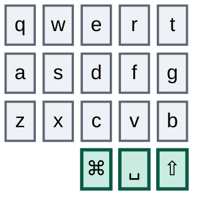

חצי ימין:

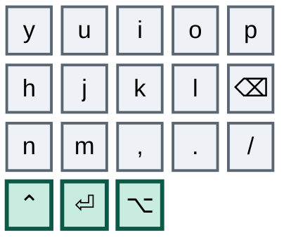

שלושים מקשים, שישה אגודלים. כל מה שלמעלה הוא מקש שלא תצטרך לחשוב עליו שוב, באף אחת מהמקלדות.

## מה נעלם

אותם שישה מקשים בשתי המקלדות. בשמאל: Tab, Escape וגרש הפוך.

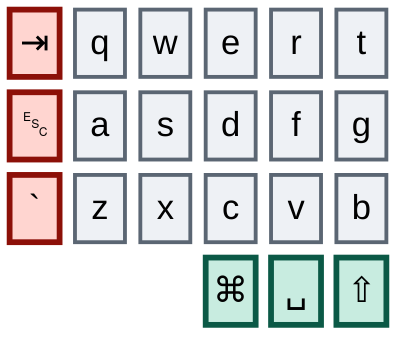

בימין: קדימה בדפדפן, אחורה בדפדפן, וטילדה.

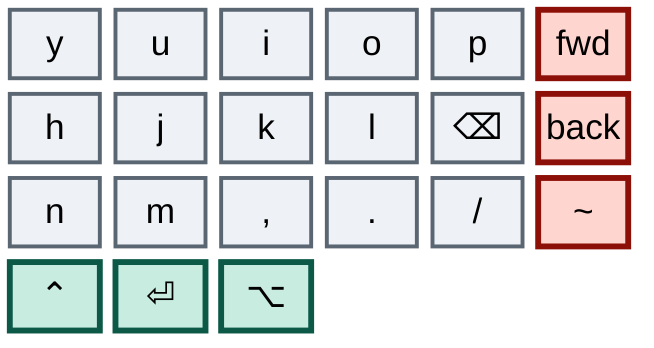

בשתי המקלדות יושב בדיוק זה, וזה נוח: תוכנית פרישה אחת מכסה את שתיהן.

ל-Ximi2 יש עוד דבר אחד להוריד — אשכול של ארבעה מקשים בכל חצי מעבר ל-42, שנושא צירופי ניהול חלונות, את קיצור ההקלטה, רענון דפדפן ושלושה קיצורי hyper. ל-Toucan2 אין מקבילה, ולכן גם תוכן האשכול הזה צריך בתים בליבה.

## למה רוב העיצוב שלך כבר מתאים

מערכת הפיסוק שלך — הקומבואים שמבוססים על צורת התו, הזוגות האנכיים, המנמוניקות שבאמת הפנמת — חיה כולה בתוך שלושים המקשים שנשארים, ב**שתי** המקלדות. כל אחד מהקומבואים האלה הוא חד-ידני, כך שהצרת החצאים לא משנה שום דבר בתחושה שלהם.

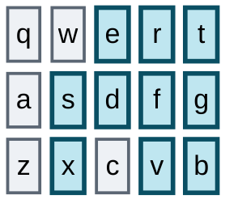

`d`+`r` משרטט `/` שעולה ימינה. `e`+`f` משרטט `\` שיורד ימינה. `s`+`f` נותן מקף, ו-`x`+`v` — ישירות מתחתיו, באותן שתי עמודות — נותן קו תחתון. `t`+`g` לנקודה-פסיק, `g`+`b` לפייפ. מוסיפים `a` לגלגול `s`+`d`+`f` והשכבה הופכת דביקה.

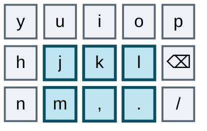

שים לב מה משותף לזוגות האלה: אף אחד מהם לא יושב על שתי עמודות צמודות באותה יד. `s`+`f` מדלג על `d`. `x`+`v` מדלג על `c`. `j`+`l` מדלג על `k`, ו-`m`+`.` מדלג על הפסיק. `t`+`g` ו-`g`+`b` אנכיים, בתוך עמודה אחת. זה לא קישוט — גלגול הקלדה נוסע על עמודות *שכנות*, ולכן קומבו שבנוי על עמודה מדולגת, או על עמודה אחת בלבד, לא יכול להיתפס בגלגול. כל קומבו שנוסף מכאן והלאה מציית לאותה מגבלה, מה שפוסל זוגות מפתים כמו `s`+`d` כמה שלא ייראו נוחים. שני האלכסונים המבוססים, `d`+`r` ו-`e`+`f`, כן חוצים עמודות צמודות — אבל אלכסונים הרבה פחות חשופים לגלגול מאשר שכנים באותה שורה, והשניים האלה הם זיכרון שרירי נעול. הם היוצא מן הכלל, לא התקדים.

---

# המסע

## שלב ראשון — לעשות את שתי המפות כשרות

לפני שאתה משנה משהו שאתה לוחץ עליו, אתה צריך לסמוך על מה שקבצי ההגדרה שלך אומרים. כרגע אף אחד מהם לא מרוויח את האמון הזה.

ב-**Corne**, ציור ה-ASCII בשכבת הסימבולים מסמן את כל הבלוק הימני שלו כ-Cmd ועוד ספרה; השיוכים הם Alt ועוד ספרה. ההערה בשורת האגודלים בשכבת המספרים מתארת מקשים שלא נמצאים שם. כל שכבה מציירת את אגודל שמאל כקו תחתון וכל שכבה משייכת רווח. מאקרו אחד מתועד כ"טקסט kubiya" ומקליד את כתובת המייל שלך. שנים-עשר מאקרו מוגדרים ואף פעם לא נקראים — תשעה מהם כפילויות מדויקות, כולל שני עותקים של כל אחד מ-fold, unfold ו-fold-all.

ב-**Ximi2**, אותו ריקבון בצורה אחרת. ארבעה מאקרו הם כפילויות מדויקות של קודמים — צירופי ניהול החלונות לשמאל, לימין, למעלה ולמטה קיימים כל אחד פעמיים. משבצת מאקרו אחת ריקה לגמרי. שכבת הניווט משייכת את אותו קיצור חלונות בשני מקשים שונים. ובשורה העליונה של לוח המספרים יש `9` כפול במקום שבו אמור לשבת מקש אחר, כך שעמדה אחת בלוח המספרים מתה בשקט.

שום דבר מזה לא משנה התנהגות. כל זה חוסם תכנון, ואתה עומד לתכנן לא מעט. אז: תקן כל דיאגרמה שתתאים לשיוכים שלה, מחק את המאקרו המתים והכפולים בשתי המקלדות, תן לשכבת ה-Bluetooth של ה-Corne `display-name` כדי ש-ZMK Studio יפסיק להציג אותה לפי שם הצומת הגולמי, תקן את שני המאקרו של ה-Corne שהשמות שלהם הפוכים — `fold` משייך בפועל *unfold recursively* ו-`expand` משייך *fold recursively* — ותקן את ה-`9` הכפול ב-Ximi2.

שום דבר שאתה לוחץ עליו לא משתנה. זה בדיוק העניין. ישיבה אחת, לגמרי בחינם.

*סיימת את השלב הזה כשאתה יכול לקרוא את מפת השכבות של כל אחת מהמקלדות ולהאמין לה.*

## שלב שני — לתת למשטחי המגע לקחת את ההצבעה

לשתי המקלדות יהיה משטח מגע, ומשטח מגע מצביע טוב יותר מכל מקש. אבל המחיקה היא לא מוחלטת, והחריג חשוב.

**למחוק: תנועה, גלילה, קליקים.** ב-Corne זה אומר את כל אשכול תנועת העכבר ואת שני מקשי הגלילה בשכבת ה-Bluetooth, את שני מקשי הגלילה-ימינה ואת מקשי הגלילה למעלה ולמטה בשכבת הניווט, ואת הקומבואים של קליק שמאלי וימני. ב-Ximi2, את מקשי העכבר והגלגל בשכבה העליונה שלו, את שני קומבואי הקליק שבליבה, את שני קומבואי הקליק שבעמודה החיצונית, ואת אנקודר הגלילה. ואז הצינורות: ב-Corne הורד את `CONFIG_ZMK_MOUSE=y`, את בלוקי `&msc` ו-`&mmv`, ואת ה-include-ים של העכבר — כרגע אתה מייבא גם את `mouse.h` הלגסי וגם את `pointing.h` הנוכחי, ושניהם יוצאים יחד עם `behaviors/mouse_keys.dtsi`.

**לשמור: אחורה וקדימה בדפדפן.** הם יושבים היום על העמודה החיצונית הימנית בשתי המקלדות, ושום משטח מגע לא ממפה אותם. הם ניווט, לא הצבעה, ואתה משתמש בהם כל הזמן. הם הופכים ליתומים אמיתיים עם זכות לנדל"ן בליבה — ראה שלב חמש.

שני דברים נופלים מזה בחינם.

**ערימת מקשים מתפנה.** אחד-עשר ב-Corne — ארבעה בשכבת הניווט, שבעה בשכבת ה-Bluetooth — פלוס המקבילים ב-Ximi2. זה בדיוק המקום שבו היתומים צריכים לנחות שלושה שלבים מכאן, כך שההיצע מגיע לפני הביקוש.

**אחת משתי התנגשויות הקומבו נעלמת.** קומבו הגלילה-למטה ב-Corne היה `a`+`d`; קומבו המספרים הדביק הוא `a`+`s`+`d`+`f`. גלגול לכיוון השכבה עלול לירות גלילה במקום החלפה. מחיקת קומבו הגלילה מתקנת את זה בלי עיצוב מחדש.

*סיימת את השלב הזה כש-`mkp`, `mmv` ו-`msc` לא מופיעים בשום מקום ב-keymap של ה-Corne, ואף קוד מקש של עכבר או גלגל לא מופיע ב-Ximi2.*

## שלב שלישי — להוריד את הידיים מהבלם

אתה חי ב-shell של zellij, וקובץ ההגדרה שלך ל-zellij הוא **מונע-Alt**. ספירה של השיוכים שלך: בערך עשרים שיוכי Alt, חמישה שיוכי Cmd, ושבעה שיוכי Ctrl שמתוכם חמישה קיימים רק כדי *להיכנס למצב*. המניעים היומיומיים כולם Alt — `Alt h/j/k/l` להזזת פוקוס, `Alt n` לפאנל חדש, `Alt b` לניתוק פאנל, `Alt i`/`Alt o` להזזת טאב, `Alt f` לציפה, ו-`Alt c`/`Alt v`/`Alt z` להרצת הסקריפטים שלך. Cmd מטפל בטאב חדש, פאנל חדש, ציפה ושינוי שם.

עכשיו תסתכל מה שני המודיפיירים האלה עולים לך ב-Corne. גם Alt וגם Cmd הם tap-dance עם זמן הקשה של **ארבע מאות מילישניות**. Ctrl הוא גם tap-dance, בערך במאתיים.

כלומר הקנס נוחת בדיוק על המודיפיירים שאתה משתמש בהם הכי הרבה, והוא ה*גדול* מבין השניים. `Alt h` להזזת פוקוס בין פאנלים הוא ככל הנראה הפעולה התכופה ביותר במקלדת שלך ביום, וכל אחת מהן ממתינה ארבע מאות מילישניות לפני שהאות נספרת כמותאמת.

הוסף כל `Cmd+C`, כל `Cmd+V`, וכל החלפת אפליקציה בבלוק Alt+ספרה בשכבת הסימבולים. אלפי פעמים ביום אתה מחכה — בשביל פיצ'רים שאתה כמעט לא משתמש בהם. גרוע מזה: גם ב-Cmd וגם ב-Alt שתי המשבצות הראשונות של ה-tap-dance משויכות ל*אותו מקש*, כך שהקשה כפולה לא קונה שום דבר. רק ההקשה המשולשת עושה משהו, והיא מגיעה לשכבה שאתה מגיע אליה בשלוש דרכים אחרות.

ל-Ximi2 יש בדיוק אותו פגם בטבלת ה-tap-dance של Vial: גם ה-tap-dance של Cmd חוזר על אותו מקש בשתי המשבצות הראשונות, וזה של Alt עוטף מודיפייר חד-פעמי. אותה מחלה, שטח הגדרה אחר.

אז בשתי המקלדות: הפוך את Ctrl, Cmd ו-Alt למודיפיירים רגילים. קיצור ההקלטה שמתחבא מאחורי ההקשה הכפולה של Ctrl ב-Corne כבר קיים כמקש רגיל בשכבת הפונקציות, וב-Ximi2 הוא יושב באשכול התוספת.

שלושה רובים טעונים שווים פריקה בזמן שאתה שם. חלון השחרור של השכבה הדביקה ב-Corne הוא שישים שניות, כך שגלגול אחד לא-מכוון של `j`+`k`+`l` משאיר את שכבת הפונקציות דרוכה לדקה שלמה — והשכבה הזאת קופצת לשכבת ה-Bluetooth, שמחזיקה bootloader ו-soft-off. הורד לכ-1.5 שניות; גם ה-timeout של השכבה החד-פעמית ב-Ximi2 רוצה את אותו טיפול. מחק את קומבו שני המקשים של ה-Corne שקופץ לשכבת ה-Bluetooth. והגבל כל קומבו לשכבת הבסיס — ב-Corne כולם נורים כרגע בכל שש השכבות, כולל מאקרו פרוזה של עשרים וארבעה תווים שיכול להיירות בזמן שאתה מקליד מספרים.

ואז תן ל-layer-taps הגנה, כי ב-Corne אין להם שום הגנה מסוג כלשהו:

```
&lt {
    quick-tap-ms = <175>;
    require-prior-idle-ms = <125>;
    flavor = "balanced";
};
```

את `quick-tap-ms` תרגיש מיד — אתה לוחץ Enter שוב ושוב ב-shell כל היום, ובלעדיו Enter כפול ומהיר עלול להפעיל שכבה במקום לשלוח שורה חדשה.

ה-Ximi2 צריך את אותן הגנות בשמות אחרים:

| מטרה | ZMK | QMK |
|---|---|---|
| הקשה חוזרת בלי להפעיל החזקה | `quick-tap-ms` | `QUICK_TAP_TERM` |
| בלי החזקה מיד אחרי הקלדה | `require-prior-idle-ms` | Flow Tap (`FLOW_TAP_TERM`) |
| החזקה רק עבור היד הנגדית | `hold-trigger-key-positions` | Chordal Hold, או Achordion |
| סגנון ההכרעה בין הקשה להחזקה | `flavor` | `PERMISSIVE_HOLD` / `HOLD_ON_OTHER_KEY_PRESS` |
| timeout לשכבה דביקה | `&sl release-after-ms` | `ONESHOT_TIMEOUT` |

אזהרה אחת: Flow Tap ו-Chordal Hold הם פיצ'רים חדשים יחסית ב-QMK, וקושחת Vial נוטה לפגר אחרי ה-mainline. בדוק מה ה-fork של Vial שלך באמת תומך בו לפני שאתה מתכנן סביבם — אם לא, אלה דורשים בנייה מחדש של הקושחה ולא שינוי ב-GUI, וזה חיכוך אמיתי שאין ב-Corne.

**התנגשות אחת שורדת את שלב שתיים** בשתי המקלדות, והיא כנראה הציקה לך בשקט חודשים. קומבו המקף הוא `s`+`f`, בענבר. כל קומבו שכבה מכיל את הזוג הזה — `s`+`d`+`f`, `s`+`e`+`f`, ושתי הווריאציות הדביקות בנות ארבעת המקשים, שהמקשים הנוספים שלהן בכחול:

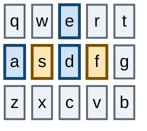

כל גלגול שכבה איטי יותר מחלון הקומבו של מאה וחמישים מילישניות מוציא מקף במקום להחליף, וה-debounce של מילישנייה אחת ב-Corne מרחיב את זה עוד. שני תיקונים נקיים: לתת למקף מקש אמיתי, או להעביר את הזוג ל-`d`+`g` עם קו תחתון מתחתיו ב-`c`+`b` — מה שמשמר את המנמוניקה של אותן-עמודות-שורה-אחת-למטה במדויק, ומציית לכלל העמודה המדולגת בשני החצאים.

*סיימת את השלב הזה כשצירופי Ctrl מרגישים מיידיים בשתי המקלדות.* צפה לשיפור הגדול ביותר במדריך — ושים לב שאין לו קשר להקטנה. שלבים אחד עד שלוש נכנסים לאחר צהריים אחד ואף אחד מהם לא מזיז מקש.

## שלב רביעי — לאחד את שתי המקלדות

השלב הזה חדש בתוכנית, והוא זה שקובע אם כל השאר עובד.

יש לך זוג ידיים אחד ושתי מקלדות. כל סטייה ביניהן עולה כפול ללמוד ומשאירה חצי, כי חצי מהתרגול שלך קורה על הפריסה הלא נכונה. לפרוש עמודות ב-Corne בזמן שה-Ximi2 עדיין מתגמל הישלחות החוצה זו לא הגירה איטית — אלה שני הרגלים מתחרים, וזה שאתה משתמש בו בעבודה שמונה שעות ביום מנצח.

אז לפני שמקש אחד מוסר, הפוך את ליבת שלושים המקשים לזהה בשתיהן.

והנה ההפתעה הנעימה: **ה-Ximi2 כבר מקדים את ה-Corne**, והזיכרון השרירי כבר אצלך. שלושה דברים שהוא עושה לגמרי בתוך הליבה, בזמן שה-Corne עדיין מעגן אותם על מקשים נידונים:

| פונקציה | Ximi2 היום (בליבה) | Corne היום (מקשים נידונים) |
|---|---|---|
| `[` | `q`+`s` | Tab+`a` |
| `]` | `a`+`w` | `q`+Escape |
| שכבה 5 | `y`+`i`+`p` | `.`+`l` |

אמץ את הגרסאות של ה-Ximi2 ב-Corne ושניים משלושת הקומבואים היתומים שלך נפתרים עם מחוות שהידיים שלך כבר מכירות.

דבר אחד מתאחד דרך מחיקה ולא דרך אימוץ: קומבו שכבה-5 הדביק של ה-Ximi2 נעלם לגמרי. שכבה 5 היא המקום שבו חיים `&bootloader` ו-`&soft_off`, וכניסה *דביקה* אליה היא הצורה הגרועה ביותר האפשרית — היא דורכת את השכבה ואז מחכה. מעבר מכוון אחד של שלושה מקשים הוא כל מה שהשכבה הזאת אי פעם הצריכה. זה בדיוק ההיגיון שהרג את הקפיצה של שני המקשים ב-Corne בשלב שלוש, מוחל על המקלדת השנייה. זה לא ניצחון תיאורטי — זו הוכחה שאתה מסוגל להעביר קומבו לליבה ולחיות איתו, כי כבר עשית את זה, בעבודה, בלי לשים לב.

שווה לומר בכנות: `q`+`s` ו-`a`+`w` הם אלכסונים על עמודות צמודות, מאותו סוג כמו ה-`/` וה-`\` שלך. הם שוברים את כלל העמודה המדולגת. אבל אתה מקליד אותם כל יום בעבודה, ולכן עבורך ספציפית הם מוכחים — וללמד את הידיים מחוות סוגריים חדשה תעלה יותר ממה שהכלל שווה כאן.

בכיוון ההפוך, ה-Corne מקדים בשכבת ה-Bluetooth שלו, שיש בה רשת select/disconnect נקייה שאין ל-Ximi2 שום שימוש בה — זו נשארת ייחודית ל-Corne. אלחוט הוא המקום היחיד שבו לשתי המקלדות מותר להיות שונות.

כל השאר צריך להתאים: אותו סדר שכבות, אותו תוכן שכבות, אותן עמדות קומבו, אותם שיוכי אגודל, אותה פילוסופיית תזמון. איפה שהן נבדלות היום, בחר את הטובה יותר והחל אותה על שתיהן.

*סיימת את השלב הזה כשאתה יכול לשבת מול כל אחת מהמקלדות ולא לשים לב באיזו מהן מדובר.*

## שלב חמישי — שני בתים לכל יתום

הנה הטריק שההגירה נשענת עליו.

אתה לא מתאמן מחדש על ידי הסרת מקש וסבל דרך החֶסֶר. אתה מתאמן מחדש על ידי הפיכת המיקום *החדש* לזמין בזמן שהישן עוד עובד, ואז נתינת לידיים להיסחף לזול יותר. הזול מנצח מעצמו — בלי כוח רצון, בלי משמעת, ובלי יום רע שבו אתה לא יכול להקליד, כי אם הבית החדש מסורבל, המקש הישן נמצא בדיוק שם.

לשבועיים עד שלושה שני הבתים עובדים, בשתי המקלדות, ואתה לא משנה שום דבר באופן שבו אתה מקליד.

**העמודה החיצונית השמאלית היא הבעיה האמיתית.** שלושה מקשים בתדירות גבוהה שזכאים לנדל"ן הטוב ביותר שנשאר. Escape רוצה קומבו שגלגול לא יכול להגיע אליו — `w`+`x`, הראש והתחתית של עמודת האצבע האמצעית, בדילוג מלא על שורת הבית; בין vim ל-shell-ים של LLM אתה לוחץ עליו כל הזמן, אז הוא חייב להיות מהיר *וגם* בלתי אפשרי לירי בטעות. Tab הוא הבא, מונע מהשלמת פקודות; גם אזור האגודל בשכבת הסימבולים וגם העמודה הפנימית השמאלית עובדים. גרש הפוך אתה צריך לגדרות קוד ב-markdown בפרומפטים, ולשכבת הסימבולים יש מקום — היא משייכת כרגע `$` בשני מקשים נפרדים. מקש גרש הפוך אחד מחזיר גם את הטילדה, כי טילדה היא הצורה המוסטת שלו.

**אחורה וקדימה בדפדפן צריכים בתים אמיתיים.** הם שרדו את שלב שתיים ואתה משתמש בהם כל הזמן. שים אותם בשכבת הניווט, ישירות מתחת לחצי שמאלה וימינה, באותן עמודות — אחורה מתחת לשמאלה, קדימה מתחת לימינה. המנמוניקה כותבת את עצמה, אין קומבו חדש ללמוד, ושום גלגול לא יכול להגיע למקש שכבה.

**שלושה מקשים נדירים הם טריוויאליים.** Caps Lock, כרגע בשכבת הפונקציות, יכול לשבת בכל מקום בליבה. Soft-off, בשכבת ה-Bluetooth של ה-Corne, צריך להתקיים איפה שהוא כי שום דבר אחר לא מכבה את הלוח — ולשכבה הזאת בדיוק התפנו שבעה מקשים. קיצור ההקלטה כבר משוכפל, אז עותק אחד יכול פשוט ללכת.

**שלושת הנותרים בעמודה הימנית הם חצאים יתומים.** מילה-ימינה, פסקה-ימינה ומרחב-דפדפן-2 — לכל אחד יש שותף שכבר בליבה: Alt+שמאלה, המקבילה שלו לפסקה, ומרחב-דפדפן-1. העבר כל זוג פנימה *ביחד* כדי שהמנמוניקה של השיקוף תישאר שלמה ולא תיקרע על גבול.

**קומבו אחד עדיין צריך בנייה מחדש:** מאקרו הפרוזה "think hard", מעוגן על Tab בשתי המקלדות. עגן אותו מחדש בליבה בצורה של עמודה מדולגת או עמודה בודדת — מאקרו פרוזה של עשרים וארבעה תווים הוא הדבר האחרון שאתה רוצה שגלגול יירה.

**וב-Ximi2, אשכול התוספת צריך ניקוז.** צירופי ניהול החלונות, רענון הדפדפן וקיצורי ה-hyper שלו חסרי מקבילה ב-Toucan2. קפל אותם לשכבת הניווט או הפונקציות, בעמדות שקיימות גם ב-Corne.

*סיימת את השלב הזה כשאתה תופס את עצמך נשלח ל-Escape החדש בלי שהחלטת על זה.* אל תתקדם לפני שזה קורה.

## שלב שישי — לפרוש את העמודה הימנית

אתה לא צריך חומרה חדשה כדי לגלות אם אתה יכול לחיות על שלושים ושישה מקשים. שייך את המקשים החיצוניים לכלום ואתה מקליד פריסת Toucan2 על המקלדות שכבר יש לך. ואתה לא חייב לעשות את כל השישה בבת אחת — העמודה הימנית הרבה יותר קלה מהשמאלית, אז היא הולכת ראשונה וקונה לך ביטחון בזול.

אחרי שלב שתיים ושלב חמש, העמודה החיצונית הימנית לא מחזיקה שום דבר ששווה לשמור: טילדה שהיא סתם Shift על גרש הפוך, קיצור הקלטה שכבר משוכפל, שלושה מקשי חזרה-לבסיס מיותרים, נקודה כפולה אחת, ומקשי הדפדפן ותנועת המילים שכבר קיבלו בתים בליבה.

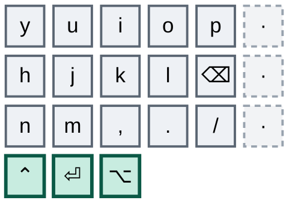

כבה את שלושתם, בכל שכבה, בשתי המקלדות בו זמנית. פרוש כאן גם את אשכול התוספת של ה-Ximi2 — אותו היגיון, ושלב חמש כבר ניקז אותו.

זה אמור להיות כמעט לא כואב. אם זה כן, משהו משלב חמש לא נחת, וזה בדיוק מה שאתה רוצה לגלות עכשיו ולא אחרי שהוצאת כסף.

*סיימת את השלב הזה כששבוע עובר בלי שהעמודה הימנית חסרה לך.*

## שלב שביעי — לפרוש את העמודה השמאלית

החצי הקשה. Tab, Escape וגרש הפוך כולם בתדירות גבוהה, וכאן ההגירה באמת נחתכת.

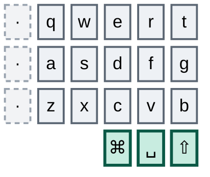

כבה את שלושתם בשתי המקלדות, מחק את הקומבואים האחרונים שמפנים אליהם, וחיה שם שבועיים מלאים.

יש יתרון לא צפוי בעשיית זה על חומרה שעדיין יש לה פיזית את המקשים: הם נשארים מתחת לאצבעות. כשאתה פוגע באחד ושום דבר לא קורה, אתה לומד בדיוק איזה הרגל לא היגר. הפידבק הזה נעלם ברגע שהמקשים נעלמים — ובדיוק בגלל זה השלב הזה שווה שבועיים ולא דילוג לקנייה.

אם מקש מסוים ממשיך לתפוס אותך, אל תחזיר את העמודה. חזור לשלב חמש ותן לאותו מקש בית טוב יותר, ואז המשך. החזרה מלמדת את הידיים שהעמדה הישנה עדיין משתלמת.

*סיימת את השלב הזה כששבועיים עוברים ואתה מפסיק לשים לב לעמודות המתות.* זה השער לקניית חומרה — היחיד.

## שלב שמיני — להזמין את ה-Toucan2

הפריסה שלך כבר רצה עליו. המקשים המתים פשוט מפסיקים להתקיים פיזית. אין אירוע הגירה, אין יום הסתגלות, אין חרדת צריבה — אתה מקליד את הפריסה הזאת כבר שבועות, בשתי מקלדות.

הזמן את גרסת 36 המקשים, פורט את ה-keymap לשילד החדש כששישה הערכים המתים בכל שכבה יורדים, והגדר את משטח המגע.

שני דברים יפתיעו אותך, ושניהם יכולת חדשה ולא הגירה.

ההיסט העמודתי תלול יותר מזה של ה-Corne והמרווח צפוף יותר. התאמה של מיקום אצבע, לא של פריסה; ימים, לא שבועות.

ומשטח המגע ישנה בשקט את מה ששכבת הניווט משרתת. ברגע שהצבעה וגלילה הן מחוות, התפקיד האמיתי של השכבה הוא חצים, תנועת מילים, ואחורה־קדימה בדפדפן ששמרת. צפה לעצב אותה מחדש — אבל אחרי שבוע של חיים עם משטח המגע, לא מראש. לא תדע מה אתה רוצה עד שתרגיש מה המחוות כבר מכסות.

---

## משימת צד — מודיפיירים בשורת הבית

אופציונלי, בלי לוח זמנים, ובמכוון לא שער לשום דבר. הרץ את זה מתי שבא לך אחרי שלב שלוש; זה לא חייב להסתיים לפני שאתה קונה.

כל שישה מקשי האגודל שורדים ב-Toucan2, כך שאסטרטגיית המודיפיירים שכולה על האגודלים ממשיכה לעבוד ללא הגבלת זמן. אבל מודיפיירים בשורת הבית הם ההבדל בין לוח 36 מקשים שמרגיש צפוף לאחד שמרגיש מרווח: האגודלים מפסיקים להיות צוואר בקבוק, צירופים מפסיקים לדרוש מתיחת אגודל-ואצבע, וקיבולת אגודל מתפנה לגישת השכבות שלוח קטן נשען עליה חזק יותר.

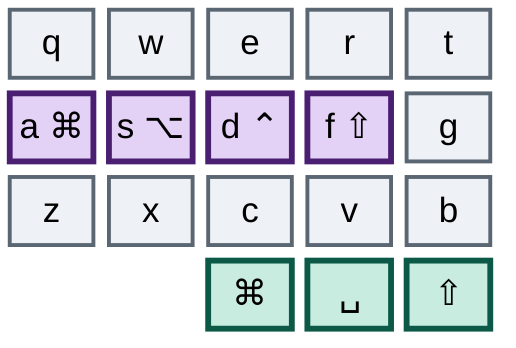

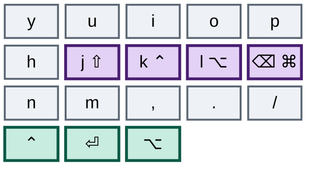

הגדרה אחת קובעת אם תאהב או תשנא את זה: החזקות רק ליד הנגדית — `hold-trigger-key-positions` ב-Corne, Chordal Hold או Achordion ב-Ximi2. בלעדיה, מודיפיירים בשורת הבית נורים בטעות בלי סוף על גלגולים באותה יד, ואתה תתייאש תוך יום. גרור גם את ערכי ה-quick-tap וה-prior-idle משלב שלוש.

הרגלי ה-zellij שלך הופכים את ההגדרה הזאת לקריטית יותר מהרגיל. `Alt h/j/k/l` הופך ל-Alt של יד שמאל פלוס אות של יד ימין — צירוף נקי של ידיים נגדיות, ובאמת נעים יותר מהיום. אבל `Alt b`, `Alt c`, `Alt v`, `Alt f` ו-`Alt z` כולם מכוונים לאותיות של יד שמאל, ולכן הם חייבים להשתמש ב-Alt של יד *ימין*. זה בדיוק מה שהחזקות-יד-נגדית נועדו לו, ובדיוק מה שנשבר בלעדיהן.

שמור על מודיפיירי האגודל פעילים לאורך כל הדרך. לא אופציונלי אם אתה רוצה שזה יידבק — ביום שבו שורת הבית נלחמת בך, הידיים נופלות חזרה למה שהן מכירות ואתה לא מאבד כלום.

ואז כוונן: תתחיל בסביבות מאתיים מילישניות ורד בצעדים של עשר עד שהצירופים מרגישים מיידיים בלי החזקות שגויות באמצע מילה. שבוע-שבועיים של ירי בטעות לפני שזה נרגע.

זה השלב שאנשים נוטים ביותר לזנוח. זניחה שלו לא עולה לך כלום בתוכנית הזאת — בגלל זה הוא חי מחוץ לרצף.

---

## שני דברים ששווה לתקן כשאתה כבר שם

המנמוניקות של הפיסוק לא עקביות בין הידיים. זוג המקף ביד שמאל משתמש באצבע אמצעית פלוס מורה; זוג הפלוס ביד ימין משתמש במורה פלוס קמיצה. אותה משפחת מחוות, אצבעות שונות תלוי ביד — בחר תבנית אחת לשתיהן. ועוד אחת עדינה: המקף מעל הקו התחתון מציב את התו *המוסט* למטה, בעוד הפלוס מעל השווה מציב את התו *הלא-מוסט* למטה. המיקום לא מקודד שום דבר לגבי מצב ה-Shift. כל מוסכמה בסדר; להחזיק את שתיהן לא.

ושיוכי ה-zellij שלך ראויים למבט שני — אבל לא מהסיבה שהיית מצפה לה. קובץ ההגדרה שלך כבר עשה את העבודה הארגונומית הקשה: במקום שבו zellij סטנדרטי מכריח אותך ללחוץ prefix ואז אות, אתה שייכת את הפעולות הנפוצות לצירופי Alt ו-Cmd ישירים. לא נשאר רצף prefix לכווץ עבור פאנל חדש, טאב חדש או הזזת פוקוס. את הזדמנות המאקרו שיש לרוב האנשים כאן — אתה כבר ניצלת.

מה שנשאר היא בעיה צרה ומעניינת יותר: **כמה מצירופי ה-zellij שלך מבקשים ממך להחזיק מודיפייר בזמן שאתה מייצר תו שהמקלדת שלך יוצרת בקומבו.** `Alt [` ו-`Alt ]` מחליפים פריסות, אבל `[` ו-`]` הם קומבואים של שני מקשים. `Alt -`, `Alt =` ו-`Alt +` משנים גודל, וגם מקף ושווה הם קומבואים. להחזיק Alt בזמן גלגול קומבו של שני מקשים זו מחווה מסורבלת, והיא מחמירה במשימת הצד של מודיפיירים בשורת הבית, שבה קומבו המקף יושב על שני מקשים שהיו הופכים בעצמם למודיפיירים.

שתי דרכי מוצא, שתיהן זולות. תן לחמשת הצירופים האלה מקשי מאקרו ייעודיים בשכבת הניווט, כך ששינוי גודל והחלפת פריסה יהפכו ללחיצה אחת. או העבר את הפיסוק המושפע למקשים אמיתיים, מה שתיקון המקף בשלב שלוש כבר רמז עליו. המקום שם בכל מקרה — שלב שתיים פינה אחד-עשר מקשים בשתי שכבות ב-Corne, ולשכבת המספרים שלו יש שישה מקשים מתים רצופים בשורה השמאלית התחתונה פלוס כפילויות של הספרות אחת עד חמש שכבר קיימות בלוח המספרים הימני.

רצפי שני הצעדים האמיתיים היחידים שנשארו לך הם חמש כניסות המצב ב-Ctrl — pane, tab, resize, session, scroll. אלה אלה ששווים מאקרו אם אתה מוצא את עצמך משתמש באחד מהם הרבה.

---

## צורת הדבר כולו

| שלב | מה זה עולה לך | כמה זמן |
|---|---|---|
| 1 — לעשות את שתי המפות כשרות | שום דבר. אין שינויי מקשים. | ישיבה אחת |
| 2 — משטחי המגע לוקחים את ההצבעה | שום דבר. אחורה/קדימה שורדים. | ישיבה אחת |
| 3 — להוריד את הידיים מהבלם | שום דבר. המקשים נשארים, הצירופים מזורזים. | ישיבה אחת |
| 4 — לאחד את שתי המקלדות | שני קומבואים עוברים למחוות שאתה כבר מכיר. | שבוע |
| 5 — שני בתים לכל יתום | שום דבר. שני הבתים עובדים. | 2–3 שבועות |
| 6 — לפרוש את העמודה הימנית | אמור להיות כמעט לא כואב. | שבוע |
| 7 — לפרוש את העמודה השמאלית | המבחן האמיתי. | שבועיים |
| 8 — להזמין את ה-Toucan2 | שום דבר. כבר הסתגלת. | ערב אחד |
| משימת צד — מודיפיירים בשורת הבית | קצת ירי בטעות. האגודלים כרשת ביטחון. | מתי שבא לך |

שבעה עד תשעה שבועות עד הקנייה, עם שתי מקלדות עובדות לגמרי בכל יום. שלושת השלבים הראשונים נוחתים באחר צהריים אחד ואף אחד מהם לא מזיז מקש.

**חוק אחד, והוא היחיד שחשוב: אל תתקדם שלב לפי לוח זמנים.** תתקדם כשהשורה המסיימת של השלב הקודם באמת נכונה לגביך. שלבים חמש ושבע הם אלה שאנשים מזדרזים בהם, והחיפזון הוא הדרך היחידה שבה התוכנית נכשלת. ואל תתקדם אף פעם במקלדת אחת בלבד — סטייה בין ה-Corne ל-Ximi2 היא הדבר היחיד הכי עלול לתקוע את כל ההגירה.
