# Going Small

### Converging a Corne and a Ximi2 onto one 36-key layout, and only then buying the Toucan2

---

You spent a long time learning the layout you have. Muscle memory that deep is an asset, and nothing here asks you to spend it. What follows is a sequence of small, reversible steps that gradually stop your hands from reaching for six keys — while those keys are still there, still working, still catching you when you slip. The keyboard gets bought at the *end*, once you already type on 36 keys comfortably.

Three facts shape the whole plan.

**You are not migrating one keyboard, you are migrating two.** The Corne at home and the Ximi2 at work are trained by the same pair of hands. Every difference between them costs you twice and teaches you half. The Ximi2 runs QMK/Vial rather than ZMK, so the config surface differs — but the layout, the six layers, and almost the entire combo vocabulary are already the same. Keeping them converged is not a nice-to-have in this plan; it is the mechanism that makes it work.

**Both boards already have, or will have, a trackpad.** The Ximi2 has one today, the Toucan2 ships with one. Pointing, clicking and scrolling stop being keyboard problems. Browser back and forward do not — no trackpad maps those — so those two survive and need real homes.

**The Toucan2's 36-key build is a Cantor/Piantor layout:** three rows of five columns per half, three thumb keys per half, columnar stagger. That is precisely your Corne minus the two outer pinky columns, and it is your Ximi2 minus those same columns plus its extra cluster. All six thumb keys survive on every board.

---

## The destination

Left half:

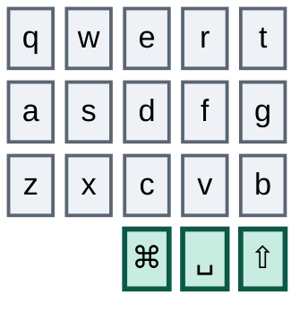

Right half:

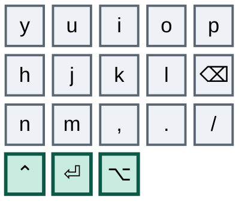

Thirty keys, six thumbs. Everything above is a key you will never have to think about again, on either board.

## What goes away

The same six keys on both keyboards. On the left: Tab, Escape, backtick.

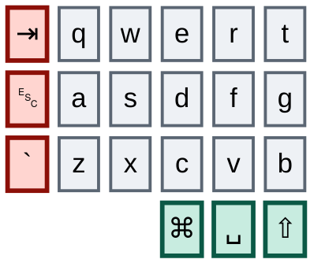

On the right: browser forward, browser back, tilde.

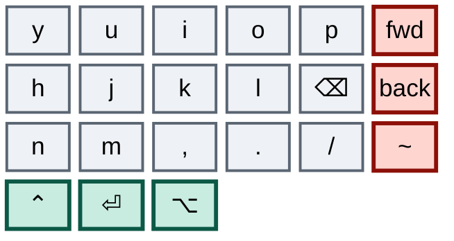

Both boards carry exactly this, which is convenient: one retirement plan covers both.

The Ximi2 has one extra thing to shed — a four-key cluster per half beyond the 42, carrying window-management chords, the record hotkey, browser refresh, and three hyper shortcuts. The Toucan2 has no equivalent, so that cluster's contents need homes in the core too.

## Why most of your design already fits

Your punctuation system — the glyph-shape combos, the vertical pairs, the mnemonics you actually internalized — lives entirely inside the thirty keys you keep, on **both** boards. Every one of those combos is single-hand, so narrowing the halves changes nothing about how they feel.

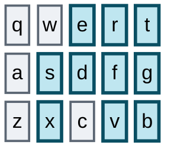

`d`+`r` traces a `/` running up and to the right. `e`+`f` traces a `\` running down and to the right. `s`+`f` gives dash, and `x`+`v` — directly below it, same two columns — gives underscore. `t`+`g` for semicolon, `g`+`b` for pipe. Add `a` to the `s`+`d`+`f` layer roll and it goes sticky.

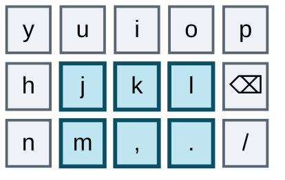

Notice what those pairs have in common: not one sits on two adjacent columns of the same hand. `s`+`f` skips `d`. `x`+`v` skips `c`. `j`+`l` skips `k`, and `m`+`.` skips the comma. `t`+`g` and `g`+`b` are vertical, inside a single column. That isn't decoration — a typing roll travels across *neighbouring* columns, so a combo built on a skipped column, or on one column alone, cannot be caught by a roll. Every combo added from here obeys the same constraint, which rules out tempting pairs like `s`+`d` however convenient they look. The two established diagonals, `d`+`r` and `e`+`f`, do cross adjacent columns — but diagonals are far less roll-prone than same-row neighbours, and those two are locked-in muscle memory. They are the exception, not the precedent.

---

# The journey

## Stage one — make both maps honest

Before changing anything you press, you need to trust what your config files say. Right now neither one earns that.

On the **Corne**, the symbols layer's ASCII art labels its entire right-hand block as Cmd plus a digit; the bindings are Alt plus a digit. The numpad layer's thumb row comment describes keys that aren't there. Every layer draws its left thumb as underscore and every layer binds Space. One macro is commented as "kubiya text" and types your email address. Twelve macros are defined and never referenced — nine of them byte-for-byte duplicates, including two copies each of fold, unfold and fold-all.

On the **Ximi2**, the same rot in a different shape. Four macros are exact duplicates of earlier ones — the window-management chords for left, right, up and down each exist twice. One macro slot is entirely empty. The nav layer binds the same window shortcut on two different keys. And the numpad's top row has a duplicated `9` where another key belongs, so one numpad position is silently dead.

None of this changes behaviour. All of it blocks planning, and you are about to do a lot of planning. So: correct every diagram to match its bindings, delete the dead and duplicated macros on both boards, give the Corne's Bluetooth layer a `display-name` so ZMK Studio stops showing it by raw node name, fix the two Corne macros whose names are inverted — `fold` actually binds *unfold recursively*, `expand` binds *fold recursively* — and fix the Ximi2's duplicated `9`.

Nothing you press changes. That is the point. One sitting, entirely free.

*You've finished this stage when you can read either board's layer map and believe it.*

## Stage two — let the trackpads take the pointer

Both boards end up with a trackpad, and a trackpad does pointing better than any key. But the deletion is not total, and the exception matters.

**Delete: movement, scrolling, clicking.** On the Corne that means the whole mouse-move cluster and both scroll keys on the Bluetooth layer, the two scroll-right keys and the scroll up/down keys on the nav layer, and the left-click and right-click combos. On the Ximi2, the mouse and wheel keys on its top layer, its two click combos in the core, its two click combos on the outer column, and the scroll encoder. Then the plumbing: on the Corne drop `CONFIG_ZMK_MOUSE=y`, the `&msc` and `&mmv` acceleration blocks, and the mouse includes — you currently pull in both the legacy `mouse.h` and the current `pointing.h`, and both go, along with `behaviors/mouse_keys.dtsi`.

**Keep: browser back and forward.** These live on the right outer column of both boards today, and no trackpad maps them. They are navigation, not pointing, and you use them constantly. They become genuine orphans with a claim on core real estate — see stage five.

Two things fall out of this for free.

**A pile of keys opens up.** Eleven on the Corne — four on the nav layer, seven on the Bluetooth layer — plus the Ximi2's equivalents. That is exactly where the orphans need to land three stages from now, so supply arrives before demand.

**One of your two combo collisions vanishes.** The Corne's scroll-down combo was `a`+`d`; its sticky-numpad combo is `a`+`s`+`d`+`f`. Rolling toward the layer could fire a scroll instead of switching. Deleting the scroll combo fixes that with no redesign.

*You've finished this stage when `mkp`, `mmv` and `msc` appear nowhere in the Corne's keymap, and no mouse or wheel keycode appears in the Ximi2's.*

## Stage three — take your hands off the brake

You live in a zellij shell, and your zellij config is **Alt-driven**. Counting your keybinds: roughly twenty Alt bindings, five Cmd bindings, and seven Ctrl bindings of which five are only there to *enter a mode*. The daily drivers are all Alt — `Alt h/j/k/l` to move focus, `Alt n` for a new pane, `Alt b` to break one out, `Alt i`/`Alt o` to move a tab, `Alt f` to float, and `Alt c`/`Alt v`/`Alt z` to launch your own scripts. Cmd handles new tab, new pane, float and rename.

Now look at what those two modifiers cost you on the Corne. Alt and Cmd are both tap-dances with a **four-hundred-millisecond** tapping term. Ctrl is also a tap-dance, at roughly two hundred.

So the penalty lands precisely on the modifiers you use most, and it is the *larger* of the two penalties. `Alt h` to move pane focus is plausibly the single most frequent keyboard action in your day, and every one of them waits out four hundred milliseconds before the letter counts as modified.

Add every `Cmd+C`, every `Cmd+V`, every application switch on the symbols layer's Alt+digit block. Thousands of times a day you wait — for features you almost never use. Worse, on both Cmd and Alt the first two slots of the dance are bound to the *same key*, so double-tapping buys nothing at all. Only the triple-tap does anything, and it reaches a layer you can already reach three other ways.

The Ximi2 has the identical flaw in Vial's tap-dance table: its Cmd dance also repeats the same key in its first two slots, and its Alt dance wraps a one-shot modifier. Same disease, different config surface.

So on both boards: make Ctrl, Cmd and Alt plain modifiers. The record hotkey hiding behind the Corne's Ctrl double-tap already exists as a normal key on its function layer, and on the Ximi2 it sits in the extra cluster.

Three loaded guns are worth unloading while you are in there. The Corne's sticky-layer release window is sixty seconds, so one accidental `j`+`k`+`l` roll arms the function layer for a full minute — and that layer jumps to the Bluetooth layer, which holds bootloader and soft-off. Drop it to about 1.5 seconds; the Ximi2's one-shot-layer timeout wants the same treatment. Delete the Corne's bare two-key combo into the Bluetooth layer. And scope every combo to the base layer — on the Corne all of them currently fire on all six layers, including a twenty-four-character prose macro that can trigger while you enter numbers.

Then give the layer-taps protection, because on the Corne they have none of any kind:

```
&lt {
    quick-tap-ms = <175>;
    require-prior-idle-ms = <125>;
    flavor = "balanced";
};
```

`quick-tap-ms` is the one you feel immediately — you hit Enter repeatedly in a shell all day, and without it a fast double-Enter can activate a layer instead of sending a newline.

The Ximi2 needs the same protections under different names:

| Intent | ZMK | QMK |
|---|---|---|
| Repeat-tap without triggering hold | `quick-tap-ms` | `QUICK_TAP_TERM` |
| No hold right after typing | `require-prior-idle-ms` | Flow Tap (`FLOW_TAP_TERM`) |
| Hold only for the opposite hand | `hold-trigger-key-positions` | Chordal Hold, or Achordion |
| Hold/tap decision style | `flavor` | `PERMISSIVE_HOLD` / `HOLD_ON_OTHER_KEY_PRESS` |
| Sticky-layer timeout | `&sl release-after-ms` | `ONESHOT_TIMEOUT` |

One caution: Flow Tap and Chordal Hold are recent QMK features, and Vial firmware often lags mainline. Check what your Vial fork actually supports before planning around them — if it doesn't, these need a firmware rebuild rather than a GUI change, which is real friction the Corne doesn't have.

**One collision survives stage two** on both boards, and it has probably been annoying you quietly for months. The dash combo is `s`+`f`, in amber. Every layer combo contains that pair — `s`+`d`+`f`, `s`+`e`+`f`, and both four-key sticky variants, whose extra keys are blue:

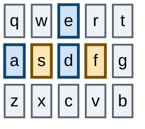

Any layer roll slower than the hundred-and-fifty-millisecond combo window emits a dash instead of switching, and the Corne's one-millisecond debounce widens that further. Two clean fixes: give dash a real key, or move the pair to `d`+`g` with underscore below it at `c`+`b` — which preserves the same-columns-one-row-down mnemonic exactly while stepping clear, and obeys the skipped-column rule on both halves.

*You've finished this stage when Ctrl chords feel instant on both boards.* Expect the single largest improvement in the guide — and notice it has nothing to do with going small. Stages one through three fit in one afternoon and none of them moves a key.

## Stage four — converge the two keyboards

This stage is new to the plan and it is the one that decides whether the rest works.

You have one pair of hands and two keyboards. Every divergence between them costs double to learn and halves what sticks, because half your practice happens on the wrong layout. Retiring columns on the Corne while the Ximi2 still rewards reaching outward is not a slow migration — it is two competing habits, and the one you use at work for eight hours a day wins.

So before any key is removed, make the thirty-key core identical on both.

Here is the pleasant surprise: **the Ximi2 is already ahead of the Corne**, and you already have the muscle memory. Three things it does entirely inside the core that the Corne still anchors on doomed keys:

| Function | Ximi2 today (core) | Corne today (doomed keys) |
|---|---|---|
| `[` | `q`+`s` | Tab+`a` |
| `]` | `a`+`w` | `q`+Escape |
| Layer 5 | `y`+`i`+`p` | `.`+`l` |

Adopt the Ximi2's versions on the Corne and two of your three orphaned combos are solved with gestures your hands already know.

One thing converges by deletion rather than adoption: the Ximi2's sticky layer-5 combo goes away entirely. Layer 5 is where `&bootloader` and `&soft_off` live, and a *sticky* entrance to it is the worst shape available — it arms the layer and then waits. One deliberate three-key switch is all that layer ever needed. This is the same reasoning that killed the Corne's bare two-key jump in stage three, applied to the other board. That is not a theoretical win — it is proof you can relocate a combo into the core and live with it, because you already did, at work, without noticing.

Worth naming honestly: `q`+`s` and `a`+`w` are diagonals on adjacent columns, the same class as your `/` and `\`. They break the strict skipped-column rule. But you have been typing them daily at work, so for you specifically they are proven, and re-teaching your hands a new bracket gesture would cost more than the rule is worth here.

Going the other direction, the Corne is ahead on its Bluetooth layer, which has a clean select/disconnect grid the Ximi2 has no use for — that one stays Corne-only. Wireless is the one place the two boards legitimately differ.

Everything else should match: same layer order, same layer contents, same combo positions, same thumb assignments, same timing philosophy. Where they differ today, pick the better one and apply it to both.

*You've finished this stage when you can sit down at either keyboard and not notice which one it is.*

## Stage five — two homes for every orphan

Here is the trick the migration rests on.

You don't retrain by removing a key and suffering the absence. You retrain by making the *new* location available while the old one still works, then letting your hands drift to whichever is cheaper. Cheaper wins on its own — no willpower, no discipline, and no bad day where you can't type, because if the new home is awkward the old key is right there.

For two to three weeks both homes work, on both boards, and you change nothing about how you type.

**The left outer column is the real problem.** Three high-frequency keys that deserve your best remaining real estate. Escape wants a combo a roll can't reach — `w`+`x`, the top and bottom of the middle-finger column, skipping the home row entirely; between vim and LLM shells you press it constantly, so it must be fast *and* impossible to fire by accident. Tab comes next, driven by shell completion; the symbols-layer thumb area or the left inner column both work. Backtick you need for markdown code fences in prompts, and the symbols layer has room — it currently binds `$` on two separate keys. One backtick key restores tilde too, since tilde is just its shifted form.

**Browser back and forward need real homes.** They survived stage two and they are used constantly. Put them on the nav layer, directly below the left and right arrows, in the same columns — back under left, forward under right. The mnemonic writes itself, there is no new combo to learn, and no roll can reach a layer key.

**Three strays are trivial.** Caps Lock, currently on the function layer, goes anywhere in the core. Soft-off, on the Corne's Bluetooth layer, needs to exist somewhere because nothing else powers the board down — and that layer just gained seven keys. The record hotkey is already duplicated, so one copy can simply go.

**The right column's remaining three are orphaned halves.** Word-right, paragraph-right, and browser-space-2 each have a partner already in the core — Alt+Left, its paragraph equivalent, and browser-space-1. Move each pair inward *together* so the mirror mnemonic stays intact rather than being split across a boundary.

**One combo still needs rebuilding:** the "think hard" prose macro, anchored on Tab on both boards. Re-anchor it inside the core with a skipped-column or single-column shape — a twenty-four-character prose macro is the last thing you want a roll to fire.

**And on the Ximi2, the extra cluster needs draining.** Its window-management chords, browser refresh and hyper shortcuts have no Toucan2 equivalent. Fold them into the nav or function layer, in positions that also exist on the Corne.

*You've finished this stage when you catch yourself reaching for the new Escape without having decided to.* Don't move on before that happens.

## Stage six — retire the right column

You don't need new hardware to find out whether you can live on thirty-six keys. Bind the outer keys to nothing and you are typing a Toucan2 layout on the boards you own. And you don't have to do all six at once — the right column is far easier than the left, so it goes first and buys you confidence cheaply.

After stage two and stage five, the right outer column holds nothing worth keeping: a tilde that is just Shift plus backtick, a record hotkey already duplicated, three redundant return-to-base keys, one duplicated period, and the browser and word-motion keys that now have core homes.

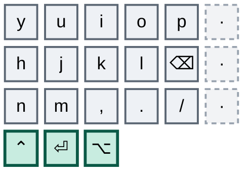

Switch off all three, on every layer, on both boards at once. Also retire the Ximi2's extra cluster here — same logic, and stage five already drained it.

This should be almost painless. If it isn't, something from stage five didn't land, and that is exactly what you want to find out now rather than after spending money.

*You've finished this stage when a week passes without the right column being missed.*

## Stage seven — retire the left column

The hard half. Tab, Escape and backtick are all high-frequency, and this is where the migration is actually decided.

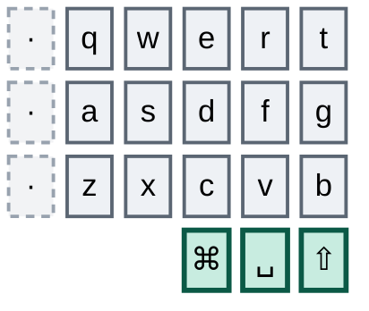

Switch all three off on both boards, delete the last combos that reference them, and live there for two full weeks.

There is an unexpected benefit to doing this on hardware that still physically has the keys: they remain under your fingers. When you hit one and nothing happens, you learn precisely which habit hasn't migrated. That feedback disappears the moment the keys are gone — which is exactly why this stage is worth two weeks rather than skipping to the purchase.

If a specific key keeps catching you, don't revert the column. Go back to stage five and give that one key a better home, then continue. Reverting teaches your hands that the old position still pays.

*You've finished this stage when two weeks pass and you stop noticing the dead columns.* This is the gate for buying hardware — the only one.

## Stage eight — order the Toucan2

Your layout already runs on it. The dead keys simply stop existing physically. There is no migration event, no adjustment day, no flashing anxiety — you have been typing this layout for weeks, on two keyboards.

Order the 36-key build, port the keymap to the new shield with the six dead entries dropped per layer, and set up the trackpad.

Two things will surprise you, both new capability rather than migration.

The columnar stagger is steeper than your Corne's and the pitch is tighter. A finger-position adjustment, not a layout one; days, not weeks.

And the trackpad will quietly change what the nav layer is for. Once pointing and scrolling are gestures, that layer's real job is arrows, word-motion, and the browser back/forward you kept. Expect to redesign it — but after a week of living with the trackpad, not in advance. You won't know what you want until you've felt what the gestures already cover.

---

## Side quest — home row mods

Optional, unscheduled, and deliberately not a gate on anything. Run it whenever you like after stage three; it does not need to be finished before you buy.

All six thumb keys survive on the Toucan2, so your all-thumb modifier strategy keeps working indefinitely. But home row mods are the difference between a 36-key board that feels cramped and one that feels roomy: thumbs stop being a bottleneck, chords stop needing a thumb-and-finger stretch, and thumb capacity frees up for the layer access a smaller board leans on harder.

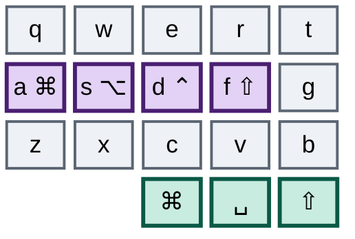

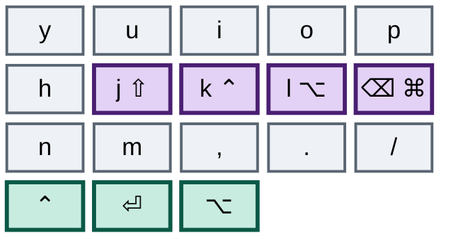

One setting decides whether you love or hate this: opposite-hand-only holds — `hold-trigger-key-positions` on the Corne, Chordal Hold or Achordion on the Ximi2. Without it, home row mods misfire constantly on same-hand rolls and you will give up within a day. Carry over the quick-tap and prior-idle values from stage three too.

Your zellij habits make this setting more load-bearing than usual. `Alt h/j/k/l` becomes left-hand Alt plus a right-hand letter — a clean opposite-hand chord, and genuinely nicer than today. But `Alt b`, `Alt c`, `Alt v`, `Alt f` and `Alt z` all target left-hand letters, so they must use the *right* hand's Alt. That is exactly what opposite-hand-only holds are for, and exactly what breaks without them.

Keep your thumb mods live throughout. Not optional if you want this to stick — on a day when the home row fights you, your hands fall back to what they know and you lose nothing.

Then tune: start around two hundred milliseconds and walk down in ten-millisecond steps until chords feel immediate without false holds mid-word. One to two weeks of misfires before it goes quiet.

This is the stage most people abandon. Abandoning it costs you nothing in this plan — that is why it lives outside the sequence.

---

## Two things worth fixing while you're in there

Your punctuation mnemonics are inconsistent across hands. The left-hand dash pair uses middle finger plus index; the right-hand plus pair uses index plus ring. Same gesture family, different fingers depending on hand — pick one pattern for both. A subtler one: dash sits above underscore, putting the *shifted* glyph below, while plus sits above equals, putting the *unshifted* glyph below. Position encodes nothing about shift state. Either convention is fine; having both isn't.

And your zellij bindings deserve a second look — though not for the reason you might expect. Your config has already done the hard ergonomic work: where stock zellij makes you press a prefix and then a letter, you bound the common actions to direct Alt and Cmd chords. There is no prefix sequence left to collapse for new pane, new tab, or moving focus. The macro opportunity most people have here, you already spent.

What remains is a narrower and more interesting problem: **several of your zellij chords ask you to hold a modifier while producing a character that your keyboard makes with a combo.** `Alt [` and `Alt ]` cycle swap layouts, but `[` and `]` are two-key combos. `Alt -`, `Alt =` and `Alt +` resize, and dash and equals are combos too. Holding Alt while rolling a two-key combo is an awkward gesture, and it gets worse in the home-row-mods side quest, where the dash combo sits on two keys that would themselves become modifiers.

Two ways out, both cheap. Give those five chords dedicated macro keys on the nav layer, so resize and layout-cycling become single presses. Or move the affected punctuation onto real keys, which the dash fix in stage three was already pointing at. The room is there either way — stage two freed eleven keys across two layers on the Corne, and its numpad layer has six consecutive dead keys on the lower-left row plus duplicates of the digits one through five that already exist on the right-hand numpad.

The only genuine two-step sequences you have left are the five Ctrl mode-entries — pane, tab, resize, session, scroll. Those are the ones worth a macro if you find yourself using any of them often.

---

## The shape of the whole thing

| Stage | What it costs you | How long |
|---|---|---|
| 1 — Make both maps honest | Nothing. No key changes. | One sitting |
| 2 — Trackpads take the pointer | Nothing. Back/forward survive. | One sitting |
| 3 — Hands off the brake | Nothing. Keys stay put, chords get faster. | One sitting |
| 4 — Converge the two boards | Two combos move to gestures you already know. | 1 week |
| 5 — Two homes for every orphan | Nothing. Both homes work. | 2–3 weeks |
| 6 — Retire the right column | Should be near-painless. | 1 week |
| 7 — Retire the left column | The real test. | 2 weeks |
| 8 — Order the Toucan2 | Nothing. Already adapted. | One evening |
| Side quest — home row mods | Some misfires. Thumbs stay as fallback. | Whenever |

Seven to nine weeks to the purchase, with two fully working keyboards every day of it. The first three stages land in one afternoon and none of them moves a key.

**One rule, and it's the only one that matters: never advance a stage on a schedule.** Advance when the previous stage's closing line is actually true of you. Stages five and seven are the ones people rush, and rushing is the only way this plan fails. And never advance on one board only — divergence between the Corne and the Ximi2 is the single thing most likely to stall the whole migration.
