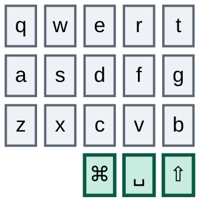
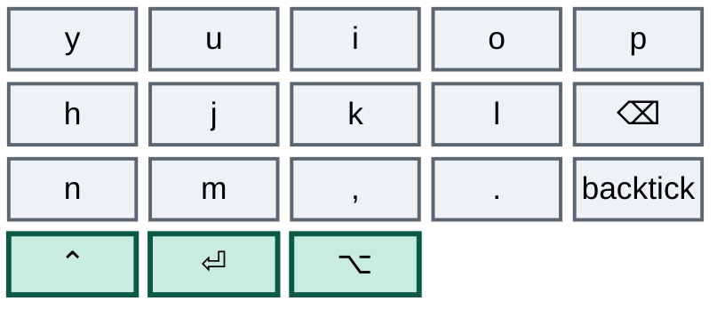
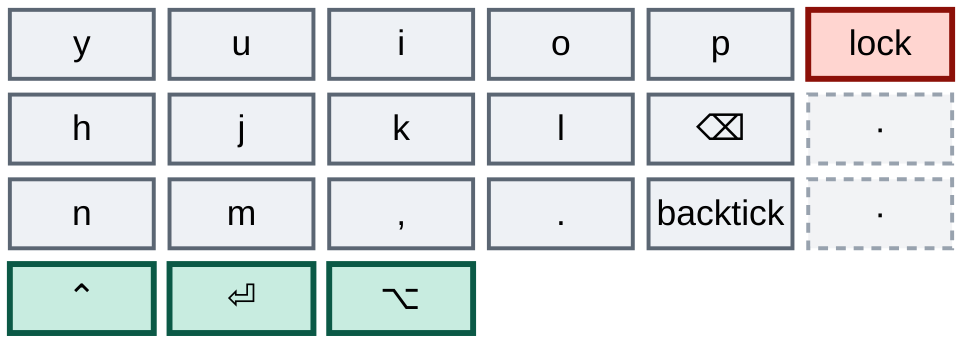
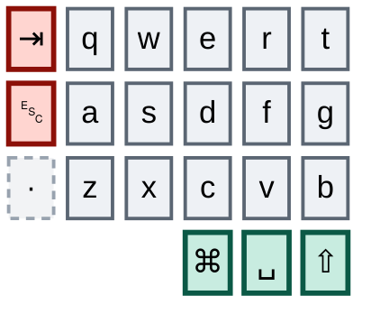
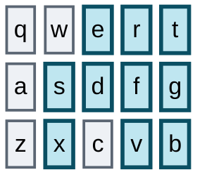
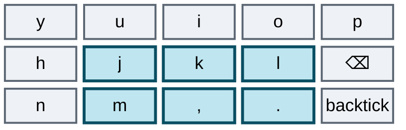
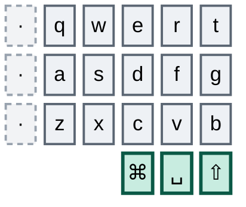
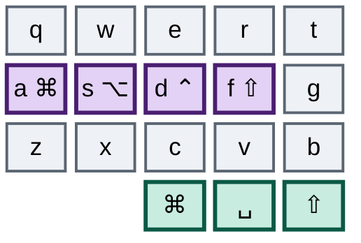
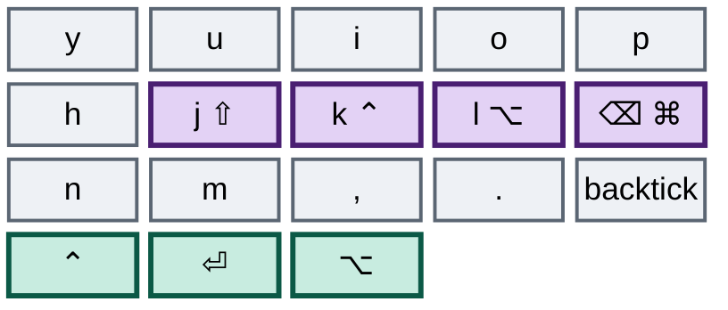

# Going Small

### One 36-key layout, two keyboards, and hardware bought only once both of them already run it

---

This is no longer a plan. It is a status report with a plan attached to the end of it.

On the **Ximi2**, the work keyboard, the right outer column is retired on every layer. Mouse emulation is gone from the keys — no movement, no scroll, nothing but the four pointer combos that survive because no trackpad maps them. Layer access was torn out and rebuilt as a uniform momentary/locked pair per layer, the same shape on every layer, learnable in an evening. Backtick found a permanent home on the right pinky bottom, which retired tilde in the same stroke. Two Vial bugs were found, understood and fixed. The left outer column's bottom key is already dead, which means that column is down to Tab and Escape and nothing else.

On the **Corne**, the home keyboard, nothing has changed. Not a binding, not a combo, not a timing value, not a macro.

That gap is the single most important fact in this document, and it is not a filing detail to be cleaned up at the end. **Convergence is the goal, not a chore on the way to it.** The endgame is one 36-key layout that runs identically on both boards — and possibly on two new pieces of hardware, since the work board needs a 36-key answer of its own: either a new Ximi, or simply pulling the outer switches off the one you have. Two boards, one layout, one set of hands.

Which means the Corne is not trailing scenery. It is half the target, and every evening spent on an unported Corne is practice on the layout you are trying to leave. That is why porting it is the very next stage rather than the last one.

---

## The destination

Thirty keys plus six thumbs — three rows of five columns per half, three thumb keys per half, columnar stagger. That is the beekeeb Toucan2's 36-key build, a Cantor/Piantor shape, and it is precisely your Corne minus the two outer pinky columns and your Ximi2 minus those same columns plus its extra cluster. All six thumb keys survive on every board.

Left half:



Right half:



One key in there has already changed identity. The right pinky's bottom position carries backtick now rather than slash, and that swap is one of the better decisions in the whole migration — the reasoning is under *Swap a redundant key for an orphan* below.

This layout is the destination for **both** boards. Hardware is the last question, not the first: a Toucan2 for home, and for work either a 36-key Ximi if one exists or the current one with its outer switches pulled. Either way you will already be typing this.

### What is still on the block

The Ximi2's right half is finished apart from one tenant. Lock screen still sits on the outer column's top key; the other two positions are dead on all six layers.



On the Corne that entire column is still live, carrying browser forward, browser back and tilde — all three of which the Ximi2 has already solved.

The left half is the hard one and it is two-thirds alive on both boards. Tab and Escape are both high-frequency, both still on the outer column, and neither has a new home yet. On the Ximi2 the bottom position is already dead, because that is where backtick used to live; on the Corne backtick is still sitting there.



The Ximi2 has one more thing to shed that the Corne never had: a four-key cluster per half, beyond the 42, carrying hyper chords, window-management arrows, browser refresh and a duplicate of the record hotkey. That cluster is the two boards' only genuine asymmetry, and because the Toucan2 has no equivalent it resolves in the Corne's favour — all eight of those keys need homes inside the core.

### Why most of your design already fits

Your punctuation system — the glyph-shape combos, the vertical pairs, the mnemonics you actually internalized — lives entirely inside the thirty keys you keep, on **both** boards. Every one of those combos is single-hand, so narrowing the halves changes nothing about how they feel.



`d`+`r` traces a `/` running up and to the right. `f`+`e` traces a `\` running down and to the right. `f`+`s` gives dash, and `x`+`v` — directly below it, same two columns — gives underscore. `t`+`g` for semicolon, `g`+`b` for pipe. All eight of those already exist on the Corne on exactly the same letters, which is why parity is nearer than it looks.



Notice what those pairs have in common: not one sits on two adjacent columns of the same hand. `f`+`s` skips `d`. `x`+`v` skips `c`. `j`+`l` skips `k`, and `m`+`.` skips the comma. `t`+`g` and `g`+`b` are vertical, inside a single column. The two newest combos on the board obey it too: `i`+`p` skips `o` and `k`+`⌫` skips `l`. That isn't decoration — a typing roll travels across *neighbouring* columns, so a combo built on a skipped column, or on one column alone, cannot be caught by a roll. Every combo added from here obeys the same constraint, which rules out tempting pairs like `s`+`d` however convenient they look. The two established diagonals, `d`+`r` and `f`+`e`, and the two bracket pairs, `q`+`s` and `a`+`w`, do cross adjacent columns. They are grandfathered because your hands already run them daily, not because they set a precedent.

---

## What you learned by doing it

None of this was in the original plan. All of it came out of actually moving keys, and it is the most durable thing the migration has produced so far.

**Tap dances are a tax you stopped paying.** Twelve tap-dance slots are configured on the Ximi2. Two are still bound to anything. Everything else — the Cmd dance, the Alt dance that wrapped a one-shot modifier, the dance on the period key, the dance on backtick, the dance that hung the lock screen off a triple-tap — became a plain modifier or a plain key, and every one of those changes made the board feel faster the same day. A tap dance charges its tapping term on the common case so the rare case can exist, and once you priced that honestly there was almost nothing left worth buying. The Corne is where the bill is largest and unpaid: Cmd and Alt are still dances with a **four-hundred-millisecond** tapping term, sitting on the two modifiers your zellij config leans on hardest.

`td[4]` is the one exception and it survives on purpose. Tap Ctrl, hold Ctrl, double-tap the record hotkey, 210 ms. It is a deliberate bill being paid on the Corne's behalf: the Corne has no spare key for that hotkey, every position that could take it is either load-bearing or already doomed, so double-Ctrl is the shape that habit has to keep. It stays until the Corne has somewhere better to put it.

**Combo overlaps are acceptable.** Thirteen subset relationships exist among the twenty-three live combos — `f`+`s` inside all four home-row layer combos, `f`+`e` inside both nav ones, `j`+`l` inside `j`+`k`+`l`, `m`+`.` inside `m`+`,`+`.`, `x`+`v` inside both layer-5 combos, and the three-key combos inside their own four-key locking variants. The old reading of that was a design defect. The correct reading is narrower: QMK does not fire a combo the instant its keys are all down. While a longer combo containing those same keys is still reachable, it waits. `x`+`v` does not escape merely because `x` and `v` are both held; it escapes only when the third key lands after `COMBO_TERM` has already expired. That is a timing bug, not an always-on one — it fires on a slow roll and never on a fast one, which makes it the one class of bug that gets rarer the more you use the board. Not worth retraining deep muscle memory to remove.

**When a punctuation combo collides with a layer combo, move the layer combo, not the punctuation.** Punctuation is older muscle memory and it is reflexive; a layer gesture is deliberate and rare, so the deliberate one is always the cheaper thing to re-teach. This is the principle that briefly turned `x`+`c`+`v` into `x`+`c`+`b`, stepping the layer-5 entrance clear of the underscore. It worked exactly as predicted, and it went back once overlaps were accepted — the premise underneath it had changed, not the reasoning. The principle still governs anything newly added.

**Retire a key by killing it, not by dual-homing it — when failure is cheap.** The original plan said keep both homes live for two to three weeks and let your hands drift to whichever is cheaper. In practice a dead key turns out to be *feedback*. You press it, nothing happens, and you learn precisely which habit hasn't migrated and how often. Dual-homing hides exactly that signal, because the old key keeps paying and your hands never have a reason to stop. Killing the right column outright cost a few days of mild irritation and bought a complete inventory of what still reached outward. Dual-homing remains the right tool for Tab and Escape, where a miss is expensive mid-flow rather than merely annoying — that is the distinction, not a blanket rule either way.

**Swap a redundant key for an orphan.** Backtick took the slash key on the right pinky bottom. Slash surrendered it without complaint, because slash already had a home: `d`+`r` has traced that glyph for as long as you have had combos, and your hands reach for the combo rather than the key. So the pinky position was housing the glyph that needed housing least, while backtick — which you need constantly for code fences — had a key or it had nothing. One move retired two doomed keys instead of one, because tilde is nothing but shifted backtick, so it left the right outer column in the same stroke. Look for that shape again: a base key whose glyph is already reachable another way is not occupied, it is available.

**Base-layer positions are the scarcest resource, because they are the only combo-eligible ones.** Every base position you spend on something reachable elsewhere is a combo you cannot define later. That is the real argument against sugar macros on base keys: `./` and `~/` are conveniences, they save two keystrokes each, and neither belongs anywhere near the base layer. Put them on a layer, where the cost is a layer hop and the base position stays available.

**Frequency-weight the good slots.** The symbols layer had to route around one fixed point — `⌥6` could not move — and everything else bent to it. Given that, the high-frequency `⌥←`/`⌥→` pair took the tight adjacent slot on the bottom row where the hand already goes, paying for it with `⌥3`, which is gone and unmissed. The rarely-used `⌥⌃←`/`⌥⌃→` took the wide bookend spread across the top row instead. The awkward position goes to the thing you press least; that is the whole rule, and it is easy to get backwards when you lay out a layer by category instead of by frequency.

---

## Two Vial mechanics that will bite you

**These are Vial mechanics, not keyboard mechanics.** Both cost a debugging round on the work board, both produce no error and no log line, and neither one exists on the Corne. Read the ZMK contrast at the end of this section before porting anything.

**Combos match resolved keycodes, not key positions.** Vial stores a combo as a list of keycodes and fires it when the keys you are holding currently *produce* those keycodes. Wrap a base-layer key in `TD()` and it stops producing its own keycode — it produces the dance — so it silently drops out of every combo that named the underlying keycode. The combo stays in the file, looks correct in the editor, and never fires again. Putting `.` behind a tap dance is what killed `m`+`.` → `=`, and since `=` existed nowhere else in the layout, equals stopped existing on the keyboard entirely. The same mechanism had already killed `ESC`+`` ` `` earlier, when backtick went behind a dance of its own. The corollary is the rule worth keeping: on Vial, a combo whose trigger keycode is absent from the base layer is inert.

**Vial's double-tap slot replaces both taps rather than adding a second one.** Set it to the same keycode as the tap action, on the reasoning that two taps should obviously do the thing twice, and you get the opposite: two taps emit one character. Leave the slot at `KC_NO` and two taps give you the tap keycode twice, the way an ordinary key does. This is what broke ```` ``` ```` on the backtick key — the dance was eating backticks in pairs and the fence never closed.

**Neither trap exists in ZMK, and the mirror image does.** A ZMK combo is declared as `key-positions = <14 16>` — it binds to *positions*, not to keycodes. Wrapping position 16 in a tap-dance, a hold-tap or anything else does not orphan a single combo, because the combo never asked what that key produces. The `TD()` hazard simply is not there. ZMK tap-dances are likewise a plain list of bindings rather than Vial's four fixed slots, so the double-tap substitution behaviour does not apply either. What ZMK breaks on instead is the opposite move: shift a key to a different *position* and every combo naming the old position now fires on whatever moved into it, silently and wrongly. Vial's combos survive a key move and break when a key is wrapped; ZMK's survive a wrap and break when a key moves. Different failure modes, same discipline — re-read the combo table after every change, and know which question to ask of which board.

---

# The journey

## Stage one — retire the right column

**Status — Ximi2: done, bar one tenant. Corne: not started.**

This is the stage that proved the whole thing is possible, and it went faster than the plan allowed for. All three keys of the right outer column are bound to nothing on every layer, with exactly one exception: `M10`, lock screen, still sits on the base layer as that column's sole remaining tenant. It is deferred rather than forgotten, and it needs a core home.

Four things about how it actually happened diverge from what was written down, and in three of the four cases the real version is better.

**Backtick went to the slash key, not to the symbols layer.** The plan proposed parking it on layer 1, which has room. What happened instead retires two doomed keys with one edit and charges no layer hop for a code fence. This is the *swap a redundant key for an orphan* principle, and it was discovered here.

**Browser back and forward became core combos, not nav-layer keys.** The plan put them on the nav layer directly under the left and right arrows, in matching columns, which is tidy and which charges a layer hop for something you fire dozens of times an hour while reading. What they got is `i`+`p` for forward and `k`+`⌫` for back — two-key rolls on the base layer, both skipping a column, both on the right hand where those actions have always lived. The reach that used to go outward now rolls inward and nothing changes sides.

**Layer access was rebuilt wholesale, not patched.** The plan asked only that the sticky layer-5 entrance be deleted and a single deliberate switch kept. What exists now is a uniform pair applied to every layer at once:

| Layer | Momentary | Locked |
|---|---|---|
| 2 — nav | `s`+`e`+`f` | `a`+`s`+`e`+`f` |
| 3 — numpad | `s`+`d`+`f` | `a`+`s`+`d`+`f` |
| 4 — function | `j`+`k`+`l` and `m`+`,`+`.`, both one-shot | none, by choice |
| 5 — F-keys | `x`+`c`+`v` | `z`+`x`+`c`+`v` |

Read the shapes and the scheme teaches itself: the momentary gesture is three keys, the locked one is the same three with the pinky added ahead of them. You never have to remember which layer works which way. Layer 4 is the deliberate exception with no locked form — the function layer is the one you enter to press exactly one key, so one-shot is the whole point and a lock would be a trap. Layer 2 is additionally a hold on the left middle thumb, because it is the layer you live in. The return trip is final too: `TO(0)` sits on the inner-index top key, the `t` position, on layers 2, 3, 4 and 5, and that column survives the left-column retirement, so the escape hatch you are learning now is the escape hatch you keep.

**The dash collision was left in place.** The plan's fix was to move the punctuation — dash to `d`+`g`, underscore to `c`+`b`. That was not taken. The mirror-image fix was taken instead and then, once overlaps were accepted as a timing cost rather than a defect, even that was reverted. `f`+`s` still sits inside all four home-row layer combos and will keep doing so.

Two costs were accepted with eyes open, and they are decisions rather than bugs. The first is a **direction reversal**: the symbols layer's bottom-row pinky used to be `⌥⌃←` and is now `⌥→`, pointing the other way. It is the only genuine muscle-memory inversion in the whole redesign, and it is the price of frequency-weighting the good slots. The second is the **combo overlaps**, thirteen of them, for the reason given above.

*You finished this stage when a week went by without the right column being missed — which it did, almost immediately, and more easily than anyone expected.*

## Stage two — bring the Corne to parity

**Status — not started, and it is the next thing to do.**

The Corne was left behind on purpose and the deferral has already paid for itself. A change on the work board is tested against eight hours a day of real typing inside a week, where the same change at home would take a month to earn the same confidence, and porting a design nobody has lived in is how you end up porting it twice. That was a tactical choice. It must not become a structural one.

Here is why it can't wait. **Every evening on an unported Corne is practice on the old layout.** Your hands spend those hours rehearsing exactly the reaches you are trying to retire — the outer column, the old bracket combos, the four-hundred-millisecond modifiers — and the two habits compete the entire time. This is the same mechanism that made the work board the right place to learn, running in reverse and undoing the learning. The longer the gap stays open, the more of stage one's gain leaks away between six in the evening and nine in the morning.

The work is mostly mechanical, because the two boards were never far apart. The punctuation combos are already on identical letters. What has to change:

| What | On the Corne today | Port to |
|---|---|---|
| Right outer column | browser forward, browser back, tilde, on every layer | `&none` on every layer |
| Backtick | left outer bottom | right pinky bottom, taking the slash key |
| Slash | right pinky bottom | combo only, `d`+`r`, which already exists |
| `[` and `]` | Tab+`a` and `q`+Escape — both anchored on doomed keys | `q`+`s` and `a`+`w` |
| Browser back / forward | outer-column keys | `k`+`⌫` and `i`+`p` |
| Layer access | `s`+`d`+`f`, `s`+`e`+`f`, `.`+`l`, sticky variants, 60-second release | the uniform momentary/locked table above |
| Cmd, Alt | tap-dances at 400 ms | plain modifiers |
| Ctrl | `control_record` tap-dance | keep the dance — this is the habit the Ximi2 is preserving for it |
| Mouse | movement, scroll, `CONFIG_ZMK_MOUSE`, both mouse headers | delete, keeping the four pointer combos |
| Combo scope | none — all 32 fire on all six layers | scope to the base layer |
| Layer-tap protection | none of any kind | `quick-tap-ms`, `require-prior-idle-ms`, `flavor` |

Two things do **not** port. The Corne's Bluetooth layer has a clean select/disconnect grid the Ximi2 has no use for; wireless is the one place the boards may legitimately differ, and that grid stays Corne-only. And the two Vial mechanics above are Vial's, not the keyboard's — ZMK combos bind to key positions, so a behaviour wrapped around a key orphans nothing, and ZMK tap-dances have no double-tap substitution slot. Do not port a phantom constraint. Port the *discipline* instead, inverted: in ZMK it is moving a key to a new position that breaks the combos naming the old one.

Do this as one sitting, not as a drip. A half-ported Corne is worse than an unported one, because then neither board is a reliable model of the other.

*You've finished this stage when you can sit down at either keyboard and not notice which one it is.*

## Stage three — housekeeping, both boards

**Status — not started on either board.**

None of this changes anything you press. All of it blocks clear thinking, and you are about to do a lot of thinking about where eight more keys should go.

On the **Ximi2**, in rough order of how much confusion it causes:

- **Ten unused tap-dance slots.** Twelve are configured, only `TD(2)` and `TD(4)` are bound to anything. Every one of the other ten is a trap for a future reader who assumes a populated slot means a live behaviour.
- **Orphan macros `M11`, `M21`, `M25`, `M26`.** `M25` and `M26` are byte-for-byte duplicates of `M16` and `M17`, which are live on the encoder; `M11` and `M21` are two-step chords nothing calls.
- **`M4` and `M12` are both `./`.** Two macro slots, one string, both bound on the function layer.
- **Combo slot `UI31` is malformed.** No trigger keys at all, but a `KC_BTN1` output keycode still stranded in the slot. It can never fire. It is the kind of half-deleted thing that makes you doubt the rest of the table.
- **Layer 3's duplicated `9`.** The numpad's top row has `9` twice, so one numpad position is silently dead. Pre-existing, known, still unfixed.
- **Layer 2 binds `⇧⌘E` on two different keys.** One of those two positions is free and nobody knows it.
- **`td[2]` gates layer 1's Shift** behind a 200 ms dance while base-layer Shift is plain. The tap-dance tax in miniature, on a modifier, with no justification anyone can reconstruct.

On the **Corne**, a bigger pile and an older one: twelve unreferenced macros, nine of them exact duplicates, including two copies each of fold, unfold and fold-all; two macros whose names are inverted, where `fold` binds unfold and `expand` binds fold; ASCII diagrams that disagree with the bindings in roughly thirty places, including combo comments that name the wrong letters entirely; `scroll-right` bound on two adjacent keys while `scroll-left` appears nowhere; `thisisunsafe` bound twice; and a Bluetooth layer with no `display-name`, so ZMK Studio shows it by raw node name. Most of that dies with stage two anyway. What survives it, fix here.

*You've finished this stage when you can read either board's layer map and believe it, and nothing in either file is defined twice.*

## Stage four — drain the Ximi2's extra cluster

**Status — Ximi2 only, not started. Nothing to do on the Corne.**

This is the two boards' one real asymmetry, and it resolves in the Corne's favour: the Corne has no such cluster, the Toucan2 has no equivalent, so everything on it needs a home inside the core. Four keys per half. What is on them today:

| Half | Contents |
|---|---|
| Left | Three hyper chords — hyper-D, hyper-F, hyper-M — with hyper-M bound twice |
| Right | `⌃⌥←` and `⌃⌥→`, browser refresh, and a duplicate of the record hotkey |
| On layer 1 | `⌘⌥` arrows on all four positions, plus two more hyper chords |

The duplicate hyper-M and the duplicate record hotkey can simply go — one copy of each is enough, and the record hotkey already lives on the double-tap of `td[4]`. The `⌘⌥` arrows are window management and belong on the nav layer, in positions that also exist on the Corne, which is now the binding constraint on where anything lands. Browser refresh and the hyper chords need real homes and there is room: the nav layer has a hole at the inner-index top position, and layer 3's entire bottom row is empty.

One tail end belongs here too. The base-layer **encoder** still turns as wheel up and wheel down — the last scrap of mouse emulation on the board, missed by the pointer purge because it is not a key. It has no Toucan2 equivalent either, so it goes out with the cluster.

Do not switch the cluster off before its contents have somewhere to go. This is the one move in the whole migration that would cost you working shortcuts rather than merely comfort.

*You've finished this stage when every Ximi2 key outside the 36 is bound to nothing, and you have not lost a single shortcut.*

## Stage five — find homes for the left outer column

**Status — not started, and largely undecided. This is where the open questions live.**

This is the stage the document cannot finish for you. The right column was easy because almost nothing on it was load-bearing. The left column is the opposite: it holds two of the keys you press most, and the decisions have not been made. Whatever is decided here applies to both boards at once — that is the point of having done stage two first.

Here is everything currently living on it, across all six layers:

| Layer | Top | Middle | Bottom |
|---|---|---|---|
| 0 — base | `⇥` | `␛` | backtick, until stage two moves it |
| 1 — symbols | `DF(0)` | `␛` | `?` |
| 2 — nav | `TO(0)` | `␛` | `LCTL(GRAVE)` |
| 3 — numpad | `TO(0)` | `DF(0)` | dead |
| 4 — function | `TO(0)` | `DF(0)` | Caps Lock |
| 5 — F-keys | `TO(0)` | transparent | transparent |

Read that table and most of the column turns out to be return-to-base keys. `TO(0)` is already prepared on the inner-index top key — the `t` position — on layers 2, 3, 4 and 5, and that column survives. So the left-outer `TO(0)` and `DF(0)` copies may simply be deletable rather than relocatable. That is worth confirming key by key rather than assuming: `DF(0)` and `TO(0)` are not the same instruction, and layer 1 has no `t`-position escape hatch at all.

**Escape** is the hard one and the candidate on the table is `w`+`x` — top and bottom of the middle-finger column, skipping the home row entirely. It obeys the single-column rule, which is exactly what you want for a key that must be both fast and impossible to fire by accident, and between vim and LLM shells you press it constantly. It is also the one combo where getting it wrong is genuinely disruptive, which argues for dual-homing this one rather than killing the key outright.

**Tab** has no candidate yet. Shell completion drives it, so it needs to be cheap. The symbols-layer thumb area and the left inner column are both plausible, and neither has been tried. Note that Tab is also the anchor of the `⇥`+`b` prose macro, which goes dark the moment the key does — so wherever Tab lands, that combo needs re-anchoring inside the core on a skipped-column or single-column shape. A twenty-three-character macro is the last thing you want a roll to fire.

**`?` on layer 1** may not need a home at all. Slash already exists as `d`+`r`, and `?` is shifted slash — so the question is simply whether Shift plus the `d`+`r` combo produces it cleanly, which is a five-minute test nobody has run.

**`LCTL(GRAVE)`** — Ctrl plus backtick, the terminal-cycling chord — and **Caps Lock** are unresolved, and both are low-frequency enough that they could reasonably be dropped rather than moved. Caps Lock has a near-substitute already on the board in `caps_word`; the terminal chord does not.

*You've finished this stage when every tenant of the left outer column has either a decided new home or a decided execution, on both boards.*

## Stage six — retire the left column

**Status — not started on either board. This is the gate.**

The real test. Bind all three positions to nothing on every layer, on both boards at once, delete the last combos that reference them, and live there for two full weeks.



There is a second way to do this, and it is worth naming because it is free and available today: **physically pull the outer keycaps, or the switches.** On both boards. It costs nothing, it takes minutes, and it is a far stronger commitment device than `&none` — you cannot absent-mindedly press a key that is not there, and there is no config change to quietly revert on a bad afternoon.

The trade-off is real and it cuts the other way. A key that is dead but still physically present is *feedback*. You hit it, nothing happens, and you learn exactly which habit hasn't migrated and how often. That is the whole diagnostic value of these two weeks, and it disappears the moment the keycap is in a drawer — a finger landing on bare plate tells you something happened, but not nearly as precisely. There is also a middle route: run the two weeks with the keys dead but present, harvest the feedback, and pull the caps afterwards as the thing that makes it permanent.

Either way, if a specific key keeps catching you, don't revert the column. Go back to stage five, give that one key a better home, and continue. Reverting teaches your hands that the old position still pays.

*You've finished this stage when two weeks pass, on both boards, and you stop noticing the dead columns.* This is the gate for buying hardware — the only one, and it may now gate two purchases rather than one.

## Stage seven — buy the hardware

**Status — not started. Gated on stage six.**

Your layout already runs on it, on both boards. The dead keys simply stop existing physically. There is no migration event, no adjustment day, no flashing anxiety — you will have been typing this layout for weeks.

For home: order the Toucan2's 36-key build, port the keymap to the new shield with the six dead entries dropped per layer, and set up the trackpad. For work there are two routes and they cost very differently. A 36-key Ximi, if such a build exists, is the clean answer. De-keying the board you already own is the free one — pull the outer switches, keep everything else, accept that the extra cluster is still physically there and decide separately whether it stays usable or goes dark for parity. Neither route needs deciding now; both are downstream of the gate.

Two things will surprise you on the Toucan2, both new capability rather than migration. The columnar stagger is steeper than the Corne's and the pitch is tighter — a finger-position adjustment, not a layout one, and days rather than weeks. And the trackpad will quietly change what the nav layer is for. Once pointing and scrolling are gestures, that layer's real job is arrows, word-motion and the browser back/forward you kept. Expect to redesign it, but after a week of living with the trackpad rather than in advance.

---

## Side quest — home row mods

**Status — not started on either board, and genuinely optional.**

All six thumb keys survive on the Toucan2, so the all-thumb modifier strategy keeps working indefinitely. But home row mods are the difference between a 36-key board that feels cramped and one that feels roomy: thumbs stop being a bottleneck, chords stop needing a thumb-and-finger stretch, and thumb capacity frees up for the layer access a smaller board leans on harder.

There is a tension here that has to be named rather than skipped. **Home row mods are hold-taps, and hold-taps are the same family of latency the tap-dance purge was about.** Every one of the eight keys below would gain a timing decision it does not have today, on the eight positions your hands rest on. Someone who just finished deleting ten tap dances because they made the board feel slow is entitled to be suspicious of this, and that suspicion is correct in the general case.





The difference from a tap dance is that a hold-tap's latency can be made conditional, and that is the whole question. **Opposite-hand-only holds** — `hold-trigger-key-positions` on the Corne, Chordal Hold or Achordion on the Ximi2 — resolve a same-hand press as a tap immediately, with no waiting at all, so the tax applies only to cross-hand chords where you were going to hold anyway. Without that setting, home row mods misfire constantly on same-hand rolls and you will give up within a day, correctly. With it, the decision is genuinely different in kind from a tap dance. That one setting decides whether this is tolerable, so test it before committing to anything else here. One caution on the work board: Chordal Hold and Flow Tap are recent QMK features and Vial firmware often lags mainline, so check what your fork supports before planning around it.

Your zellij habits make it more load-bearing than usual. `Alt h/j/k/l` becomes left-hand Alt plus a right-hand letter — a clean opposite-hand chord, and genuinely nicer than today. But `Alt b`, `Alt c`, `Alt v`, `Alt f` and `Alt z` all target left-hand letters, so they must use the *right* hand's Alt. That is exactly what opposite-hand-only holds are for, and exactly what breaks without them.

Keep the thumb mods live throughout. On a day when the home row fights you, your hands fall back to what they know and you lose nothing. Then tune: start around 200 ms and walk down in 10 ms steps until chords feel immediate without false holds mid-word. Expect one to two weeks of misfires before it goes quiet.

This is the stage most people abandon. Abandoning it costs you nothing here — that is why it lives outside the sequence.

---

## Open questions

Unresolved, and listed rather than papered over. Most of stage five is in here.

1. **Where does Escape go?** `w`+`x` is the proposal — top and bottom of the middle-finger column, skipping the home row. Untested. It is also the strongest candidate for dual-homing rather than a clean kill, because a missed Escape mid-vim is expensive in a way a missed Tab is not.
2. **Where does Tab go?** No candidate. Symbols-layer thumb area and left inner column are both untried.
3. **Can `?` on layer 1 just be Shift plus `d`+`r`?** If shifted combo output works cleanly, the layer-1 bottom key needs no replacement at all. Five-minute test, never run.
4. **Are the left-outer `TO(0)` and `DF(0)` copies redundant now** that `TO(0)` is on the `t` position on layers 2 through 5? Probably yes for `TO(0)`, unclear for `DF(0)`, and layer 1 has no `t`-position escape hatch at all. Confirm rather than assume.
5. **What happens to `LCTL(GRAVE)` and Caps Lock?** Both are low-frequency enough to drop rather than relocate. `caps_word` is a near-substitute for one of them; nothing substitutes for the other.
6. **Is slash staying combo-only acceptable permanently?** It has been fine for weeks, but weeks of a combo-only glyph is not the same test as a year of it, and file paths are a thing you type.
7. **Do home row mods happen at all,** given how much better the board felt after the tap dances came out? The answer depends entirely on whether opposite-hand-only holds behave as advertised on both firmwares.
8. **Where does `M10` go?** Lock screen is the last tenant of the right outer column, and it is currently the only thing keeping that column from being entirely dead.
9. **Does a 36-key Ximi build exist at all?** Unknown, and worth finding out before stage seven rather than during it. If it does not, de-keying the current board is the only route for work, which changes nothing about the plan but changes what stage seven costs.
10. **If the current Ximi2 is kept and de-keyed rather than replaced, what happens to the extra cluster?** It stays physically present whether or not the outer columns do. Does it remain usable as a work-board bonus, or does it go dark too, so that both boards are the same 36 keys and nothing is muscle memory in only one place?

---

## The shape of the whole thing

| Stage | What it costs you | Ximi2 | Corne |
|---|---|---|---|
| 1 — Retire the right column | Almost nothing, as it turned out | **Done**, bar the lock key | Not started |
| 2 — Bring the Corne to parity | One sitting of config work | Source of truth | **Next** |
| 3 — Housekeeping, both boards | Nothing. No key changes | Open | Open, and a bigger pile |
| 4 — Drain the extra cluster | Nothing, if drained before it is cut | Not started | Not applicable |
| 5 — Homes for the left outer column | Thinking, mostly | Not started, largely undecided | Same decisions, both boards |
| 6 — Retire the left column | The real test. Two weeks | Not started | Not started |
| 7 — Buy the hardware | Money — possibly twice | Gated on stage 6 | Gated on stage 6 |
| Side quest — home row mods | Some misfires. Thumbs stay as fallback | Not started | Not started |

Two rules, and they are the same two the plan started with. **Never advance a stage on a schedule** — advance when the previous stage's closing line is actually true of you; stages five and six are the ones worth being slow about. And **never advance on one board alone.** That second rule was suspended for exactly one stage, knowingly, and stage two is where it comes back into force. From there on the two boards move together, because a single layout on two keyboards was the whole point.
