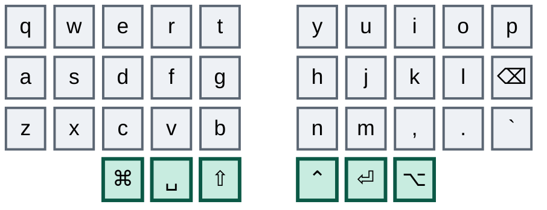
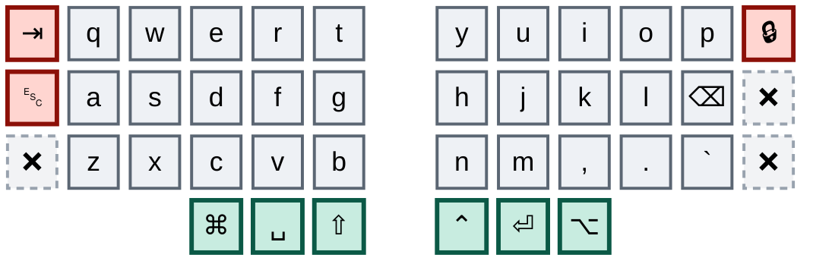
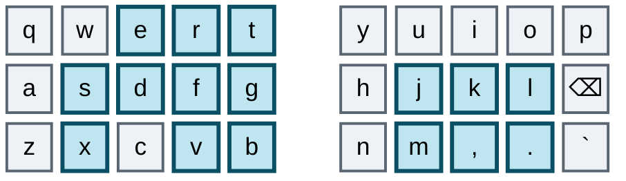
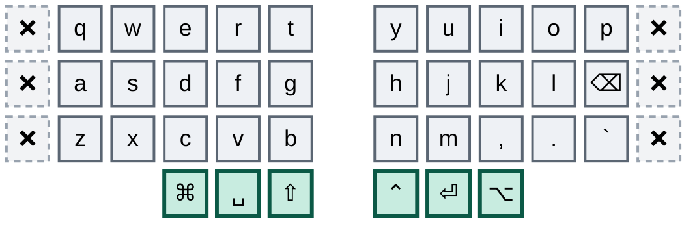
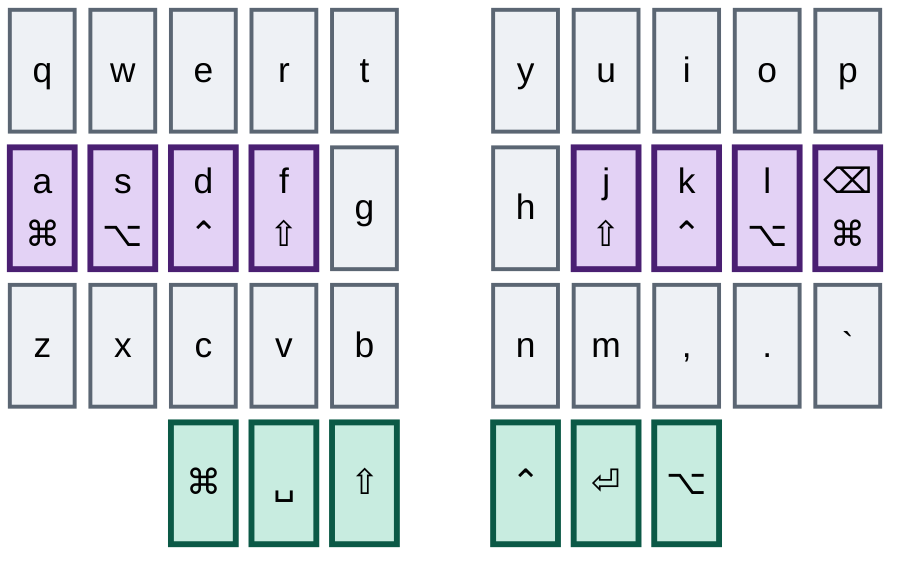

# Going Small

### One 36-key layout, two keyboards, and hardware bought only once both of them already run it

---

This is no longer a plan. It is a status report with a plan attached to the end of it.

On the **Ximi2**, the work keyboard, the right outer column is retired on every layer. Mouse emulation is gone from the keys — no movement, no scroll, nothing but the four pointer combos that survive because no trackpad maps them. Layer access was torn out and rebuilt as a uniform momentary/locked pair per layer, the same shape on every layer, learnable in an evening. Backtick found a permanent home on the right pinky bottom, which retired tilde in the same stroke. Two Vial bugs were found, understood and fixed. The left outer column's bottom key is already dead, which means that column is down to Tab and Escape and nothing else.

On the **Corne**, the home keyboard, all of that has now landed, in one sitting. `config/corne.keymap` is a position-for-position port of `akiva.vil`: every binding on all six layers matches the Ximi2, and the only things left behind are the ones the Corne does not physically have — the outer seventh column, the extra per-half cluster, the rotary encoders, the attached mouse.

That gap was the single most important fact in this document, and closing it was never a filing detail to be cleaned up at the end. **Convergence is the goal, not a chore on the way to it.** The endgame is one 36-key layout that runs identically on both boards — and possibly on two new pieces of hardware, since the work board needs a 36-key answer of its own: either a new Ximi, or simply pulling the outer switches off the one you have. Two boards, one layout, one set of hands.

Which is why the Corne was never trailing scenery. It is half the target, and every evening spent on an unported Corne was practice on the layout you are trying to leave. That is why porting it jumped the queue instead of closing it, and it is why the rule about never advancing on one board alone is back in force from here. What is left to decide is the left outer column, and it is now the same decision on both boards at the same time.

---

## The destination

Thirty keys plus six thumbs — three rows of five columns per half, three thumb keys per half, columnar stagger. That is the beekeeb Toucan2's 36-key build, a Cantor/Piantor shape, and it is precisely your Corne minus the two outer pinky columns and your Ximi2 minus those same columns plus its extra cluster. All six thumb keys survive on every board.



One key in there has already changed identity. The right pinky's bottom position carries backtick now rather than slash, and that swap is one of the better decisions in the whole migration — the reasoning is under *Swap a redundant key for an orphan* below.

This layout is the destination for **both** boards. Hardware is the last question, not the first: a Toucan2 for home, and for work either a 36-key Ximi if one exists or the current one with its outer switches pulled. Either way you will already be typing this.

### What is still on the block

Both right halves are now finished apart from one tenant, and it is the same tenant on each. Lock screen still sits on the outer column's top key; the other two positions are dead on all six layers, on both boards.

The Corne's copy of that column used to carry browser forward, browser back and tilde. All three are gone: forward and back rolled inward onto `i`+`p` and `k`+`⌫`, and tilde left with the backtick move, since tilde is nothing but shifted backtick. What the plan asked for was that column dead on every layer, and that is not quite what happened — `m10` survives on it, because the lock screen has no home inside the core yet and inventing a bad one to satisfy a diagram would be the wrong trade. It is a named deferral on both boards rather than an oversight on either.

The left half is the hard one and it is two-thirds alive on both boards. Tab and Escape are both high-frequency, both still on the outer column, and neither has a decided execution yet — though Escape now has a combo, which is new since this was written and is covered in stage five. The bottom position is dead on both boards: that is where backtick used to live, and the same move that freed it on the Ximi2 freed it on the Corne.



The Ximi2 has one more thing to shed that the Corne never had: a four-key cluster per half, beyond the 42, carrying hyper chords, window-management arrows, browser refresh and a duplicate of the record hotkey. That cluster is the two boards' only genuine hardware asymmetry, and because the Toucan2 has no equivalent it resolves in the Corne's favour — all eight of those keys need homes inside the core.

### Why most of your design already fits

Your punctuation system — the glyph-shape combos, the vertical pairs, the mnemonics you actually internalized — lives entirely inside the thirty keys you keep, on **both** boards. Every one of those combos is single-hand, so narrowing the halves changes nothing about how they feel.



`d`+`r` traces a `/` running up and to the right. `f`+`e` traces a `\` running down and to the right. `f`+`s` gives dash, and `x`+`v` — directly below it, same two columns — gives underscore. `t`+`g` for semicolon, `g`+`b` for pipe. All eight of those now exist on both boards on exactly the same letters, which is what made parity nearer than it looked.

Notice what those pairs have in common: not one sits on two adjacent columns of the same hand. `f`+`s` skips `d`. `x`+`v` skips `c`. `j`+`l` skips `k`, and `m`+`.` skips the comma. `t`+`g` and `g`+`b` are vertical, inside a single column. The newest combos obey it too: `i`+`p` skips `o`, `k`+`⌫` skips `l`, `q`+`e` — Escape, added since this was written — skips `w`, and `q`+`b` spans the whole hand. That isn't decoration — a typing roll travels across *neighbouring* columns, so a combo built on a skipped column, or on one column alone, cannot be caught by a roll. Every combo added from here obeys the same constraint, which rules out tempting pairs like `s`+`d` however convenient they look. The two established diagonals, `d`+`r` and `f`+`e`, and the two bracket pairs, `q`+`s` and `a`+`w`, do cross adjacent columns. They are grandfathered because your hands already run them daily, not because they set a precedent.

---

## What you learned by doing it

None of this was in the original plan. All of it came out of actually moving keys, and it is the most durable thing the migration has produced so far.

**Tap dances are a tax you stopped paying.** The Ximi2's dance table is down to two live entries out of thirty-two slots — Shift on the left thumb, which becomes Caps Lock on a tap-then-hold, and the Ctrl-and-record dance on the right. Everything else — the Cmd dance, the Alt dance that wrapped a one-shot modifier, the dance on the period key, the dance on backtick, the dance that hung the lock screen off a triple-tap — became a plain modifier or a plain key, and every one of those changes made the board feel faster the same day. A tap dance charges its tapping term on the common case so the rare case can exist, and once you priced that honestly there was almost nothing left worth buying. The Corne is where the bill was largest, and the port paid it: `gui5` and `alt5` are deleted, so the **four-hundred-millisecond** tapping term is off Cmd and Alt — the two modifiers your zellij config leans on hardest — and both are plain keys now. `td10`, which hung the lock screen off a triple-tap, went with them.

The Ctrl dance is the one exception and it survives on purpose, on both boards — `td[1]` on the Ximi2, `control_record` on the Corne, both at 210 ms. Tap Ctrl, hold Ctrl, double-tap for the record hotkey. It was always a bill being paid on the Corne's behalf, and the port kept it deliberately rather than taking the easy win: the Corne still has no spare key for that hotkey, every position that could take it is either load-bearing or already doomed, so double-Ctrl is the shape that habit has to keep. It stays until the Corne has somewhere better to put it.

The left thumb is the one place the purge could not reach. The Ximi2's Shift there is a dance — tap for Shift, tap-then-hold for Caps Lock — and ZMK has no tap-then-hold slot to express it. A double-tap-to-caps would have been the obvious substitute and is the wrong one, because it fires the moment you type two capitals in a row. So the Corne's left thumb is a plain Shift, Caps Lock lives on layer 4's left outer column, and Caps Word on layer 4's left inner thumb. That is the third and last deliberate difference between the two maps, and the only one where the Corne is the poorer of the two.

**Combo overlaps are acceptable.** Thirteen subset relationships exist among the Ximi2's twenty-four live combos, and the same thirteen exist among the Corne's twenty-eight — `f`+`s` inside all four home-row layer combos, `f`+`e` inside both nav ones, `j`+`l` inside `j`+`k`+`l`, `m`+`.` inside `m`+`,`+`.`, `x`+`v` inside both layer-5 combos, and the three-key combos inside their own four-key locking variants. The old reading of that was a design defect. The correct reading is narrower: QMK does not fire a combo the instant its keys are all down. While a longer combo containing those same keys is still reachable, it waits. `x`+`v` does not escape merely because `x` and `v` are both held; it escapes only when the third key lands after `COMBO_TERM` has already expired. That is a timing bug, not an always-on one — it fires on a slow roll and never on a fast one, which makes it the one class of bug that gets rarer the more you use the board. ZMK defers to the longer combo the same way, so the reading transferred to the Corne intact rather than needing to be re-argued there. Not worth retraining deep muscle memory to remove.

**When a punctuation combo collides with a layer combo, move the layer combo, not the punctuation.** Punctuation is older muscle memory and it is reflexive; a layer gesture is deliberate and rare, so the deliberate one is always the cheaper thing to re-teach. This is the principle that briefly turned `x`+`c`+`v` into `x`+`c`+`b`, stepping the layer-5 entrance clear of the underscore. It worked exactly as predicted, and it went back once overlaps were accepted — the premise underneath it had changed, not the reasoning. The principle still governs anything newly added.

**Retire a key by killing it, not by dual-homing it — when failure is cheap.** The original plan said keep both homes live for two to three weeks and let your hands drift to whichever is cheaper. In practice a dead key turns out to be *feedback*. You press it, nothing happens, and you learn precisely which habit hasn't migrated and how often. Dual-homing hides exactly that signal, because the old key keeps paying and your hands never have a reason to stop. Killing the right column outright cost a few days of mild irritation and bought a complete inventory of what still reached outward. Dual-homing remains the right tool for Tab and Escape, where a miss is expensive mid-flow rather than merely annoying — that is the distinction, not a blanket rule either way.

**Swap a redundant key for an orphan.** Backtick took the slash key on the right pinky bottom. Slash surrendered it without complaint, because slash already had a home: `d`+`r` has traced that glyph for as long as you have had combos, and your hands reach for the combo rather than the key. So the pinky position was housing the glyph that needed housing least, while backtick — which you need constantly for code fences — had a key or it had nothing. One move retired two doomed keys instead of one, because tilde is nothing but shifted backtick, so it left the right outer column in the same stroke. Look for that shape again: a base key whose glyph is already reachable another way is not occupied, it is available.

**Base-layer positions are the scarcest resource, because they are the only combo-eligible ones.** Every base position you spend on something reachable elsewhere is a combo you cannot define later. That is the real argument against sugar macros on base keys: `./` and `~/` are conveniences, they save two keystrokes each, and neither belongs anywhere near the base layer. Put them on a layer, where the cost is a layer hop and the base position stays available.

**Frequency-weight the good slots.** The symbols layer had to route around one fixed point — `⌥6` could not move — and everything else bent to it. Given that, the high-frequency `⌥←`/`⌥→` pair took the tight adjacent slot on the bottom row where the hand already goes, paying for it with `⌥3`, which is gone and unmissed. The rarely-used `⌥⌃←`/`⌥⌃→` took the wide bookend spread across the top row instead. The awkward position goes to the thing you press least; that is the whole rule, and it is easy to get backwards when you lay out a layer by category instead of by frequency.

---

## Two Vial mechanics that will bite you

**These are Vial mechanics, not keyboard mechanics.** Both cost a debugging round on the work board, both produce no error and no log line, and neither one exists on the Corne. The ZMK contrast at the end of this section is the form the same discipline takes there, and it is the form that governed the port.

**Combos match resolved keycodes, not key positions.** Vial stores a combo as a list of keycodes and fires it when the keys you are holding currently *produce* those keycodes. Wrap a base-layer key in `TD()` and it stops producing its own keycode — it produces the dance — so it silently drops out of every combo that named the underlying keycode. The combo stays in the file, looks correct in the editor, and never fires again. Putting `.` behind a tap dance is what killed `m`+`.` → `=`, and since `=` existed nowhere else in the layout, equals stopped existing on the keyboard entirely. The same mechanism had already killed `ESC`+`` ` `` earlier, when backtick went behind a dance of its own. The corollary is the rule worth keeping: on Vial, a combo whose trigger keycode is absent from the base layer is inert.

**Vial's double-tap slot replaces both taps rather than adding a second one.** Set it to the same keycode as the tap action, on the reasoning that two taps should obviously do the thing twice, and you get the opposite: two taps emit one character. Leave the slot at `KC_NO` and two taps give you the tap keycode twice, the way an ordinary key does. This is what broke ```` ``` ```` on the backtick key — the dance was eating backticks in pairs and the fence never closed.

**Neither trap exists in ZMK, and the mirror image does.** A ZMK combo is declared as `key-positions = <14 16>` — it binds to *positions*, not to keycodes. Wrapping position 16 in a tap-dance, a hold-tap or anything else does not orphan a single combo, because the combo never asked what that key produces. The `TD()` hazard simply is not there. ZMK tap-dances are likewise a plain list of bindings rather than Vial's four fixed slots, so the double-tap substitution behaviour does not apply either. What ZMK breaks on instead is the opposite move: shift a key to a different *position* and every combo naming the old position now fires on whatever moved into it, silently and wrongly. Vial's combos survive a key move and break when a key is wrapped; ZMK's survive a wrap and break when a key moves. Different failure modes, same discipline — re-read the combo table after every change, and know which question to ask of which board.

---

# The journey

## Stage one — retire the right column

**Status — done on both boards, bar one tenant.**

This is the stage that proved the whole thing is possible, and it went faster than the plan allowed for. All three keys of the right outer column are bound to nothing on every layer, with exactly one exception: `M10`, lock screen, still sits on the base layer as that column's sole remaining tenant. It is deferred rather than forgotten, and it needs a core home. The Corne now reads identically, tenant included — the port copied the deferral rather than papering over it, which is the right call while the answer is still unknown, and the wrong one to leave standing for long.

Four things about how it actually happened diverge from what was written down, and in three of the four cases the real version is better.

**Backtick went to the slash key, not to the symbols layer.** The plan proposed parking it on layer 1, which has room. What happened instead retires two doomed keys with one edit and charges no layer hop for a code fence. This is the *swap a redundant key for an orphan* principle, and it was discovered here.

**Browser back and forward became core combos, not nav-layer keys.** The plan put them on the nav layer directly under the left and right arrows, in matching columns, which is tidy and which charges a layer hop for something you fire dozens of times an hour while reading. What they got is `i`+`p` for forward and `k`+`⌫` for back — two-key rolls on the base layer, both skipping a column, both on the right hand where those actions have always lived. The reach that used to go outward now rolls inward and nothing changes sides.

**Layer access was rebuilt wholesale, not patched.** The plan asked only that the sticky layer-5 entrance be deleted and a single deliberate switch kept. What exists now is a uniform pair applied to every layer at once:

| Layer | Momentary | Locked |
|---|---|---|
| 2 — nav | `s`+`e`+`f` | `a`+`s`+`e`+`f` |
| 3 — numpad | `s`+`d`+`f` | `a`+`s`+`d`+`f` |
| 4 — function | `j`+`k`+`l` and `m`+`,`+`.`, both one-shot | none, by choice |
| 5 — F-keys | `x`+`c`+`v` | `z`+`x`+`c`+`v` |

Read the shapes and the scheme teaches itself: the momentary gesture is three keys, the locked one is the same three with the pinky added ahead of them. You never have to remember which layer works which way. Layer 4 is the deliberate exception with no locked form — the function layer is the one you enter to press exactly one key, so one-shot is the whole point and a lock would be a trap. Layer 2 is additionally a hold on the left middle thumb, because it is the layer you live in. The return trip is final too: `TO(0)` sits on the inner-index top key, the `t` position, on layers 2, 3, 4 and 5, and that column survives the left-column retirement, so the escape hatch you are learning now is the escape hatch you keep.

**The dash collision was left in place.** The plan's fix was to move the punctuation — dash to `d`+`g`, underscore to `c`+`b`. That was not taken. The mirror-image fix was taken instead and then, once overlaps were accepted as a timing cost rather than a defect, even that was reverted. `f`+`s` still sits inside all four home-row layer combos and will keep doing so.

Two costs were accepted with eyes open, and they are decisions rather than bugs. The first is a **direction reversal**: the symbols layer's bottom-row pinky used to be `⌥⌃←` and is now `⌥→`, pointing the other way. It is the only genuine muscle-memory inversion in the whole redesign, and it is the price of frequency-weighting the good slots. The second is the **combo overlaps**, thirteen of them, for the reason given above.

*You finished this stage when a week went by without the right column being missed — which it did, almost immediately, and more easily than anyone expected.*

## Stage two — bring the Corne to parity

**Status — done, in one sitting, which is how it had to be done.**

The Corne was left behind on purpose and the deferral paid for itself. A change on the work board is tested against eight hours a day of real typing inside a week, where the same change at home would take a month to earn the same confidence, and porting a design nobody has lived in is how you end up porting it twice. That was a tactical choice, and the reason it could not be allowed to become a structural one is worth keeping on the page even now that it is settled.

It is this. **Every evening on an unported Corne was practice on the old layout.** Your hands spent those hours rehearsing exactly the reaches you are trying to retire — the outer column, the old bracket combos, the four-hundred-millisecond modifiers — and the two habits competed the entire time. That is the same mechanism that made the work board the right place to learn, running in reverse and undoing the learning. Every week the gap stayed open leaked away some of stage one's gain between six in the evening and nine in the morning. That is why this stage jumped the queue, and it is the argument to reach for the next time a board is tempted to run ahead alone.

The work was mostly mechanical, because the two boards were never far apart. The punctuation combos were already on identical letters. What changed:

| What | On the Corne before | Now |
|---|---|---|
| Right outer column | browser forward, browser back, tilde, on every layer | `&none` everywhere except `m10`, the lock screen — the Ximi2's deferral, copied |
| Backtick | left outer bottom | right pinky bottom, taking the slash key |
| Slash | right pinky bottom | combo only, `d`+`r`, which already existed |
| `[` and `]` | Tab+`a` and `q`+Escape — both anchored on doomed keys | `q`+`s` and `a`+`w` |
| Browser back / forward | outer-column keys | `k`+`⌫` and `i`+`p` |
| Layer access | `s`+`d`+`f`, `s`+`e`+`f`, `.`+`l`, sticky variants, 60-second release | the uniform momentary/locked table above, and the 60-second window gone |
| Cmd, Alt | tap-dances at 400 ms | plain modifiers; `gui5`, `alt5` and `td10` deleted |
| Ctrl | `control_record` tap-dance | kept, at the Ximi2's 210 ms — the one dance that earns its term |
| Mouse | movement, scroll, `CONFIG_ZMK_MOUSE`, both mouse headers | deleted; the four pointer combos kept, and the deprecated flag replaced by `CONFIG_ZMK_POINTING` |
| Combo scope | none — all 32 fire on all six layers | 28 combos, every one of them `layers = <0>` |
| Layer-tap protection | none of any kind | `quick-tap-ms = 200`, `require-prior-idle-ms = 125`, `flavor = "tap-preferred"` |
| Macros | twelve legacy named macros, nine of them duplicates | renumbered to the Vial table, `m0`..`m27` with the gaps the Vial table has |

The last row was stage three's work, pulled forward because you cannot port position-for-position against a file you do not believe. The ASCII diagrams were regenerated in the same pass, for the same reason.

Three differences do **not** port, and one of them turned out better than planned. Bluetooth is the first: the Corne needs a select/disconnect grid the Ximi2 has no use for, and the plan assumed that grid would simply stay Corne-only and awkward. It landed somewhere clean instead — the Ximi2 leaves its whole left half transparent on layer 5, which is exactly the room the radio needed, so the grid, soft off, Studio unlock and the bootloader moved in without displacing a single binding that exists on the other board. Four cross-hand bottom-row combos select profiles 0 to 2 and clear the current one — `z`+`m`, `x`+`,`, `c`+`.`, `v`+`n` — and all eight of those keys are inside the 36-key core, so they survive the move to a smaller board. The second is the layer-tap protection, which has no QMK equivalent knob and so stays a Corne-only improvement. The third is the left thumb, described above: a plain Shift, because ZMK cannot express tap-then-hold Caps Lock and the obvious substitute misfires.

And the two Vial mechanics above are Vial's, not the keyboard's — ZMK combos bind to key positions, so a behaviour wrapped around a key orphans nothing, and ZMK tap-dances have no double-tap substitution slot. No phantom constraint was ported. The *discipline* was, inverted: in ZMK it is moving a key to a new position that breaks the combos naming the old one, which is why every combo in the file carries the letters it means in a comment beside the position numbers.

It was done as one sitting, not as a drip. A half-ported Corne would have been worse than an unported one, because then neither board is a reliable model of the other.

*You've finished this stage when you can sit down at either keyboard and not notice which one it is.* Which is now true everywhere except the outer columns — and those are dead, doomed or down to one tenant on both.

## Stage three — housekeeping, both boards

**Status — done on the Corne. Open on the Ximi2, and a good deal smaller than it was.**

None of this changes anything you press. All of it blocks clear thinking, and you are about to do a lot of thinking about where eight more keys should go.

On the **Ximi2**, in rough order of how much confusion it causes. Four of the seven items below have quietly closed since they were written, which is worth recording rather than deleting — it says something about which kinds of clutter actually get cleaned:

- ~~**Ten unused tap-dance slots.**~~ Closed. The dance table is compacted: `td[0]` is Shift with tap-then-hold Caps Lock, `td[1]` is the Ctrl-and-record dance, and every other slot is genuinely empty rather than half-populated. The old `TD(2)`/`TD(4)` numbering in your notes is stale.
- ~~**Orphan macros `M11`, `M21`, `M25`, `M26`.**~~ Closed; those slots are empty in the current export. The duplication that is left is `M28` and `M29`, byte-for-byte copies of `M18` and `M19` — the `⌘⌥` up and down arrows. Both pairs live on the extra cluster, so both die with stage four.
- **`M4` and `M12` are both `./`.** Two macro slots, one string, both bound on the function layer. Still true, and now true on the Corne as well, deliberately.
- ~~**Combo slot `UI31` is malformed.**~~ Closed. The combo table was compacted in the same pass that added `q`+`e` for Escape, and the stranded `KC_BTN1` went with the empty slots.
- **Layer 3's duplicated `9`.** The numpad's top row has `9` twice, so one numpad position is silently dead. Pre-existing, known, still unfixed — and reproduced on the Corne on purpose.
- **Layer 2 binds `⇧⌘E` on two different keys.** One of those two positions is free and nobody knows it. Also reproduced on the Corne.
- ~~**`td[2]` gates layer 1's Shift** behind a 200 ms dance while base-layer Shift is plain.~~ Closed, though not the way this bullet wanted: layer 1 and the base layer now carry the *same* dance, `td[0]`, so the inconsistency is gone but the tax is on both. That dance is the one binding the Corne could not mirror.

On the **Corne**, what used to be a bigger and older pile is cleared. Twelve unreferenced macros are gone, nine of them exact duplicates, including the two copies each of fold, unfold and fold-all, and including the pair whose names were inverted — where `fold` bound unfold and `expand` bound fold, which is the single most misleading thing that has ever been in either file. The ASCII diagrams were regenerated against the bindings rather than patched. `scroll-right`, bound on two adjacent keys while `scroll-left` appeared nowhere, went out with mouse emulation. The duplicate `thisisunsafe` is gone, every layer has a `display-name`, and the macros are numbered to the Vial table so the two files can be read side by side. Most of that died with stage two, exactly as predicted; nothing survived it needing a second pass.

One honest exception has to be named. Three of the Ximi2's defects were reproduced on the Corne rather than fixed: layer 3's duplicate `9`, layer 2's two `⇧⌘E` keys, and the two macros that both type `./`. That was a decision, not sloppiness — two identical boards are worth more than one correct key, and a file that claims to be a position-for-position port loses the property that makes it useful the moment it starts quietly improving on its source. Fix them on the Ximi2 and the Corne follows in the same commit. Fix them on the Corne alone and you have re-opened the gap this stage exists to close.

*You've finished this stage when you can read either board's layer map and believe it, and nothing in either file is defined twice* — with those three reproductions as the named, deliberate exception, and only for as long as they are still deliberate.

## Stage four — drain the Ximi2's extra cluster

**Status — Ximi2 only, not started. Nothing to do on the Corne.**

This is the two boards' one real asymmetry, and it resolves in the Corne's favour: the Corne has no such cluster, the Toucan2 has no equivalent, so everything on it needs a home inside the core. Four keys per half. What is on them today:

| Half | Contents |
|---|---|
| Left | Three hyper chords — hyper-D, hyper-F, hyper-M — with hyper-M bound twice |
| Right | `⌃⌥←` and `⌃⌥→`, browser refresh, and a duplicate of the record hotkey |
| On layer 1 | `⌘⌥` arrows on all four positions, plus two more hyper chords |

The duplicate hyper-M and the duplicate record hotkey can simply go — one copy of each is enough, and the record hotkey already lives on the double-tap of `td[4]`. The `⌘⌥` arrows are window management and belong on the nav layer, in positions that also exist on the Corne, which is now the binding constraint on where anything lands. Browser refresh and the hyper chords need real homes and there is room: the nav layer has a hole at the inner-index top position, and layer 3's entire bottom row is empty. Both holes now exist on the Corne too, in the same positions, because the port copied the emptiness along with everything else — so whatever lands in them lands on both boards in one decision rather than two.

One tail end belongs here too. The base-layer **encoder** still turns as wheel up and wheel down — the last scrap of mouse emulation on the board, missed by the pointer purge because it is not a key. It has no Toucan2 equivalent either, so it goes out with the cluster.

Do not switch the cluster off before its contents have somewhere to go. This is the one move in the whole migration that would cost you working shortcuts rather than merely comfort.

*You've finished this stage when every Ximi2 key outside the 36 is bound to nothing, and you have not lost a single shortcut.*

## Stage five — find homes for the left outer column

**Status — undecided, but no longer untouched, and it is now the same set of decisions on both boards. This is where the open questions live.**

This is the stage the document cannot finish for you. The right column was easy because almost nothing on it was load-bearing. The left column is the opposite: it holds two of the keys you press most, and most of the decisions have still not been made. What has changed is that whatever is decided here now lands on both boards at once — which was the whole point of doing stage two first, and is the dividend it pays.

Here is everything currently living on it, across all six layers, on both boards:

| Layer | Top | Middle | Bottom |
|---|---|---|---|
| 0 — base | `⇥` | `␛` | dead — backtick left in stage two |
| 1 — symbols | `DF(0)`, `&to 0` on the Corne | `␛` | `?` |
| 2 — nav | `TO(0)` | `␛` | `LCTL(GRAVE)` |
| 3 — numpad | `TO(0)` | `DF(0)`, `&to 0` on the Corne | dead |
| 4 — function | `TO(0)` | `DF(0)`, `&to 0` on the Corne | Caps Lock |
| 5 — F-keys | `TO(0)` | transparent | transparent |

Read that table and most of the column turns out to be return-to-base keys. `TO(0)` is already prepared on the inner-index top key — the `t` position — on layers 2, 3, 4 and 5, and that column survives. So the left-outer `TO(0)` and `DF(0)` copies may simply be deletable rather than relocatable.

The port took a position on half of that without being asked to. Every `DF(0)` became `&to 0` on the Corne, because `&to 0` is what the rest of the map already used and nothing in the file could say what `DF(0)` was buying. That is almost certainly right — the default layer is 0 and nothing ever sets it elsewhere — but it is a decision taken in a porting pass rather than a tested equivalence, and it is recorded here as such. `DF(0)` and `TO(0)` are still not the same instruction, and layer 1 still has no `t`-position escape hatch at all.

**Escape** was the hard one, and it now has an answer that is not the one this document proposed. The candidate here was `w`+`x` — top and bottom of the middle-finger column, skipping the home row. What actually got tried, and what is live on both boards, is **`q`+`e`**: top of the pinky column plus top of the middle column, skipping `w`. It obeys the same constraint by a different route — a skipped column rather than a single one — and it costs nothing that `w`+`x` was going to cost. `w`+`x` is not refuted, it is simply unneeded unless `q`+`e` fails under load, and load is the test: between vim and LLM shells you press Escape constantly, and this is still the one combo where getting it wrong is genuinely disruptive. So the key stays live alongside the combo for now. This is the dual-homing exception the document argued for, being used exactly where it said it should be.

**Tab** still has no candidate, and it is now the only real tenant of that column without one. Shell completion drives it, so it needs to be cheap. The symbols-layer thumb area and the left inner column are both plausible, and neither has been tried. One worry here has already been discharged: the `⇥`+`b` prose macro, which would have gone dark the moment Tab did, was re-anchored to `q`+`b` on both boards. It is inside the core, it skips three columns, and a roll cannot reach it — which is what you want of a twenty-three-character macro. Tab can now die without taking anything with it.

**`?` on layer 1** may not need a home at all. Slash already exists as `d`+`r`, and `?` is shifted slash — so the question is simply whether Shift plus the `d`+`r` combo produces it cleanly, which is a five-minute test nobody has run.

**`LCTL(GRAVE)`** — Ctrl plus backtick, the terminal-cycling chord — and **Caps Lock** are unresolved, and both are low-frequency enough that they could reasonably be dropped rather than moved. Caps Lock's near-substitute, `caps_word`, now sits on layer 4's left inner thumb on both boards, which is inside the core and inside the 36 keys — so dropping Caps Lock costs less than it did when this was written. The terminal chord still has no substitute at all.

*You've finished this stage when every tenant of the left outer column has either a decided new home or a decided execution, on both boards.*

## Stage six — retire the left column

**Status — not started on either board, which is now the same point on both. This is the gate.**

The real test. Bind all three positions to nothing on every layer, on both boards at once, and live there for two full weeks. The instruction to delete the last combos that reference the column has already been carried out ahead of time: `⇥`+`b` was the only one, and it is re-anchored on `q`+`b`. Nothing else in either combo table touches those three positions, so the column can now be switched off in a single edit per board with no collateral. The picture below draws the right outer column dead too, because that is where it ends up — which assumes the lock screen has found a core home by then. It has not. Open question 8 is the whole distance between this diagram and the literal truth.



There is a second way to do this, and it is worth naming because it is free and available today: **physically pull the outer keycaps, or the switches.** On both boards. It costs nothing, it takes minutes, and it is a far stronger commitment device than `&none` — you cannot absent-mindedly press a key that is not there, and there is no config change to quietly revert on a bad afternoon.

The trade-off is real and it cuts the other way. A key that is dead but still physically present is *feedback*. You hit it, nothing happens, and you learn exactly which habit hasn't migrated and how often. That is the whole diagnostic value of these two weeks, and it disappears the moment the keycap is in a drawer — a finger landing on bare plate tells you something happened, but not nearly as precisely. There is also a middle route: run the two weeks with the keys dead but present, harvest the feedback, and pull the caps afterwards as the thing that makes it permanent.

Either way, if a specific key keeps catching you, don't revert the column. Go back to stage five, give that one key a better home, and continue. Reverting teaches your hands that the old position still pays.

*You've finished this stage when two weeks pass, on both boards, and you stop noticing the dead columns.* This is the gate for buying hardware — the only one, and it may now gate two purchases rather than one.

## Stage seven — buy the hardware

**Status — not started. Gated on stage six.**

Your layout already runs on it, on both boards. The dead keys simply stop existing physically. There is no migration event, no adjustment day, no flashing anxiety — you will have been typing this layout for weeks.

For home: order the Toucan2's 36-key build, port the keymap to the new shield with the six dead entries dropped per layer, and set up the trackpad. For work there are two routes and they cost very differently. A 36-key Ximi, if such a build exists, is the clean answer. De-keying the board you already own is the free one — pull the outer switches, keep everything else, accept that the extra cluster is still physically there and decide separately whether it stays usable or goes dark for parity. Neither route needs deciding now; both are downstream of the gate.

Two things will surprise you on the Toucan2, both new capability rather than migration. The columnar stagger is steeper than the Corne's and the pitch is tighter — a finger-position adjustment, not a layout one, and days rather than weeks. And the trackpad will quietly change what the nav layer is for. Once pointing and scrolling are gestures, that layer's real job is arrows, word-motion and the browser back/forward you kept. Expect to redesign it, but after a week of living with the trackpad rather than in advance.

---

## Side quest — home row mods

**Status — not started on either board, and genuinely optional.**

All six thumb keys survive on the Toucan2, so the all-thumb modifier strategy keeps working indefinitely. But home row mods are the difference between a 36-key board that feels cramped and one that feels roomy: thumbs stop being a bottleneck, chords stop needing a thumb-and-finger stretch, and thumb capacity frees up for the layer access a smaller board leans on harder.

There is a tension here that has to be named rather than skipped. **Home row mods are hold-taps, and hold-taps are the same family of latency the tap-dance purge was about.** Every one of the eight keys below would gain a timing decision it does not have today, on the eight positions your hands rest on. Someone who just finished stripping the tap dances off both boards because they made typing feel slow is entitled to be suspicious of this, and that suspicion is correct in the general case.



The difference from a tap dance is that a hold-tap's latency can be made conditional, and that is the whole question. **Opposite-hand-only holds** — `hold-trigger-key-positions` on the Corne, Chordal Hold or Achordion on the Ximi2 — resolve a same-hand press as a tap immediately, with no waiting at all, so the tax applies only to cross-hand chords where you were going to hold anyway. Without that setting, home row mods misfire constantly on same-hand rolls and you will give up within a day, correctly. With it, the decision is genuinely different in kind from a tap dance. That one setting decides whether this is tolerable, so test it before committing to anything else here. One caution on the work board: Chordal Hold and Flow Tap are recent QMK features and Vial firmware often lags mainline, so check what your fork supports before planning around it.

Your zellij habits make it more load-bearing than usual. `Alt h/j/k/l` becomes left-hand Alt plus a right-hand letter — a clean opposite-hand chord, and genuinely nicer than today. But `Alt b`, `Alt c`, `Alt v`, `Alt f` and `Alt z` all target left-hand letters, so they must use the *right* hand's Alt. That is exactly what opposite-hand-only holds are for, and exactly what breaks without them.

Keep the thumb mods live throughout. On a day when the home row fights you, your hands fall back to what they know and you lose nothing. Then tune: start around 200 ms and walk down in 10 ms steps until chords feel immediate without false holds mid-word. Expect one to two weeks of misfires before it goes quiet.

This is the stage most people abandon. Abandoning it costs you nothing here — that is why it lives outside the sequence.

---

## Open questions

Unresolved, and listed rather than papered over. Most of stage five is in here.

1. **Does `q`+`e` hold up as Escape?** It is live on both boards, it took the question over from the `w`+`x` proposal, and it has not yet been tested by a long vim session or a bad afternoon in an LLM shell. The key stays live beside it until it has been — a missed Escape mid-vim is expensive in a way a missed Tab is not, which is why this is the one dual-homing exception the plan allows.
2. **Where does Tab go?** Still no candidate, and now the only tenant of the left column without one. Symbols-layer thumb area and left inner column are both untried.
3. **Can `?` on layer 1 just be Shift plus `d`+`r`?** If shifted combo output works cleanly, the layer-1 bottom key needs no replacement at all. Five-minute test, never run.
4. **Are the left-outer `TO(0)` and `DF(0)` copies redundant now** that `TO(0)` is on the `t` position on layers 2 through 5? Probably yes for `TO(0)`. For `DF(0)` the Corne has already answered by fiat — the port turned every one of them into `&to 0` — so the live question is whether that was right and whether the Ximi2 should follow, or whether `DF(0)` was doing something nobody has noticed. Layer 1 still has no `t`-position escape hatch at all.
5. **What happens to `LCTL(GRAVE)` and Caps Lock?** Both are low-frequency enough to drop rather than relocate. `caps_word` is a near-substitute for one of them; nothing substitutes for the other.
6. **Is slash staying combo-only acceptable permanently?** It has been fine for weeks, but weeks of a combo-only glyph is not the same test as a year of it, and file paths are a thing you type.
7. **Do home row mods happen at all,** given how much better the board felt after the tap dances came out? The answer depends entirely on whether opposite-hand-only holds behave as advertised on both firmwares.
8. **Where does `M10` go?** Lock screen is the last tenant of the right outer column, and it is currently the only thing keeping that column from being entirely dead.
9. **Does a 36-key Ximi build exist at all?** Unknown, and worth finding out before stage seven rather than during it. If it does not, de-keying the current board is the only route for work, which changes nothing about the plan but changes what stage seven costs.
10. **If the current Ximi2 is kept and de-keyed rather than replaced, what happens to the extra cluster?** It stays physically present whether or not the outer columns do. Does it remain usable as a work-board bonus, or does it go dark too, so that both boards are the same 36 keys and nothing is muscle memory in only one place?
11. **Why is the base-layer left thumb right Cmd?** `KC_RGUI` on the Ximi2, `&kp RGUI` on the Corne, while every other layer on both boards uses left Cmd. It was copied faithfully rather than silently corrected, which was the right instinct during a port and is not an answer. Either there is a reason nobody has written down, or it is a slip that has been load-bearing long enough to feel deliberate. Decide, then make all twelve positions agree.
12. **Does the left-thumb Caps Lock dance survive?** The Ximi2 taps that thumb for Shift and tap-then-holds it for Caps Lock; ZMK has no tap-then-hold slot, so the Corne has a plain Shift and takes Caps Lock from layer 4 instead. That is the only binding the port could not mirror. The cheap fix is to drop the dance on the Ximi2 and let both boards take Caps Lock off layer 4 — which is also one more tap-dance term retired, and the pattern says those have never been missed.

---

## The shape of the whole thing

| Stage | What it costs you | Ximi2 | Corne |
|---|---|---|---|
| 1 — Retire the right column | Almost nothing, as it turned out | **Done**, bar the lock key | **Done**, bar the same lock key |
| 2 — Bring the Corne to parity | One sitting of config work | Source of truth | **Done** |
| 3 — Housekeeping, both boards | Nothing. No key changes | Open, and smaller than it was | **Done** |
| 4 — Drain the extra cluster | Nothing, if drained before it is cut | Not started | Not applicable |
| 5 — Homes for the left outer column | Thinking, mostly | Escape answered, Tab and the rest open | The same, on both boards at once |
| 6 — Retire the left column | The real test. Two weeks | Not started | Not started |
| 7 — Buy the hardware | Money — possibly twice | Gated on stage 6 | Gated on stage 6 |
| Side quest — home row mods | Some misfires. Thumbs stay as fallback | Not started | Not started |

Two rules, and they are the same two the plan started with. **Never advance a stage on a schedule** — advance when the previous stage's closing line is actually true of you; stages five and six are the ones worth being slow about. And **never advance on one board alone.** That second rule was suspended for exactly one stage, knowingly, and stage two is where it came back into force — which it now has. From here the two boards move together, because a single layout on two keyboards was the whole point, and the next stage that matters is the one that costs a column off both of them.
