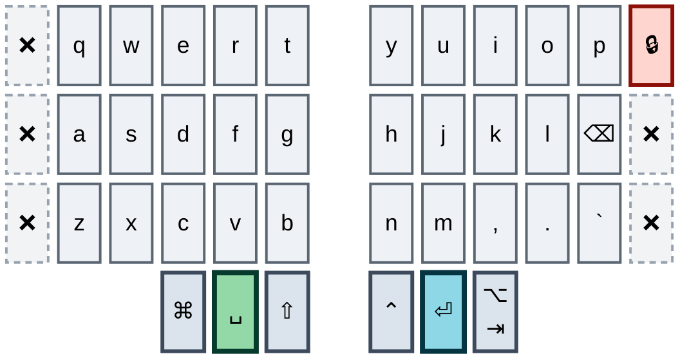
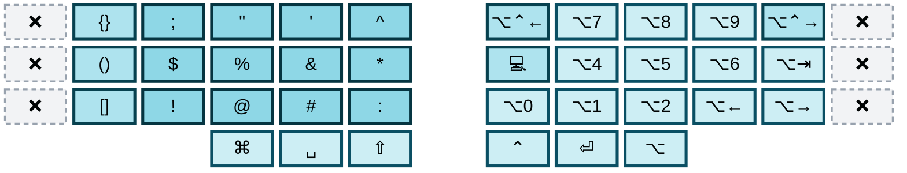
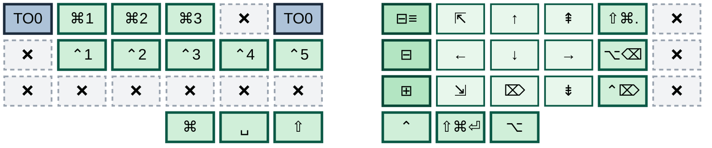
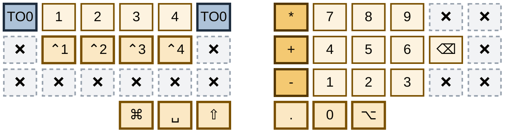
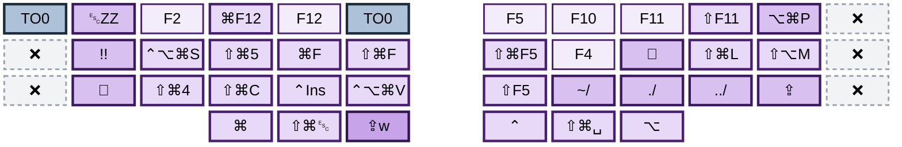
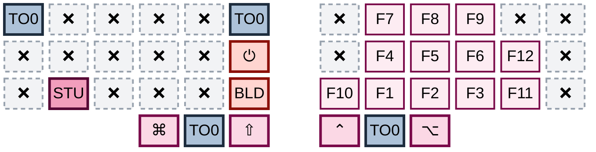

# zmk-corne

ZMK firmware configuration for a 42-key Corne split keyboard on nice!nano v2 controllers, plus the Vial export for the second keyboard the same hands train on.

Visual keymap editor: <https://nickcoutsos.github.io/keymap-editor/>

> **Status:** the 36-key migration documented in [`32-keys.md`](32-keys.md) **has caught the Corne up.** `config/corne.keymap` is now a position-for-position port of `akiva.vil`: every binding on all six layers matches the Ximi2, with the Ximi2-only hardware left behind — the outer seventh column, the extra per-half cluster, the rotary encoders and the attached mouse have no representation here. That hardware is **staying** on the work board rather than being drained: the plan no longer tries to empty it, it only forbids anything from living there alone.
>
> The divergence the status note used to apologise for is paid off. Stage 4 — converge the two keyboards — is done for the bindings, and stages 1, 2, 3, 5 and 6 came with it. What is left is stage 7, retiring the left outer column, which is the only gate on buying hardware — and Tab, the last tenant that needed a home, now has one on the right outer thumb.
>
> The two maps now differ in exactly two places, both of them deliberate: three keys on layer 5 — Studio unlock, soft off and the bootloader — which ZMK needs and QMK has no equivalent for, and the layer-tap protection on `&lt`, which QMK has no equivalent knob for either. Caps Lock used to be the third; both boards now bind it on layer 4's right pinky bottom key, inside the 36-key core, and both boards also carry it on the left thumb's tap-dance — Caps Word on double-tap, Caps Lock on tap-then-hold (Ximi2) or triple-tap (Corne, since ZMK tap-dance has no hold slot). Bluetooth, which used to be the largest difference, now lives entirely in combos and takes up no keymap positions at all.

---

## Repository layout

| Path | What it is |
|---|---|
| `config/corne.keymap` | The whole Corne layout — 6 layers, 25 macro definitions, 1 behavior, 41 combos |
| `config/corne.conf` | Kconfig flags (Studio, pointer buttons, combo limits, sleep, BLE power, debounce) |
| `config/west.yml` | West manifest pinning ZMK to `zmkfirmware/zmk@main` |
| `build.yaml` | Build matrix: `corne_left`, `corne_right`, `settings_reset`, all on `nice_nano_v2` |
| `.github/workflows/build.yml` | Calls ZMK's reusable `build-user-config.yml` |
| `combos.md` | All 41 combos, one diagram each |
| `32-keys.md` | The 36-key transition plan (English) |
| `32-keys.he.md` | Same plan, Hebrew |
| `akiva.vil` | Vial export for the **Ximi2**, the work keyboard — the source of truth for the layout |

There is no local build. Every push builds through GitHub Actions and produces flashable artifacts.

---

## Hardware and physical shape

Corne 42 keys: three rows of six columns per half, three thumb keys per half. Every map below draws both halves together, in physical left-to-right order, with the gap between them standing in for the two controllers.

The outer pinky column on each half is the part the 36-key migration removes, and both boards now agree on what is still standing there — a redundant return-to-base copy on layers 2 to 5 on the left, the lock-screen macro on the right, ❌ everywhere else. Tab was the left column's last real tenant and it has moved onto the right outer thumb: hold for Alt, tap for Tab. Escape and Caps Lock were the last two tenants of the left column's other keys, and both left in the same pass: Escape into the `q`+`e` combo, Caps Lock into the core. Backtick sits on the right pinky bottom row, where slash used to be; slash is now the `d`+`r` combo and tilde is gone. Backspace is on the right pinky home position. The base layer carries no `-` `=` `;` `'` `[` `]` `\` at all — every one of those is a combo or a layer.

---

## Layer maps

Six layers, each with a `display-name` and **each with its own hue**, so a glance at the colour says which layer you are looking at before you read a single key:

| Layer | Hue | | Layer | Hue |
|---|---|---|---|---|
| 0 base | slate | | 3 numbers | amber |
| 1 symbols | teal | | 4 function | violet |
| 2 nav | green | | 5 F-keys | rose |

Within a layer, the shade says what kind of key it is — lightest to deepest:

| Shade | Meaning |
|---|---|
| lightest | plain unmodified keypress — a letter, a digit, an F-key, an arrow |
| light | a modifier — a chord like `⌘1`, or a thumb modifier |
| mid | a macro — a sequence, not a single chord |
| deepest | the layer's own signature output — the symbols on layer 1, the operators on layer 3, the macros on layer 4 |

Two classes ignore the layer hue, because what they mean does not change between layers: **red** is destructive, irreversible, or a known defect; **dashed grey ❌** is a key with nothing on it — `&none` everywhere, plus layer 5's `&trans` left half, which only shows base through.

One rule ties the hues together: **a key that switches layers wears the colour of the layer it goes to.** That is why layer 0's Space is green and its Enter is teal — holding them is how nav and symbols are reached — and why `TO0`, the escape hatch back to base, is slate on all five of the others.

### Layer 0 — base

QWERTY, all modifiers on the thumbs, no home row mods. Space and Enter wear nav's and symbols' colours because holding them is how you get there.



### Layer 1 — symbols

Bracket-pair macros and the shifted number row on the left; ⌥+digit app switching, word motion and the terminal on the right.



### Layer 2 — nav

An inverted-T arrow cluster with the editor folds down the inner column; workspace and window chords on the left.



### Layer 3 — numbers

A calculator numpad on the right, 7-8-9 ascending upward, with the operators running down the inner column.



### Layer 4 — function

F-keys and the screenshot and window chords, plus every text macro — the email address, the path prefixes, the certificate bypass.



### Layer 5 — F-keys

The Ximi2's F-key block, ported straight across. The left half is transparent bar the three keys ZMK needs and QMK has no equivalent for.



---

## Layer notes

Detail that does not fit on a one-line caption, kept out of the maps above so they read as a set.

### Base — the thumbs

**All modifiers live on the thumbs.** There are no home row mods anywhere in this keymap. Three of the six thumb keys are plain; both inner ones are tap-dances and the right outer one is a hold-tap wrapped in a mod-morph. The map shows each thumb's tap — the table is what they do when held, or on a double-tap:

| Thumb | Binding | Notes |
|---|---|---|
| Left outer | `&kp RGUI` | Cmd. Right Cmd, faithfully copied from the Ximi2, where every other layer uses left Cmd |
| Left middle | `&lt 2 SPACE` | Space / hold for nav — hence the green |
| Left inner | `&shift_caps` | Shift; double-tap for Caps Word, triple-tap for Caps Lock. 200 ms, the Ximi2's term. Bound on layers 0 and 1; plain `&kp LSHFT` on 2, 3 and 5; one-tap `&caps_word` on layer 4 — as on Ximi2 |
| Right inner | `&control_record` | Ctrl; double-tap for the record hotkey. 210 ms, the Ximi2's term |
| Right middle | `&lt 1 ENTER` | Enter / hold for symbols — hence the teal |
| Right outer | `&alt_or_tab` | **Hold for Alt, tap for Tab.** With Shift already held it is a plain Tab on keydown, so Shift+Tab is exact. Base layer only — layers 1 to 5 keep a plain `&kp LALT` |

The lock-screen macro on the right outer column is that column's only surviving tenant on either board. Its final home is still an open question in the plan.

The left outer column has no tenant left that needs a home. Tab moved onto the right outer thumb as a hold-tap — hold for Alt, tap for Tab — and layer 1's return-to-base copy went with it, because layer 1 is a hold-only layer and cannot strand you. Escape's key is gone from all six on both boards — `q`+`e` is the only Escape now, with nothing beside it, so the dual home the plan allowed itself was granted and then spent unused. The middle and bottom positions are `&none` throughout, and the top key is now `&none` on the base layer and on layer 1. What still stands on it is a return-to-base copy on layers 2 to 5 that position 5 already duplicates — one edit per board away from the column being dead everywhere.

### Symbols — what sits where

Left hand: the three bracket-pair macros stacked vertically, each leaving the cursor inside, then the quotes, the colons and the shifted number row. Right hand: **⌥+digit** for all ten digits, which is an application switcher, plus word and paragraph motion and a terminal launcher.

The outer column's bottom key used to carry `?`, and it is unbound now on both boards: the glyph moved to a combo, `d`+`v`, rather than to another key. Two earlier candidates were rejected for rolling — `a`+`x` catches "tax" and "max", `s`+`c` catches "scan" and "escape" — and `d`+`v` was taken knowing it is adjacent columns too, because it is the backslash diagonal one row down and those diagonals have held for years.

### Nav — what sits where

Left hand: Cmd+1..3, Ctrl+1..5, and a bottom row that is empty now — it carried `⇧⌘E` on two separate keys, plus `⌘⌥T`, F4 and Shift+F4, and the Ximi2 cleared the whole row when it fixed the duplicate. Five positions inside the core are free there. The outer column's bottom key went the same way for a different reason: it held Ctrl+backtick, the terminal-cycling chord, and that was dropped rather than rehoused — the worst case is pressing `⌃` and `` ` `` explicitly — which also closed the last divergence on that position, since the Ximi2 had cleared it already. Right hand: an inverted-T arrow cluster with Home, End, PgUp, PgDn and Delete, the three editor fold macros down the inner column, and word-wise delete on the pinky.

### Numbers — the emptiest layer

The operators `* + -` run down the inner column, which is where they belong and where the Corne did not have them before. The left hand carries digits 1–4 and Ctrl+1..4, and the whole bottom-left row is `&none`.

The right pinky is dead. It used to carry a second `9`, a Ximi2 defect this file reproduced on purpose; the Ximi2 has since fixed it and the Corne followed in the same pass.

### Function — sticky, never locked

`&caps_word` sits on the left inner thumb, and **Caps Lock is on the right pinky bottom key** — the position that carries backtick on base, which puts it inside the 36-key core on both boards. It used to sit on the left outer bottom key, on a column the plan is retiring; this is where it landed instead. Both Caps Word and Caps Lock are also reachable from base via the `&shift_caps` tap-dance on the left thumb (double-tap, triple-tap), mirroring the Ximi2's `tap_dance[0]`. Layer 4 has a sticky form and no locked form, by design.

The three path prefixes run `~/`, `./`, `../` inward along the bottom row. `M12` used to be a second copy of `M4`'s `./`; it is `../` now. `thisisunsafe` lost its key in the same shuffle and is defined but unbound on both boards.

### F-keys — what the left half is for

Bluetooth used to fill that left half. It has moved out entirely into the `o`+`p` combo grid, which means the radio occupies no keymap position on either board and this layer is down to the three things ZMK needs and QMK has no equivalent for: `STU` is ZMK Studio unlock, `⏻` is soft off, `BLD` the bootloader. They sit on `z`, `g` and `b`, none of which the layer-entry combo `x`+`c`+`v` touches.

That takes layer 5 from fifteen divergent positions to three, and it is the single largest parity gain since the port itself.

Reaching the layer is `x`+`c`+`v` held, or `z`+`x`+`c`+`v` to lock it, the same on both boards. Nothing on the base thumbs opens it any more.

---

## Corne macros

Twenty-five definitions. Twenty are numbered to match the Vial macro table in `akiva.vil` rather than renamed, with the gaps being the Vial slots that are empty or bound only to Ximi2-only keys. The other five are Bluetooth, which the Ximi2 has no equivalent for.

| Macro | What it does |
|---|---|
| `m0` `m1` `m2` | `{}`, `()`, `[]`, cursor left into the pair |
| `m3` | terminal: `⌃⌥⌘T`, wait 100 ms, `⌥3` |
| `m4` | `./` |
| `m12` | `../` |
| `m5` `m6` `m7` | editor fold, unfold, fold all |
| `m8` | `⌥⌘P` |
| `m9` | Escape then `ZZ` — vim exit |
| `m10` | `⌃⌘Q` — lock screen |
| `m13` `m14` | `⌥⌃←` and `⌥⌃→` |
| `m15` | the email address |
| `m20` | `⇧⌥T`, wait 300 ms, `!!`, Enter — re-run the last shell command |
| `m22` | `thisisunsafe` — defined, bound to nothing on either board |
| `m23` | `think hard and be smart` |
| `m24` | `~/` |
| `m27` | `⌘⌥T` |
| `capslock` | Caps Lock, on layer 4's right pinky bottom on both boards |
| `btclr0`-`btclr4` | select Bluetooth profile 0-4, wait 30 ms, then clear it |

The twelve legacy named macros are gone, the nine byte-identical duplicates with them, and with them the pair whose `fold` and `expand` names were inverted.

The five `btclr` macros exist because ZMK's `BT_CLR` takes no profile index — it clears whichever profile is current. Clearing a *named* profile therefore means selecting it first, which is a sequence, which is a macro.

---

## Corne behaviors

Two tap-dances, one hold-tap, one mod-morph.

- **`control_record`** — tap for Ctrl, double-tap for `⌃⌥⌘\`. 210 ms, matching the Ximi2. Kept on purpose: the Corne has no spare key for the record hotkey, so the double-Ctrl habit is what transfers between boards.
- **`shift_caps`** — tap for Shift, double-tap for `&caps_word`, triple-tap for the `capslock` macro. 200 ms, matching the Ximi2's `tap_dance[0]`. The Ximi2's third slot is a tap-then-hold; ZMK tap-dance has no hold slot, so Caps Lock takes the third tap instead — the closest gesture ZMK can express.

- **`alt_tab`** — a hold-tap, `flavor = "hold-preferred"`, 180 ms, `hold-trigger-key-positions` listing the thirty letter positions and no thumb. Hold for Alt, tap for Tab. This is Tab's home now that the left outer column is being retired.
- **`alt_or_tab`** — a mod-morph wrapping it. With Shift held it is a plain `&kp TAB`; otherwise it is the hold-tap. `mods` and `keep-mods` are both `MOD_LSFT|MOD_RSFT`.

Those last two and `shift_caps` landed in the same pass and have an untested interaction. A mod-morph reads the held modifiers at the instant of its own keydown, and `shift_caps` is a tap-dance, so the Shift it produces is emitted on the interrupt path rather than at the moment the thumb goes down. Whether that Shift reaches the report before the morph looks for it decides which branch Shift+Tab takes — the plain `&kp TAB`, or the hold-tap with its release-order exposure. Verify on the first firmware build.

Three things make that affordable, and each one answers an objection this file raises elsewhere.

`hold-preferred` is why it is not the `gui5`/`alt5` tax again. A tap-dance charges its tapping term on every press; a hold-preferred hold-tap resolves the hold the instant another key goes down, so `⌥h`/`⌥j`/`⌥k`/`⌥l` cost nothing. The 180 ms only runs when no key follows — the keyless hold, which is `⌥`-click, `⌥`-drag and `⌥`-scroll.

`hold-trigger-key-positions` excludes the thumbs on purpose. Without it, pressing Shift a few milliseconds *after* this key would satisfy hold-preferred's "another key went down" test and turn Shift+Tab into Alt+Shift.

The mod-morph exists because a hold-tap emits its tap on **release**. Shift+Tab is two thumbs on opposite halves, so a left thumb that lifts early lands a plain Tab instead of Shift+Tab — in a Claude Code session, the mode cycles the wrong way. No timing knob fixes a late tap. The morph makes the Shift case a keydown event instead, and `keep-mods` passes the Shift through.

The mask is Shift and nothing else, deliberately. Adding Cmd and Ctrl would make `⌘⇥` and `⌃⇥` fire on keydown too, but it would also mean this key can never produce Alt while Cmd or Ctrl is held, which kills live `⌘⌥x` and `⌃⌥x` chords from the thumbs. `⌘⇥` needs no help: you hold `⌘` far past the Tab while browsing the switcher, so the late tap is harmless. Modifiers absent from `mods` are untouched, so `⌘⇧⇥` still works — the Shift branch fires and the Cmd passes straight through.

What it costs: `⌥⇥` cannot come from this key at all, since Alt is its own hold. That is on layer 1's right pinky home key instead, as `&kp LA(TAB)`. And `⌃⇥` is correct but awkward, because Ctrl and this key are both right-thumb positions.

The `gui5` and `alt5` triple-tap dances are gone. They put a 400 ms tapping term on Cmd and Alt, which are the two modifiers this user's zellij config leans on hardest. `td10` is gone too; its lock-screen tap is now a plain macro on the key it already shared.

The left inner thumb is `&shift_caps` on layers 0 and 1, mirroring the Ximi2's `tap_dance[0]`, and a plain `&kp LSHFT` on layers 2, 3 and 5 — the dance buys nothing on nav/number/F-key layers and would only tax the modifier. Layer 4's left inner thumb stays a one-tap `&caps_word`, as on the Ximi2, so Caps Word is reachable from base without going to layer 4. The double-tap is safe under normal typing: a held Shift plus a letter resolves on the letter (the tap-dance interrupt path), not on a second tap, so two capitals typed in a row never arm it.

The `capslock` macro also stays bound on layer 4's right pinky bottom on both boards, inside the 36-key core — a second route that does not depend on a triple-tap gesture. The Corne now reaches Caps Lock by two routes, like the Ximi2, with the thumb gesture adapted from tap-then-hold to triple-tap.

`&lt` now carries `quick-tap-ms = 200`, `require-prior-idle-ms = 125` and `flavor = "tap-preferred"`, so a fast Space or Enter cannot resolve as a layer hold. This is a Corne-only improvement; QMK has no equivalent knob, so the Ximi2 goes without.

---

## Corne combos

Forty-one combos, 150 ms timeout, **all scoped to `layers = <0>`** — they fire on base and nowhere else. The Ximi2 leaves its combos global; the Corne leads here.

Every one of them is drawn key by key in [`combos.md`](combos.md), which uses its own two-colour scheme — amber for a combo's keys, cyan for the shared Bluetooth anchor — rather than the per-layer hues above. What follows is the summary.

**Punctuation** — the mnemonic core of the layout, and the part that works best:

| Combo | Output | Logic |
|---|---|---|
| `d`+`r` | `/` | traces the glyph, lower-left to upper-right |
| `e`+`f` | `\` | traces the glyph, upper-left to lower-right |
| `d`+`v` | `?` | the backslash diagonal one row down, and `?` is shifted slash |
| `s`+`f` | `-` | |
| `x`+`v` | `_` | directly below dash, same two columns |
| `t`+`g` | `;` | vertical, outer column |
| `g`+`b` | pipe | vertical, outer column |
| `j`+`l` | `+` | |
| `m`+`.` | `=` | directly below plus, same two columns |
| `q`+`s` | `[` | |
| `a`+`w` | `]` | |
| `q`+`e` | Escape | the only Escape on either board; the outer key is gone |

Almost none of these sit on two adjacent columns of the same hand — they skip a column or run vertically, which is what keeps a typing roll from firing them. `d`+`r`, `f`+`e`, `q`+`s` and `a`+`w` are the grandfathered exceptions, inherited rather than chosen. `d`+`v` is the exception that was chosen: it breaks the rule on purpose, on the bet that the two diagonals it copies have never misfired, and it is the weakest-defended combo in the set.

**Layer access** — a uniform momentary/locked pair per layer, identical on both boards:

| Combo | Goes to |
|---|---|
| `s`+`e`+`f` | nav, momentary |
| `a`+`s`+`e`+`f` | nav, locked |
| `s`+`d`+`f` | numbers, momentary |
| `a`+`s`+`d`+`f` | numbers, locked |
| `x`+`c`+`v` | layer 5, momentary |
| `z`+`x`+`c`+`v` | layer 5, locked |
| `j`+`k`+`l` | function, sticky |
| `m`+`,`+`.` | function, sticky |

Function has a sticky form and no locked form on purpose — one-shot is the point, and a lock would be a trap.

**Pointer** — four buttons, no movement and no scroll; the trackpad owns the pointer, and these four survive because no trackpad maps them:

| Combo | Button |
|---|---|
| `i`+`p` | button 5 — browser forward |
| `k`+`⌫` | button 4 — browser back |
| `q`+`d` | left click |
| `a`+`c` | right click |

**Bluetooth** — sixteen combos on one shared anchor, and the only part of the keymap with no Ximi2 equivalent, since the work board is wired.

`o`+`p` is the anchor. Every Bluetooth combo holds it, and a third key names the profile. The row that third key sits on picks the verb:

| Row | Verb | Profile 0 | 1 | 2 | 3 | 4 |
|---|---|---|---|---|---|---|
| top | select | `q` | `w` | `e` | `r` | `t` |
| home | disconnect | `a` | `s` | `d` | `f` | `g` |
| bottom | clear | `z` | `x` | `c` | `v` | `b` |

Plus one escalation: `o`+`p`+`z`+`x`+`c`+`v` clears every profile. Six keys, the largest combo in the keymap.

The whole radio is one posture with fifteen destinations. **ZMK counts profiles from 0**, so the first key of a row is profile 0, not profile 1.

The anchor has a cost, and it is paid explicitly. `o` and `p` are adjacent columns of the same hand — the exact pattern every other combo here avoids — and `t`-`o`-`p` is a triple that "top" and "stop" roll straight through. So every Bluetooth combo carries `require-prior-idle-ms = <250>` and will not fire unless the keyboard was already idle, which mid-word it never is. A deliberate press starts from a standing stop and is unaffected.

Every key in the grid is inside the 36-key core, so all sixteen survive the move to a smaller board. Bluetooth exists nowhere else in the keymap — there are no radio keys on any layer, which is what lets layer 5 hand its left half back to `&trans` and match the Ximi2.

**Everything else** — `q`+`b` types the prose macro.

Many of these combos overlap as subsets of each other — `s`+`f` inside the four home-row layer combos, `x`+`c`+`v` inside `z`+`x`+`c`+`v`, the four bottom-row Bluetooth clears inside clear-everything. That is accepted, not a defect: both QMK and ZMK defer to the longer combo, so the cost is a slow-roll timing tax, not an always-on collision. In particular, do not "fix" `s`+`f` out of the layer-access family.

---

## Configuration

Active in `corne.conf`: ZMK Studio, pointer buttons (`CONFIG_ZMK_POINTING`, for the four pointer combos), raised combo budgets, soft-off, experimental BLE features, sleep with a 15-minute idle timeout, split battery reporting, +8 dBm TX power, and an aggressive 1 ms press debounce (the default is 5). RGB underglow and display are commented out.

Both combo budgets are raised for the Bluetooth grid: `p` now sits in seventeen combos, past the default of five per key, and clear-everything needs six keys, past the default of four per combo.

The deprecated mouse-emulation flag is gone along with mouse movement and scroll.

---

## Known issues in the current layout

**The three reproduced Ximi2 defects are fixed.** Layer 3's duplicate `9`, layer 2's two `⇧⌘E` keys and the second `./` macro were all carried over on purpose, on the rule that two identical boards beat one correct key. The Ximi2 fixed all three, so the Corne followed in the same pass: the numpad pinky is dead, layer 2's bottom-left row is empty, and `m12` types `../`. Nothing in either file is now defined twice.

**Still open on the Corne**

- Layer 5 holds `&bootloader` and `&soft_off`, and the layer has two entrances, one of them a three-key combo. Nothing guards them once you are there; they sit on keys the entry combo does not touch, which is mitigation, not a fix.
- Bluetooth is now reachable only through combos. If a combo ever stops firing — a debounce change, a timeout change, a dead switch under `o` or `p` — there is no keymap position to fall back on, and re-pairing needs the physical reset button.
- The Bluetooth anchor `o`+`p` sits on two adjacent columns of the same hand, breaking the rule the rest of the combo set follows. `require-prior-idle-ms = <250>` is what makes it safe, so that number is load-bearing: lower it and `t`-`o`-`p` starts switching profiles inside the word "stop".
- The 1 ms press debounce widens the window for a slow roll to emit `-` instead of entering a layer. The combo overlap itself is accepted; the debounce is not examined.
- The lock-screen macro is the only tenant of the right outer column, on either board. It needs a home inside the 36-key core before that column can be retired.
- The left outer column's top key is answered, and both of the problems that used to sit on it are gone. **Tab** went to the right outer thumb as `&alt_or_tab` — hold for Alt, tap for Tab — which is a single press on the base layer and costs no new position. And layer 1's escape hatch turned out not to exist as a problem: layer 1 is reachable only by holding `&lt 1 ENTER`, with no `TO(1)`, `MO(1)`, `TG(1)` or combo entry on either board, so the copy on position 0 was dead weight and is deleted. What remains on the column is a redundant return-to-base copy on layers 2 to 5, which position 5 already carries on each of them.
- `?` is combo-only, on `d`+`v`, which is two adjacent columns of the same hand. It breaks the rule the rest of the combo set follows and is defended only by the two grandfathered diagonals it copies, `r`+`d` and `e`+`f`. The idle guard that protects the Bluetooth anchor cannot be reused here, because `?` gets typed mid-word.

---

## The second keyboard — Ximi2

`akiva.vil` is a Vial export for a **Ximi2** used at work: QMK rather than ZMK, already fitted with a trackpad, and carrying a four-key extra cluster per half that has no Corne equivalent (window-management chords, a record hotkey, browser refresh, hyper shortcuts). That cluster is **staying**: it is work-board hardware, it costs nothing to keep, and the plan's rule about it is now a rule about tenancy rather than removal — anything on it must also be reachable inside the 36-key core, so nothing there is muscle memory in only one place. It is the board the migration is running on, and it is now several stages ahead of the Corne.

What changed: the right outer column is dead on every layer except one tenant; mouse movement and scrolling are gone; backtick moved down onto the old `/` key; layer access was rebuilt into a uniform momentary/locked pair; and two structural Vial bugs were found and fixed.

### Ximi2 layer maps

Vial stores the right half **reversed** in the JSON — array `col0` is the outermost right key. Everything below is in physical left-to-right order.

**Layer 0 — base**
```
 ·   q w e r t        y u i o p   M10
 ·   a s d f g        h j k l ⌫    ·
 ·   z x c v b        n m , . `    ·
        ⌘  ␣/L2  ⇧    ⌃(TD1) ⏎/L1  ⌥/⇥
```

Left thumbs: `RGUI`, `LT2(SPACE)`, `LSHIFT`. Right thumbs: `TD(1)` (Ctrl), `LT1(ENTER)`, `LALT_T(KC_TAB)` — hold for Alt, tap for Tab.

Backtick sits on the right pinky bottom, where `/` used to be. `/` is now combo-only (`d`+`r`), and tilde comes free as shifted backtick — one move retires two doomed keys. `M10` (`Ctrl+Cmd+Q`, lock screen) is the sole remaining tenant of the right outer column, deferred to a later phase. The left outer column no longer holds Tab. Tab moved onto the right outer thumb as `LALT_T(KC_TAB)`, so the column is `KC_NO` on the base layer and on layer 1 as well; what is left on it is a redundant return-to-base copy on layers 2 to 5, which position 5 already carries. Escape became the `q`+`e` combo and Caps Lock moved into the core.

**Layer 1 — symbols / Alt-digit**
```
 ·   {}  :  "  '  ^      ⌥⌃←  ⌥7 ⌥8 ⌥9  ⌥⌃→   ·
 ·   ()  $  %  &  *      TRM  ⌥4 ⌥5 ⌥6  ⌥⇥    ·
 ·   []  !  @  #  :       ⌥0  ⌥1 ⌥2 ⌥←   ⌥→   ·
```

The high-frequency `⌥←`/`⌥→` pair took the tight adjacent slot on the bottom row, paying with `⌥3`. The low-frequency `⌥⌃←`/`⌥⌃→` became bookends of the top row. `⌥6` never moved — that was the binding constraint the whole redesign was built around.

`⌥⇥` joined that block on the right pinky home key, which used to carry `^`. It is a one-shot switch: a precomposed keycode releases Alt along with the Tab, so it cannot hold a switcher open and cycle. Holding the thumb's own Alt and cycling is the route for that. `^` took the `t` position, which held a second copy of `$`; `$` keeps the home-row slot, being the commoner glyph on the better finger. And position 0 is `KC_NO` here because layer 1 is reachable only by holding `LT1(ENTER)` — there is no `TO(1)`, `MO(1)` or combo entry on either board, so nothing can strand you on it and it needs no way home.

**Layer 2 — nav**
```
TO0  ⌘1 ⌘2 ⌘3  ·  TO0     foldall HOME  ↑  PgUp  ⇧⌘.   ·
 ·   ⌃1 ⌃2 ⌃3 ⌃4  ⌃5      fold     ←    ↓   →    ⌥⌫    ·
 ·    ·   ·   ·   ·  ·    expand  END  ⌦  PgDn   ⌃⌦    ·
```

**Layer 3 — numpad**
```
TO0  1 2 3 4  TO0       *  7 8 9  ·   ·
 ·   ⌃1 ⌃2 ⌃3 ⌃4  ·     +  4 5 6  ⌫   ·
 ·   ·  ·  ·  ·   ·     -  1 2 3  ·   ·
                            thumbs: ⌥  0  .
```

The duplicated `9` on the pinky is fixed — that position is dead now.

**Layer 4 — function**
```
TO0  M9  F2  ⌘F12 F12 TO0      F5   F10 F11 ⇧F11  M8    ·
 ·   M20 ⌃⌥⌘S ⇧⌘5 ⌘F  ⇧⌘F      ⇧⌘F5 F4  M15 ⇧⌘L   ⇧⌥M   ·
 ·   M23 ⇧⌘4 ⇧⌘C ⌃Ins ⌃⌥⌘V     ⇧F5  M24 M4  M12   M11   ·
```

**Layer 5 — F-keys**
```
TO0  ·  ·  ·  ·  TO0        ·  F7 F8 F9  ·    ·
 ·   ·  ·  ·  ·   ·         ·  F4 F5 F6  F12  ·
 ·   ·  ·  ·  ·   ·        F10 F1 F2 F3  F11  ·
```

The left half is `KC_TRNS`, not `KC_NO` — it was reserved for the Bluetooth controls a wired work board does not need. The Corne has since put Bluetooth entirely into combos, so nothing needs that room any more and both boards now leave it transparent bar the Corne's three ZMK-only keys. Both middle thumbs are `TO(0)`.

### Layer access — uniform momentary/locked pairs

Every layer now follows the same shape: a three-key combo for momentary, the same combo plus the pinky for locked.

| Layer | Momentary | Locked |
|---|---|---|
| 2 nav | `s`+`e`+`f` | `a`+`s`+`e`+`f` |
| 3 numpad | `s`+`d`+`f` | `a`+`s`+`d`+`f` |
| 4 function | `j`+`k`+`l` and `m`+`,`+`.`, both `OSL` | none, by choice |
| 5 F-keys | `x`+`c`+`v` | `z`+`x`+`c`+`v` |

Layer 2 is additionally a hold on the left-middle thumb. `TO(0)` is prepared on the inner-index top key (the `t` position) on layers 2, 3, 4 and 5 — that column survives the left-column retirement, so the escape hatch is already in its final home.

### Punctuation combos

Unchanged from the Corne, and the part that works:

| Combo | Output | Combo | Output |
|---|---|---|---|
| `d`+`r` | `/` | `t`+`g` | `;` |
| `f`+`e` | `\` | `g`+`b` | `\|` |
| `f`+`s` | `-` | `q`+`s` | `[` |
| `x`+`v` | `_` | `a`+`w` | `]` |
| `j`+`l` | `+` | `m`+`.` | `=` |

`d`+`v` → `?` joined the set on both boards in the same pass, once the glyph's key on layer 1 was unbound. It is the one combo here that crosses two adjacent columns by choice rather than by inheritance.

### Pointer combos

Mouse movement and scroll are deleted — the trackpad owns the pointer. Four pointer combos survive because no trackpad maps them:

| Combo | Output | Why it stays |
|---|---|---|
| `i`+`p` | `BTN5` | browser forward |
| `k`+`⌫` | `BTN4` | browser back |
| `q`+`d` | `BTN1` | left click without leaving home row |
| `a`+`c` | `BTN2` | right click without leaving home row |

`q`+`b` fires the prose macro and `q`+`e` is now the only Escape on either board, the outer key having been retired rather than kept beside it. Both are anchored inside the 36-key core, so neither dies with the outer columns — `⇥`+`b`, which an earlier draft of this section recorded, no longer exists on either board — which is also why moving Tab off position 0 broke no combo: nothing in either table names that position, or any thumb.

---

## Lessons learned — three Vial mechanics

The first two each cost a debugging round, and both are the kind of failure that produces no error and no log line. The third is not a bug but a capability limit, and it is what decides how much of the Corne's Tab arrangement the work board can copy. Together they are the most reusable output of the session.

**1. Combos match resolved keycodes, not key positions.**

A Vial combo is defined as a set of keycodes, and it fires when the keys currently producing those keycodes are pressed together. It does not reference physical positions. So wrapping a base-layer key in `TD(n)` changes what that position resolves to, and **silently removes it from every combo that names the underlying keycode**. The combo stays in the file, looks correct in the editor, and never fires again.

This happened twice. Putting `.` behind a tap dance killed `m`+`.` → `=`, and `=` existed nowhere else in the layout, so the character became untypeable. The same mechanism had already killed `ESC`+`` ` `` when backtick moved behind a dance.

Corollary, and the rule to keep: **a combo whose trigger keycode is absent from the base layer is inert.** Any key move, any new tap dance, any layer reshuffle can orphan a combo. Check the combo list against the base layer after every one of them.

**2. Vial's double-tap slot replaces both taps, it does not add a second one.**

The tap-dance slots are tap / hold / double-tap / tap-hold. Setting the double-tap slot to the same keycode as the tap slot does not give you two characters — it gives you one, because the double-tap action *substitutes for* the pair of taps rather than following them. Leave the double-tap slot as `KC_NO` to get the natural behaviour of the tap keycode emitted twice.

This broke ```` ``` ```` on the backtick key: three backticks came out as fewer than three, unpredictably, depending on typing speed.

**3. Vial has a mod-morph — `key_override` — but it fires too late to fix a mod-tap.**

`akiva.vil` carries a `key_override` table of thirty-two slots, all empty, with QMK's exact fields: `trigger`, `replacement`, `layers` (a bitmask, so one entry can span chosen layers), `trigger_mods`, `negative_mod_mask`, `suppressed_mods` and `options`. `suppressed_mods` is the inverse of ZMK's `keep-mods`; `negative_mod_mask` has no ZMK counterpart at all. It is runtime-editable, so no recompile is needed. In that sense Vial is ahead of ZMK here.

What it cannot do is pre-empt a mod-tap, and for the same reason as mechanic 1: overrides act on **resolved** keycodes. `LALT_T(KC_TAB)` does not produce `KC_TAB` until the key is released, so an override on `KC_TAB` fires at that same late moment and inherits the same release-order exposure. Whether `trigger` can name the `LALT_T(KC_TAB)` keycode *itself* — which would fire on keydown — is undocumented and is the bench test in the backlog.

There is no Vial equivalent of `hold-trigger-key-positions` at all. QMK's Chordal Hold is opposite-hands-only, which is the wrong shape here: Alt is the right thumb and `⌥h`/`⌥j`/`⌥k`/`⌥l` are right-hand letters, so Chordal Hold would resolve exactly those as taps and break them. Achordion can express an arbitrary whitelist but is userspace C and needs a firmware build. And Vial's tapping term is global, exposed in its QMK Settings tab, so the Corne's per-behaviour 180 ms has no counterpart either — lowering it on the Ximi2 would retime every `LT()` layer-tap as well.

---

## Accepted costs

These are decisions, not defects. Each was taken knowingly and each has a reason.

**Direction reversal on the bottom-row pinky.** That key was `⌥⌃←` and is now `⌥→`. Re-learning a reversed direction on one key is the price of putting the high-frequency `⌥←`/`⌥→` pair on adjacent keys, and the low-frequency pair got the bookend positions instead.

**Combo subset overlaps.** Thirteen subset relationships exist among the twenty-five live combos — a shorter combo whose keys are all contained in a longer one. QMK defers to the longer combo for as long as it is still reachable, so the shorter one only escapes when the last key of the longer chord lands after `COMBO_TERM`. That makes this a timing bug under slow rolls, not an always-on collision. Explicitly accepted: *"I am not afraid of combo overlaps."* The notable cases:

| Shorter | Contained in |
|---|---|
| `f`+`s` → `-` | all four home-row layer combos |
| `f`+`e` → `\` | both nav combos |
| `j`+`l` → `+` | `j`+`k`+`l` |
| `m`+`.` → `=` | `m`+`,`+`.` |
| `x`+`v` → `_` | both layer-5 combos |

Note that the fix chosen here was the mirror image of the one `32-keys.md` proposed: the *layer combo* moved, not the punctuation.

**`td[1]` stays a tap dance.** `[tap=LCTRL, hold=LCTRL, double=LCAG(\), 210 ms]`. Stage 3 says replace tap-dance modifiers with plain ones, and this one is declined on purpose: the Corne has no spare key for the record hotkey, so keeping the double-Ctrl habit on the Ximi2 is what lets it transfer.

**Layer 5's left half stays `KC_TRNS`.** Originally reserved for the Bluetooth controls the Corne needs and the work board does not; the Corne then moved Bluetooth into combos, so the reservation turned out to be unnecessary and the transparency is now simply parity. The consequence is real and accepted either way: while locked into layer 5, every left-hand combo is still armed.

**`⌥⇥` is one-shot.** Tab's new home is the Alt thumb, so `⌥⇥` cannot come from that key — Alt is its own hold. It sits on layer 1's right pinky home key as a precomposed `LALT(KC_TAB)`, which releases Alt along with the Tab and therefore cannot hold a switcher open and cycle. Accepted: a discrete next-window switch is what that block of `⌥`-digit bindings is for. Cycling means holding the thumb's Alt and finding a Tab elsewhere, which no current binding offers.

**`⌃⇥` is correct but awkward.** Ctrl and Tab are now both right-thumb positions, so the chord needs one thumb on two keys. Layer 2's dead bottom-left row has six free core positions and is the obvious home for a `LCTL(KC_TAB)` / `LCTL(LSFT(KC_TAB))` pair if the awkwardness turns out to matter; nothing is bound there yet.

**Shift must be released last on the Ximi2.** The Corne's mod-morph makes Shift+Tab a keydown event. Vial has no equivalent that reaches a mod-tap, so on the work board the Tab still emits on release and a left thumb that lifts early sends a plain Tab. Third Corne-only reliability item, alongside the `&lt` knobs and the Studio/soft-off/bootloader keys.

**Dropped and not missed:** `⌥↑`/`⌥↓`, `⌥3`, layer-4 `F8` and `F9`, layer-3's left-half `5`, `TO(4)`, and the `q`+`a`+`z` sticky layer-5 combo.

---

## Ximi2 backlog

Open, known, and deliberately not fixed yet. Twenty-five of the thirty-two combo slots are live and the other seven are empty.

- ~~`UI31` is a malformed leftover: no trigger keys at all, but a `KC_BTN1` output keycode still stranded in the slot.~~ Fixed. The combo table was compacted and the stranded keycode went with the empty slots.
- ~~`td[2]` gates layer 1's Shift behind a 200 ms dance while base-layer Shift is plain.~~ Fixed, though not the way this line wanted: `td[2]` no longer exists, and layer 1 carries the same `td[0]` the base layer does, so the inconsistency is gone and the tapping term is on both.
- ~~Ten configured tap-dance slots are unreferenced.~~ Fixed. The dance table holds two live entries, `td[0]` for Shift and `td[1]` for Ctrl, and the remaining thirty slots are empty.
- Orphan macros: `M21`, `M25`, `M26`. `M11` is not one any more — it is Caps Lock, bound on layer 4's right pinky bottom key, inside the core.
- ~~`M12` and `M4` are both `./`.~~ Fixed. `M12` is `../`, and the function layer's bottom row now runs `~/`, `./`, `../` inward. `M22`, `thisisunsafe`, lost its key in the shuffle and is unbound on both boards.
- ~~Layer 3's duplicate `9`.~~ Fixed; that pinky position is dead.
- ~~Layer 2 binds `SGUI(E)` twice.~~ Fixed by clearing the whole bottom-left row, which also freed `M27`, F4 and Shift+F4 — five core positions on the nav layer with nothing in them.
- ~~The extra cluster is undrained and has no Toucan2 equivalent; everything on it eventually has to move or die.~~ Withdrawn. The cluster stays. It is not the Toucan2's problem because the Toucan2 is the *home* board; the work board is allowed extra hardware. The live constraint is tenancy: nothing may have its only home there.
- ~~The Corne keymap bindings are unported.~~ Ported. The Corne now matches this file position for position, so every remaining item on this list is a defect on **both** boards.
- Combos are still global on the Ximi2; the Corne has scoped its own to the base layer, and QMK should follow.
- The base-layer left thumb is `KC_RGUI` while every other layer uses `KC_LGUI`. Copied faithfully to the Corne rather than silently corrected; worth deciding one way or the other.
- ~~Layer 1 binds `$` twice, on the `t` position and on `s`.~~ Fixed. `^` took the `t` position when it was displaced by `⌥⇥`, so the duplicate paid for the move.
- **Bench test outstanding: can a Vial key override trigger on a mod-tap keycode?** The `key_override` table has thirty-two slots and none are used. If `trigger` can be set to `LALT_T(KC_TAB)` itself — QMK runs `process_key_override` before tap-hold resolution, so in principle it can — then `{trigger: LALT_T(KC_TAB), replacement: KC_TAB, layers: 1, trigger_mods: MOD_LSFT, suppressed_mods: 0, options: 7|16}` is an exact stand-in for the Corne's mod-morph, and the Ximi2's Shift+Tab becomes a keydown event too. `options` needs bit 16, `ko_option_no_reregister_trigger`, or releasing the key re-fires the mod-tap. Untested, so it is **not** written into `akiva.vil`; the fallback is the release-order discipline recorded under accepted costs.

---

## Planned transition

Full plan: [`32-keys.md`](32-keys.md).

The goal is a **beekeeb Toucan2, 36-key build** — a Cantor/Piantor layout with a multi-touch trackpad, which is this Corne minus the two outer pinky columns. All six thumb keys survive.

The approach is deliberately gradual, and the hardware is bought **last**, only after 36 keys already feels normal on the boards already owned.

| # | Stage | Corne | Ximi2 |
|---|---|---|---|
| 1 | **Make both maps honest** — fix diagrams, delete dead and duplicated macros. No key changes | done — diagrams regenerated, twelve legacy macros deleted, macro numbering matched to Vial | done — the duplicate `9`, the double-bound `SGUI(E)` and the second `./` macro are all fixed, and the orphan macro slots are empty |
| 2 | **Let the trackpads take the pointer** — delete movement, scroll and clicks; keep browser back/forward | done — movement and scroll deleted, four pointer combos kept | done — movement and scroll deleted, four pointer combos kept by choice |
| 3 | **Take your hands off the brake** — plain modifiers, sane sticky timeout, per-layer combo scoping, layer-tap protection | done — `gui5`/`alt5` and `td10` deleted, the 60-second sticky window dropped, combos scoped to base, `&lt` given quick-tap, prior-idle and tap-preferred | partly declined — `td[4]` kept for Corne parity, `td[2]` still gating layer-1 Shift, combos still unscoped |
| 4 | **Converge the two keyboards** — identical 30-key core on both | done — every binding on all six layers ported from `akiva.vil`, and layer 5 down from fifteen divergent positions to three now that Bluetooth is combos-only | done |
| 5 | **Two homes for every orphan** — new locations go live while the old keys still work | done — `/`, backtick and the square brackets moved with the port | done for `/`, backtick and the square brackets |
| 6 | **Retire the right column** — nearly free after stage 2 | done except `M10` (lock screen), matching the Ximi2 | done except `M10` (lock screen), which is deferred |
| 7 | **Retire the left column** — Tab, Escape and backtick; the real test, and the only gate on buying hardware | middle and bottom dead on all six layers; the top key is dead on base and on layer 1 now that Tab is on the thumb and layer 1's way home proved unnecessary. A redundant `&to 0` remains on layers 2 to 5 | the same, position for position |
| 8 | **Order the Toucan2** | blocked on stage 7, both boards | |

Home row mods are an optional side quest that can run at any point after stage 3 and deliberately gates nothing.

Two rules run through the whole plan: never advance a stage on a schedule, only when the previous one is genuinely settled; and never advance on one keyboard alone, because divergence between the two is the likeliest way the migration stalls. The second rule was suspended while the work board ran ahead; stage 4 has now repaid that, and both rules are back in force for stage 7.

---

## ZMK reference

- Keymaps — <https://zmk.dev/docs/keymaps>
- Behaviors — <https://zmk.dev/docs/keymaps/behaviors>
- Combos — <https://zmk.dev/docs/keymaps/combos>
- Macros — <https://zmk.dev/docs/keymaps/behaviors/macros>
- Pointer and mouse keys — <https://zmk.dev/docs/keymaps/behaviors/mouse-emulation>
- Bluetooth — <https://zmk.dev/docs/keymaps/behaviors/bluetooth>
