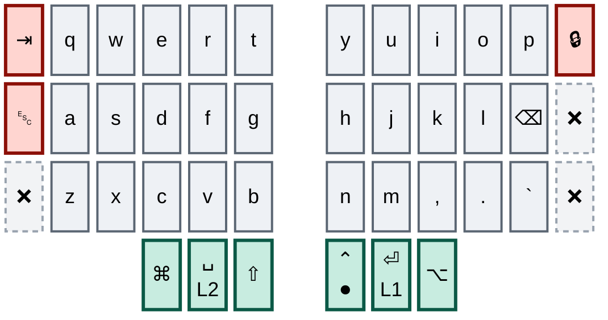
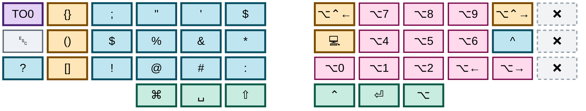
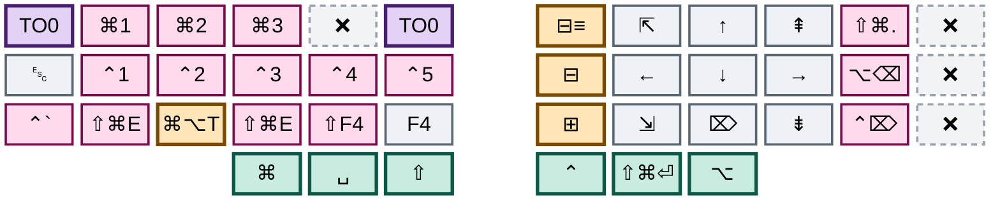
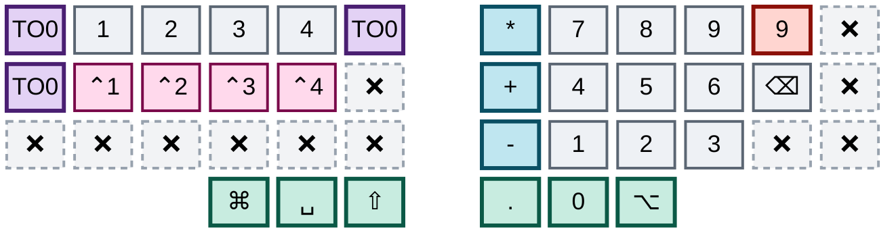
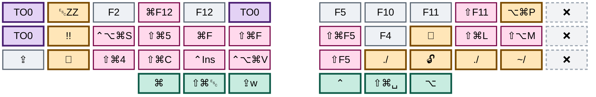
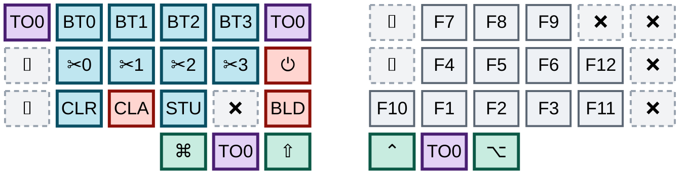

# zmk-corne

ZMK firmware configuration for a 42-key Corne split keyboard on nice!nano v2 controllers, plus the Vial export for the second keyboard the same hands train on.

Visual keymap editor: <https://nickcoutsos.github.io/keymap-editor/>

> **Status:** the 36-key migration documented in [`32-keys.md`](32-keys.md) **has caught the Corne up.** `config/corne.keymap` is now a position-for-position port of `akiva.vil`: every binding on all six layers matches the Ximi2, with the Ximi2-only hardware left behind — the outer seventh column, the extra per-half cluster, the rotary encoders and the attached mouse have no representation here.
>
> The divergence the status note used to apologise for is paid off. Stage 4 — converge the two keyboards — is done for the bindings, and stages 1, 2, 3, 5 and 6 came with it. What is left is stage 7, retiring the left outer column, which is the only gate on buying hardware.
>
> The two maps now differ in exactly three places, all of them deliberate: Bluetooth, which the Ximi2 has no use for and which lives on layer 5's otherwise-transparent left half; the layer-tap protection on `&lt`, which QMK has no equivalent knob for; and the left thumb, where ZMK's tap-dance cannot express the Ximi2's tap-then-hold Caps Lock.

---

## Repository layout

| Path | What it is |
|---|---|
| `config/corne.keymap` | The whole Corne layout — 6 layers, 20 macro definitions, 1 behavior, 28 combos |
| `config/corne.conf` | Kconfig flags (Studio, pointer buttons, combo limits, sleep, BLE power, debounce) |
| `config/west.yml` | West manifest pinning ZMK to `zmkfirmware/zmk@main` |
| `build.yaml` | Build matrix: `corne_left`, `corne_right`, `settings_reset`, all on `nice_nano_v2` |
| `.github/workflows/build.yml` | Calls ZMK's reusable `build-user-config.yml` |
| `combos.md` | All 28 combos, one diagram each |
| `32-keys.md` | The 36-key transition plan (English) |
| `32-keys.he.md` | Same plan, Hebrew |
| `akiva.vil` | Vial export for the **Ximi2**, the work keyboard — the source of truth for the layout |

There is no local build. Every push builds through GitHub Actions and produces flashable artifacts.

---

## Hardware and physical shape

Corne 42 keys: three rows of six columns per half, three thumb keys per half. Both halves are drawn together below, in physical left-to-right order, with the gap between them standing in for the two controllers. The outer pinky column on each half is the part the 36-key migration removes, and both boards now agree on what is still standing there — Tab and Escape on the left, the lock-screen macro on the right, ❌ everywhere else.



Backtick sits on the right pinky bottom row, where slash used to be; slash is now the `d`+`r` combo and tilde is gone. Backspace is on the right pinky home position. Base carries no `-` `=` `;` `'` `[` `]` `\` at all — every one of those is a combo or a layer.

---

## Corne layer structure

Six layers, each with a `display-name`. The maps below are drawn the same way as the one above — both halves side by side, physical left-to-right, one layer below the next — and the colours mean the same thing on every one:

| Colour | Meaning |
|---|---|
| grey | plain unmodified keypress — a letter, a digit, an F-key, an arrow |
| cyan | punctuation or symbol output |
| pink | a modifier chord, such as `⌘1` or `⇧⌘E` |
| amber | a macro — a sequence, not a single chord |
| purple | layer switch |
| mint | thumb key |
| red | destructive, irreversible, or slated for retirement |
| dashed grey | `&none`, marked ❌ |

`TO0` is `&to 0`, the escape hatch back to base. `⌷` is `&trans`, falling through to the layer below.

### Layer 0 — base

QWERTY, drawn in the diagram above. **All modifiers live on the thumbs** — there are no home row mods anywhere in this keymap. Five of the six thumb keys are plain; only the right inner one is a tap-dance.

| Thumb | Binding | Notes |
|---|---|---|
| Left outer | `&kp RGUI` | Cmd. Right Cmd, faithfully copied from the Ximi2, where every other layer uses left Cmd |
| Left middle | `&lt 2 SPACE` | Space / hold for nav |
| Left inner | `&kp LSHFT` | Shift |
| Right inner | `&control_record` | Ctrl; double-tap for the record hotkey. 210 ms, the Ximi2's term |
| Right middle | `&lt 1 ENTER` | Enter / hold for symbols |
| Right outer | `&kp LALT` | Alt |

The lock-screen macro on the right outer column is that column's only surviving tenant on either board. Its final home is still an open question in the plan.

### Layer 1 — symbols

Left hand: the three bracket-pair macros stacked vertically, each leaving the cursor inside, then the quotes, the colons and the shifted number row. Right hand: **Alt+digit** for all ten digits — an application switcher — plus word and paragraph motion and a terminal launcher.



### Layer 2 — nav

Left hand: Cmd+1..3, Ctrl+1..5, the screen-capture and terminal chords, F4 and Shift+F4. Right hand: an inverted-T arrow cluster with Home/End/PgUp/PgDn/Delete, the three editor fold macros down the inner column, and word-wise delete on the pinky.



### Layer 3 — numbers

**Calculator-style numpad** on the right, 7-8-9 on the top row ascending upward, with `0` and `.` on the right thumbs. The operators `* + -` run down the inner column, which is where they belong and where the Corne did not have them before. The left hand carries digits 1–4 and Ctrl+1..4, and the whole bottom-left row is `&none` — the emptiest layer in the keymap on both boards.



The second `9` on the right pinky is a known Ximi2 defect. It is reproduced here on purpose: the two boards being identical is worth more than one key being right on one of them.

### Layer 4 — function

F-keys on the right, screenshot and window chords on the left, a vim-exit macro, an email macro, the browser certificate bypass, the prose macro, and the two path-prefix macros. Caps Lock sits on the left outer column and `&caps_word` on the left inner thumb. Layer 4 has a sticky form and no locked form, by design.



`./` appears twice because `M4` and `M12` are both `./` in the Vial table. Another deliberate reproduction.

### Layer 5 — bluetooth and F-keys

The right half is the Ximi2's F-key block, ported straight across. The Ximi2 leaves its **entire left half transparent** on this layer, which is exactly the room ZMK's radio needs — so the Bluetooth grid, soft off, Studio unlock and the bootloader live there without displacing anything that exists on the other board. Wireless is the one place the two maps may legitimately differ.



`CLR` clears the current profile, `CLA` clears all of them, `STU` is ZMK Studio unlock, `⏻` is soft off and `BLD` the bootloader. Reaching the layer is `x`+`c`+`v` held, or `z`+`x`+`c`+`v` to lock it, the same on both boards. Nothing on the base thumbs opens it any more.

---

## Corne macros

Twenty definitions, numbered to match the Vial macro table in `akiva.vil` rather than renamed. The gaps in the sequence are the Vial slots that are empty or bound only to Ximi2-only keys.

| Macro | What it does |
|---|---|
| `m0` `m1` `m2` | `{}`, `()`, `[]`, cursor left into the pair |
| `m3` | terminal: `⌃⌥⌘T`, wait 100 ms, `⌥3` |
| `m4` `m12` | `./` — both, as in the Vial table |
| `m5` `m6` `m7` | editor fold, unfold, fold all |
| `m8` | `⌥⌘P` |
| `m9` | Escape then `ZZ` — vim exit |
| `m10` | `⌃⌘Q` — lock screen |
| `m13` `m14` | `⌥⌃←` and `⌥⌃→` |
| `m15` | the email address |
| `m20` | `⇧⌥T`, wait 300 ms, `!!`, Enter — re-run the last shell command |
| `m22` | `thisisunsafe` |
| `m23` | `think hard and be smart` |
| `m24` | `~/` |
| `m27` | `⌘⌥T` |

The twelve legacy named macros are gone, the nine byte-identical duplicates with them, and with them the pair whose `fold` and `expand` names were inverted.

---

## Corne behaviors

One tap-dance. No hold-taps, no mod-morphs, no `&mt` anywhere.

- **`control_record`** — tap for Ctrl, double-tap for `⌃⌥⌘\`. 210 ms, matching the Ximi2. Kept on purpose: the Corne has no spare key for the record hotkey, so the double-Ctrl habit is what transfers between boards.

The `gui5` and `alt5` triple-tap dances are gone. They put a 400 ms tapping term on Cmd and Alt, which are the two modifiers this user's zellij config leans on hardest. `td10` is gone too; its lock-screen tap is now a plain macro on the key it already shared.

The left thumb is a plain Shift. The Ximi2 gets Caps Lock there from a tap-then-hold, which ZMK's tap-dance cannot express, and a double-tap-to-caps would fire while typing two capitals in a row. Caps Lock is on layer 4's left outer column and `&caps_word` on layer 4's left inner thumb.

`&lt` now carries `quick-tap-ms = 200`, `require-prior-idle-ms = 125` and `flavor = "tap-preferred"`, so a fast Space or Enter cannot resolve as a layer hold. This is a Corne-only improvement; QMK has no equivalent knob, so the Ximi2 goes without.

---

## Corne combos

Twenty-eight combos, 150 ms timeout, **all scoped to `layers = <0>`** — they fire on base and nowhere else. The Ximi2 leaves its combos global; the Corne leads here.

Every one of them is drawn key by key in [`combos.md`](combos.md); what follows is the summary.

**Punctuation** — the mnemonic core of the layout, and the part that works best:

| Combo | Output | Logic |
|---|---|---|
| `d`+`r` | `/` | traces the glyph, lower-left to upper-right |
| `e`+`f` | `\` | traces the glyph, upper-left to lower-right |
| `s`+`f` | `-` | |
| `x`+`v` | `_` | directly below dash, same two columns |
| `t`+`g` | `;` | vertical, outer column |
| `g`+`b` | pipe | vertical, outer column |
| `j`+`l` | `+` | |
| `m`+`.` | `=` | directly below plus, same two columns |
| `q`+`s` | `[` | |
| `a`+`w` | `]` | |
| `q`+`e` | Escape | |

Almost none of these sit on two adjacent columns of the same hand — they skip a column or run vertically, which is what keeps a typing roll from firing them. `d`+`r`, `f`+`e`, `q`+`s` and `a`+`w` are the grandfathered exceptions, not a precedent.

**Layer access** — a uniform momentary/locked pair per layer, identical on both boards:

| Combo | Goes to |
|---|---|
| `s`+`e`+`f` | nav, momentary |
| `a`+`s`+`e`+`f` | nav, locked |
| `s`+`d`+`f` | numbers, momentary |
| `a`+`s`+`d`+`f` | numbers, locked |
| `x`+`c`+`v` | layer 5, momentary |
| `z`+`x`+`c`+`v` | layer 5, locked |
| `j`+`k`+`l` | function, sticky |
| `m`+`,`+`.` | function, sticky |

Function has a sticky form and no locked form on purpose — one-shot is the point, and a lock would be a trap.

**Pointer** — four buttons, no movement and no scroll; the trackpad owns the pointer, and these four survive because no trackpad maps them:

| Combo | Button |
|---|---|
| `i`+`p` | button 5 — browser forward |
| `k`+`⌫` | button 4 — browser back |
| `q`+`d` | left click |
| `a`+`c` | right click |

**Bluetooth** — four cross-hand combos on the bottom row, the one place the two maps differ by design:

| Combo | Effect |
|---|---|
| `z`+`m` | profile 0 |
| `x`+`,` | profile 1 |
| `c`+`.` | profile 2 |
| `v`+`n` | clear the current profile |

Cross-hand pairs on the bottom row are never rolled while typing, and all eight keys sit inside the 36-key core, so the combos survive the move to a smaller board. The full grid — all four profiles, disconnect, clear, clear-all — is still on layer 5.

**Everything else** — `q`+`b` types the prose macro.

Thirteen of these combos overlap as subsets of each other. That is accepted, not a defect: both QMK and ZMK defer to the longer combo, so the cost is a slow-roll timing tax, not an always-on collision. In particular, do not "fix" `s`+`f` out of the layer-access family.

---

## Configuration

Active in `corne.conf`: ZMK Studio, pointer buttons (`CONFIG_ZMK_POINTING`, for the four pointer combos), a raised per-key combo limit of 8 because `s` and `f` each sit in six combos, soft-off, experimental BLE features, sleep with a 15-minute idle timeout, split battery reporting, +8 dBm TX power, and an aggressive 1 ms press debounce (the default is 5). RGB underglow and display are commented out.

The deprecated mouse-emulation flag is gone along with mouse movement and scroll.

---

## Known issues in the current layout

**Carried over from the Ximi2 on purpose.** These are real defects in `akiva.vil`, reproduced here because two identical boards are worth more than one correct key:

- Layer 3's duplicate `9` on the right pinky.
- Layer 2 binds `⇧⌘E` on two different keys.
- `M4` and `M12` are both `./`.

**Still open on the Corne**

- Layer 5 holds `&bootloader` and `&soft_off`, and the layer has two entrances, one of them a three-key combo. Nothing guards the destructive keys once you are there; they are placed away from the `x`+`c`+`v` entry keys, which is mitigation, not a fix.
- The 1 ms press debounce widens the window for a slow roll to emit `-` instead of entering a layer. The combo overlap itself is accepted; the debounce is not examined.
- The lock-screen macro is the only tenant of the right outer column, on either board. It needs a home inside the 36-key core before that column can be retired.
- Tab and Escape still sit on the left outer column and have no new home.

---

## The second keyboard — Ximi2

`akiva.vil` is a Vial export for a **Ximi2** used at work: QMK rather than ZMK, already fitted with a trackpad, and carrying a four-key extra cluster per half that has no Corne equivalent (window-management chords, a record hotkey, browser refresh, hyper shortcuts). It is the board the migration is running on, and it is now several stages ahead of the Corne.

What changed: the right outer column is dead on every layer except one tenant; mouse movement and scrolling are gone; backtick moved down onto the old `/` key; layer access was rebuilt into a uniform momentary/locked pair; and two structural Vial bugs were found and fixed.

### Layer maps

Vial stores the right half **reversed** in the JSON — array `col0` is the outermost right key. Everything below is in physical left-to-right order.

**Layer 0 — base**

```
 ⇥   q w e r t        y u i o p   M10
 ␛   a s d f g        h j k l ⌫    ·
 ·   z x c v b        n m , . `    ·
        ⌘  ␣/L2  ⇧    ⌃(TD4) ⏎/L1  ⌥
```

Left thumbs: `RGUI`, `LT2(SPACE)`, `LSHIFT`. Right thumbs: `TD(4)` (Ctrl), `LT1(ENTER)`, `LALT`.

Backtick sits on the right pinky bottom, where `/` used to be. `/` is now combo-only (`d`+`r`), and tilde comes free as shifted backtick — one move retires two doomed keys. `M10` (`Ctrl+Cmd+Q`, lock screen) is the sole remaining tenant of the right outer column, deferred to a later phase. The left outer column is still live for `⇥` and `␛`; its bottom key is already dead.

**Layer 1 — symbols / Alt-digit**

```
DF0  {}  :  "  '  $      ⌥⌃←  ⌥7 ⌥8 ⌥9  ⌥⌃→   ·
 ␛   ()  $  %  &  *      TRM  ⌥4 ⌥5 ⌥6   ^    ·
 ?   []  !  @  #  :       ⌥0  ⌥1 ⌥2 ⌥←   ⌥→   ·
```

The high-frequency `⌥←`/`⌥→` pair took the tight adjacent slot on the bottom row, paying with `⌥3`. The low-frequency `⌥⌃←`/`⌥⌃→` became bookends of the top row. `⌥6` never moved — that was the binding constraint the whole redesign was built around.

**Layer 2 — nav**

```
TO0  ⌘1 ⌘2 ⌘3  ·  TO0     foldall HOME  ↑  PgUp  ⇧⌘.   ·
 ␛   ⌃1 ⌃2 ⌃3 ⌃4  ⌃5      fold     ←    ↓   →    ⌥⌫    ·
⌃`   ⇧⌘E M27 ⇧⌘E ⇧F4 F4   expand  END  ⌦  PgDn   ⌃⌦    ·
```

**Layer 3 — numpad**

```
TO0  1 2 3 4  TO0       *  7 8 9  9   ·
DF0  ⌃1 ⌃2 ⌃3 ⌃4  ·     +  4 5 6  ⌫   ·
 ·   ·  ·  ·  ·   ·     -  1 2 3  ·   ·
                            thumbs: ⌥  0  .
```

The duplicated `9` on the pinky is a pre-existing defect, still unfixed.

**Layer 4 — function**

```
TO0  M9  F2  ⌘F12 F12 TO0      F5   F10 F11 ⇧F11  M8    ·
DF0  M20 ⌃⌥⌘S ⇧⌘5 ⌘F  ⇧⌘F      ⇧⌘F5 F4  M15 ⇧⌘L   ⇧⌥M   ·
CAPS M23 ⇧⌘4 ⇧⌘C ⌃Ins ⌃⌥⌘V     ⇧F5  M4  M22 M12   M24   ·
```

**Layer 5 — F-keys**

```
TO0  ·  ·  ·  ·  TO0        ·  F7 F8 F9  ·    ·
 ·   ·  ·  ·  ·   ·         ·  F4 F5 F6  F12  ·
 ·   ·  ·  ·  ·   ·        F10 F1 F2 F3  F11  ·
```

The left half is `KC_TRNS`, not `KC_NO` — reserved for the Bluetooth controls a wired work board does not need. Both middle thumbs are `TO(0)`.

### Layer access — uniform momentary/locked pairs

Every layer now follows the same shape: a three-key combo for momentary, the same combo plus the pinky for locked.

| Layer | Momentary | Locked |
|---|---|---|
| 2 nav | `s`+`e`+`f` | `a`+`s`+`e`+`f` |
| 3 numpad | `s`+`d`+`f` | `a`+`s`+`d`+`f` |
| 4 function | `j`+`k`+`l` and `m`+`,`+`.`, both `OSL` | none, by choice |
| 5 F-keys | `x`+`c`+`v` | `z`+`x`+`c`+`v` |

Layer 2 is additionally a hold on the left-middle thumb. `TO(0)` is prepared on the inner-index top key (the `t` position) on layers 2, 3, 4 and 5 — that column survives the left-column retirement, so the escape hatch is already in its final home.

### Punctuation combos

Unchanged from the Corne, and the part that works:

| Combo | Output | Combo | Output |
|---|---|---|---|
| `d`+`r` | `/` | `t`+`g` | `;` |
| `f`+`e` | `\` | `g`+`b` | `\|` |
| `f`+`s` | `-` | `q`+`s` | `[` |
| `x`+`v` | `_` | `a`+`w` | `]` |
| `j`+`l` | `+` | `m`+`.` | `=` |

### Pointer combos

Mouse movement and scroll are deleted — the trackpad owns the pointer. Four pointer combos survive because no trackpad maps them:

| Combo | Output | Why it stays |
|---|---|---|
| `i`+`p` | `BTN5` | browser forward |
| `k`+`⌫` | `BTN4` | browser back |
| `q`+`d` | `BTN1` | left click without leaving home row |
| `a`+`c` | `BTN2` | right click without leaving home row |

`⇥`+`b` fires the prose macro.

---

## Lessons learned — two Vial mechanics

Both cost a debugging round, and both are the kind of failure that produces no error and no log line. They are the most reusable output of the session.

**1. Combos match resolved keycodes, not key positions.**

A Vial combo is defined as a set of keycodes, and it fires when the keys currently producing those keycodes are pressed together. It does not reference physical positions. So wrapping a base-layer key in `TD(n)` changes what that position resolves to, and **silently removes it from every combo that names the underlying keycode**. The combo stays in the file, looks correct in the editor, and never fires again.

This happened twice. Putting `.` behind a tap dance killed `m`+`.` → `=`, and `=` existed nowhere else in the layout, so the character became untypeable. The same mechanism had already killed `ESC`+`` ` `` when backtick moved behind a dance.

Corollary, and the rule to keep: **a combo whose trigger keycode is absent from the base layer is inert.** Any key move, any new tap dance, any layer reshuffle can orphan a combo. Check the combo list against the base layer after every one of them.

**2. Vial's double-tap slot replaces both taps, it does not add a second one.**

The tap-dance slots are tap / hold / double-tap / tap-hold. Setting the double-tap slot to the same keycode as the tap slot does not give you two characters — it gives you one, because the double-tap action *substitutes for* the pair of taps rather than following them. Leave the double-tap slot as `KC_NO` to get the natural behaviour of the tap keycode emitted twice.

This broke ```` ``` ```` on the backtick key: three backticks came out as fewer than three, unpredictably, depending on typing speed.

---

## Accepted costs

These are decisions, not defects. Each was taken knowingly and each has a reason.

**Direction reversal on the bottom-row pinky.** That key was `⌥⌃←` and is now `⌥→`. Re-learning a reversed direction on one key is the price of putting the high-frequency `⌥←`/`⌥→` pair on adjacent keys, and the low-frequency pair got the bookend positions instead.

**Combo subset overlaps.** Thirteen subset relationships exist among the twenty-three live combos — a shorter combo whose keys are all contained in a longer one. QMK defers to the longer combo for as long as it is still reachable, so the shorter one only escapes when the last key of the longer chord lands after `COMBO_TERM`. That makes this a timing bug under slow rolls, not an always-on collision. Explicitly accepted: *"I am not afraid of combo overlaps."* The notable cases:

| Shorter | Contained in |
|---|---|
| `f`+`s` → `-` | all four home-row layer combos |
| `f`+`e` → `\` | both nav combos |
| `j`+`l` → `+` | `j`+`k`+`l` |
| `m`+`.` → `=` | `m`+`,`+`.` |
| `x`+`v` → `_` | both layer-5 combos |

Note that the fix chosen here was the mirror image of the one `32-keys.md` proposed: the *layer combo* moved, not the punctuation.

**`td[4]` stays a tap dance.** `[tap=LCTRL, hold=LCTRL, double=LCAG(\), 210 ms]`. Stage 3 says replace tap-dance modifiers with plain ones, and this one is declined on purpose: the Corne has no spare key for the record hotkey, so keeping the double-Ctrl habit on the Ximi2 is what lets it transfer.

**Layer 5's left half stays `KC_TRNS`.** Reserved for the Bluetooth controls the Corne needs and the work board does not. The consequence is real and accepted: while locked into layer 5, every left-hand combo is still armed.

**Dropped and not missed:** `⌥↑`/`⌥↓`, `⌥3`, layer-4 `F8` and `F9`, layer-3's left-half `5`, `TO(4)`, and the `q`+`a`+`z` sticky layer-5 combo.

---

## Ximi2 backlog

Open, known, and deliberately not fixed yet. Twenty-three combos are live (`UI1`-`UI7`, `UI10`-`UI21`, `UI24`, `UI26`, `UI28`, `UI29`); of the other nine slots, all are empty except `UI31`.

- `UI31` is a malformed leftover: no trigger keys at all, but a `KC_BTN1` output keycode still stranded in the slot. Inert, and untidy.
- `td[2]` gates layer 1's Shift behind a 200 ms dance while base-layer Shift is plain — an inconsistency with no justification.
- Ten configured tap-dance slots are unreferenced; only `TD(2)` and `TD(4)` are bound anywhere.
- Orphan macros: `M11`, `M21`, `M25`, `M26`.
- `M12` and `M4` are both `./`.
- Layer 3's duplicate `9`.
- Layer 2 binds `SGUI(E)` twice.
- The extra cluster is undrained and has no Toucan2 equivalent; everything on it eventually has to move or die.
- ~~The Corne keymap bindings are unported.~~ Ported. The Corne now matches this file position for position, so every remaining item on this list is a defect on **both** boards.
- Combos are still global on the Ximi2; the Corne has scoped its own to the base layer, and QMK should follow.
- The base-layer left thumb is `KC_RGUI` while every other layer uses `KC_LGUI`. Copied faithfully to the Corne rather than silently corrected; worth deciding one way or the other.

---

## Planned transition

Full plan: [`32-keys.md`](32-keys.md).

The goal is a **beekeeb Toucan2, 36-key build** — a Cantor/Piantor layout with a multi-touch trackpad, which is this Corne minus the two outer pinky columns. All six thumb keys survive.

The approach is deliberately gradual, and the hardware is bought **last**, only after 36 keys already feels normal on the boards already owned.

| # | Stage | Corne | Ximi2 |
|---|---|---|---|
| 1 | **Make both maps honest** — fix diagrams, delete dead and duplicated macros. No key changes | done — diagrams regenerated, twelve legacy macros deleted, macro numbering matched to Vial | partial — mouse cruft gone, but orphan macros, the duplicate `9` and the double-bound `SGUI(E)` remain |
| 2 | **Let the trackpads take the pointer** — delete movement, scroll and clicks; keep browser back/forward | done — movement and scroll deleted, four pointer combos kept | done — movement and scroll deleted, four pointer combos kept by choice |
| 3 | **Take your hands off the brake** — plain modifiers, sane sticky timeout, per-layer combo scoping, layer-tap protection | done — `gui5`/`alt5` and `td10` deleted, the 60-second sticky window dropped, combos scoped to base, `&lt` given quick-tap, prior-idle and tap-preferred | partly declined — `td[4]` kept for Corne parity, `td[2]` still gating layer-1 Shift, combos still unscoped |
| 4 | **Converge the two keyboards** — identical 30-key core on both | done — every binding on all six layers ported from `akiva.vil` | done |
| 5 | **Two homes for every orphan** — new locations go live while the old keys still work | done — `/`, backtick and the square brackets moved with the port | done for `/`, backtick and the square brackets |
| 6 | **Retire the right column** — nearly free after stage 2 | done except `M10` (lock screen), matching the Ximi2 | done except `M10` (lock screen), which is deferred |
| 7 | **Retire the left column** — Tab, Escape and backtick; the real test, and the only gate on buying hardware | started — the outer bottom key is dead and the `TO(0)` escape hatch is pre-placed on the `t` column | started — the outer bottom key is dead and the `TO(0)` escape hatch is pre-placed on the `t` column |
| 8 | **Order the Toucan2** | blocked on stage 7, both boards | |

Home row mods are an optional side quest that can run at any point after stage 3 and deliberately gates nothing.

Two rules run through the whole plan: never advance a stage on a schedule, only when the previous one is genuinely settled; and never advance on one keyboard alone, because divergence between the two is the likeliest way the migration stalls. The second rule was suspended while the work board ran ahead; stage 4 has now repaid that, and both rules are back in force for stage 7.

---

## ZMK reference

- Keymaps — <https://zmk.dev/docs/keymaps>
- Behaviors — <https://zmk.dev/docs/keymaps/behaviors>
- Combos — <https://zmk.dev/docs/keymaps/combos>
- Macros — <https://zmk.dev/docs/keymaps/behaviors/macros>
- Pointer and mouse keys — <https://zmk.dev/docs/keymaps/behaviors/mouse-emulation>
- Bluetooth — <https://zmk.dev/docs/keymaps/behaviors/bluetooth>
