# Corne combos

Forty-one combos, one diagram each. Every combo has a 150 ms timeout and is scoped to `layers = <0>`, so it fires on the base layer and nowhere else.

The diagrams show the base layer with the combo's own keys picked out in amber. The Bluetooth combos additionally show their shared `o`+`p` anchor in cyan. Both halves are drawn side by side in physical left-to-right order, with the gap between them standing in for the two controllers.

| Colour | Meaning |
|---|---|
| amber, thick border | the keys this combo needs |
| cyan, thick border | the shared Bluetooth anchor, held by all sixteen |
| grey | every other key, for orientation |
| mint | thumb key |
| dashed grey, ❌ | `&none` |

Combos are defined by **key position**, not by keycode. That is the one real difference from the Vial combo table these were ported from, where a combo binds to whatever keycode sits on the key. In ZMK, rebinding a key leaves its combos alone; moving a key to a different position is what breaks them.

---

## Punctuation

The mnemonic core of the layout, and the part that works best. Most of these skip a column or run vertically, because two adjacent columns of the same hand fire on an ordinary typing roll. `r`+`d`, `e`+`f`, `q`+`s` and `a`+`w` are grandfathered exceptions, inherited rather than chosen. `d`+`v` is the one that was chosen knowingly, and it is defended only by sitting in the same geometry as the two diagonals it copies.

### `t`+`g` → `;`

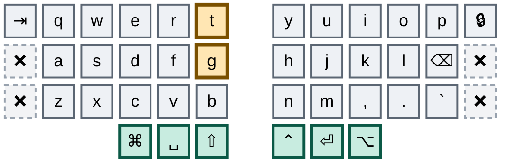

Vertical, both keys on the left index's outer column. Nothing rolls down a single column, which is what makes a vertical pair safe.

### `g`+`b` → pipe

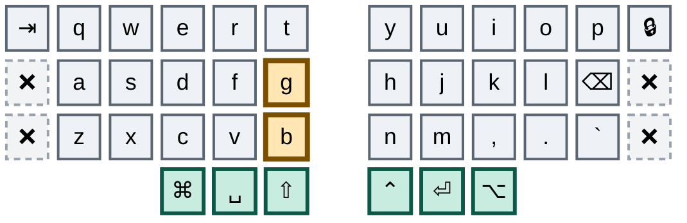

Vertical on the same outer column, one row below semicolon. Semicolon and pipe are neighbours on a staggered keyboard too, so the pairing is already in the fingers.

### `r`+`d` → `/`

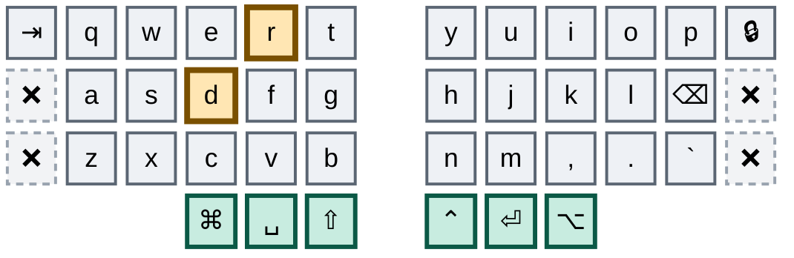

The two keys trace the glyph: `d` is lower-left, `r` is upper-right, and the slash runs between them. This is also the only place slash exists — it has no base key any more.

### `e`+`f` → `\`

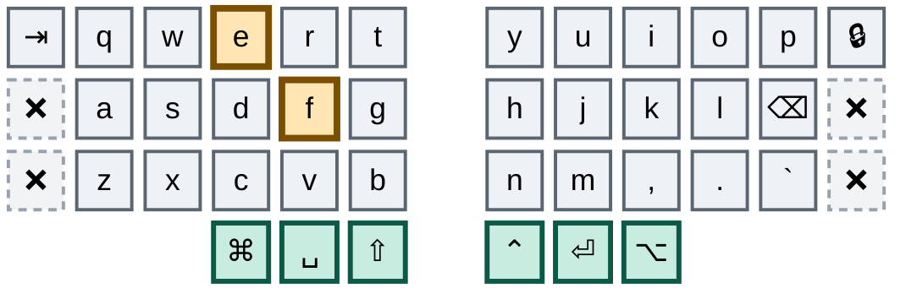

The mirror of the slash combo, tracing a backslash from upper-left down to lower-right.

### `d`+`v` → `?`

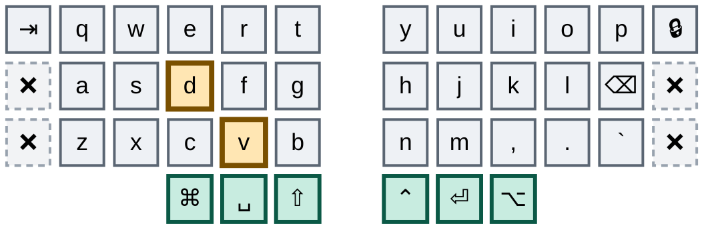

The backslash combo moved one row down: middle-column home plus index-column bottom, the same down-right diagonal a row lower. It sits with the slash family because `?` is shifted slash, and it is the only route to the glyph — layer 1's outer bottom key, which used to carry it, is unbound on both boards.

This is the fifth adjacent-column combo and the first one chosen rather than inherited. `d` and `v` are neighbouring columns of the same hand, which is the pattern the rest of this group avoids, and the defence is entirely that it is `e`+`f`'s and `r`+`d`'s geometry one row down: if `r`+`d` has never emitted `/` while you typed "address", this will not emit `?` while you type "advice". The idle guard that protects the Bluetooth anchor is no help here, because `?` is typed mid-word. So this combo rides on the two diagonals above it continuing to behave, and if either of them ever misfires, this is the second casualty and they move together.

### `s`+`f` → `-`

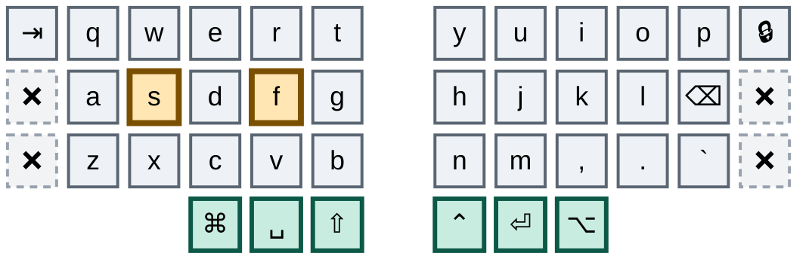

Home row, skipping the `d` column. The skipped column is deliberate: two adjacent columns of the same hand would fire on an ordinary typing roll.

### `x`+`v` → `_`

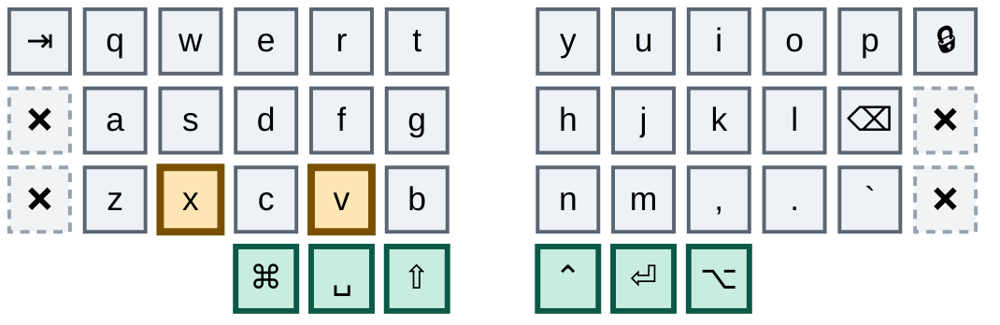

Directly below dash, on the same two columns. Underscore is a shifted dash on a normal keyboard, and here it is a dash moved one row down.

### `j`+`l` → `+`

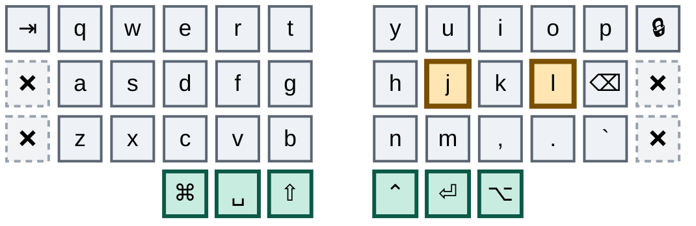

The right hand's mirror of the dash combo — home row, skipping the middle column.

### `m`+`.` → `=`

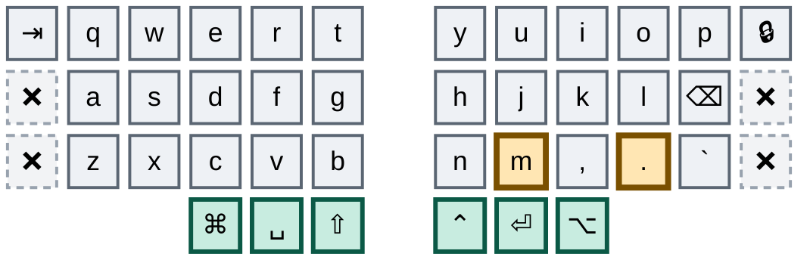

Directly below plus, same two columns, exactly as underscore sits below dash. Plus and equals share a key on a normal keyboard; here they share a column pair.

### `q`+`s` → `[`

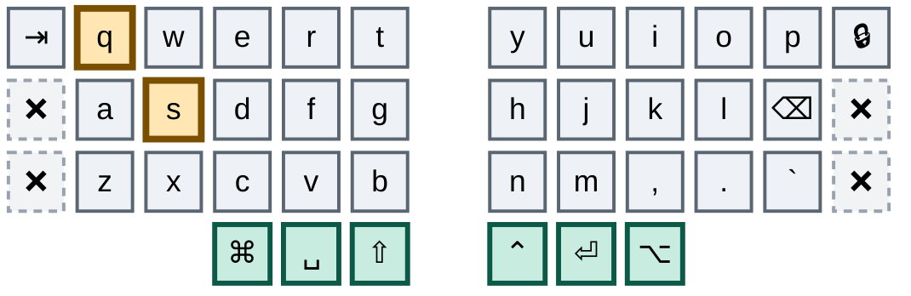

A diagonal on the left hand's outer two columns. One of four grandfathered adjacent-column combos, kept because the fingers already know it.

### `w`+`a` → `]`

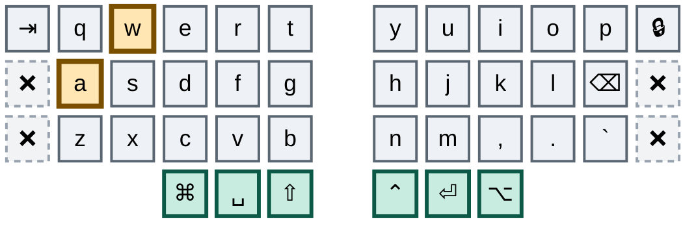

The opposite diagonal across the same two columns, so the two brackets mirror each other.

## Escape and prose

Two left-hand combos that have nothing to do with each other beyond both being long reaches.

### `q`+`e` → Escape

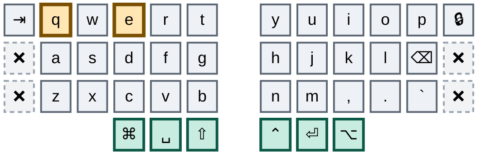

The only Escape on either board, on the left hand, skipping the `w` column. The dedicated key on the outer column is gone rather than standing beside this combo — the dual home the plan allowed itself was spent deliberately, so a miss here is answered by pressing again, not by reaching outward.

### `q`+`b` → `think hard and be smart`

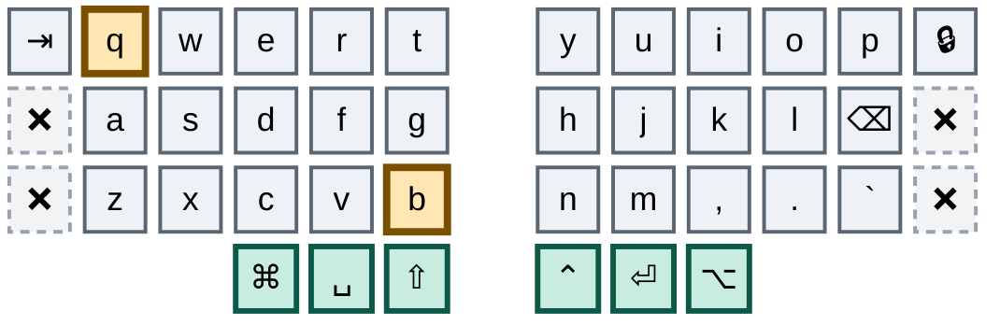

The full diagonal reach of the left hand, corner to corner. Deliberately awkward: it types a long string, and a long string is the worst thing to emit by accident.

## Pointer

Four buttons, no movement and no scroll. The trackpad owns the pointer; these four survive because no trackpad gesture maps them.

### `i`+`p` → button 5, browser forward

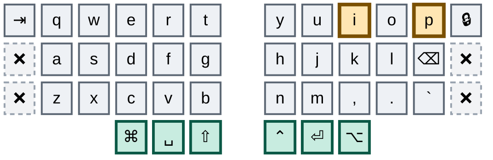

Right hand, skipping the `o` column. Survives the trackpad because no trackpad gesture maps browser forward.

### `k`+`⌫` → button 4, browser back

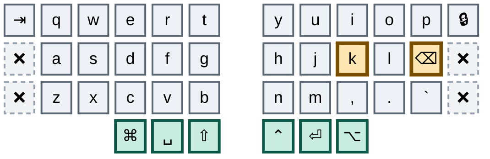

The home-row pair directly below forward, so back and forward sit one row apart on the same two columns.

### `q`+`d` → left click

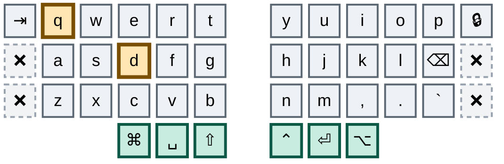

A left-hand diagonal. Clicks exist as combos only because the pointer itself belongs to the trackpad now — movement and scroll are gone from the keymap entirely.

### `a`+`c` → right click

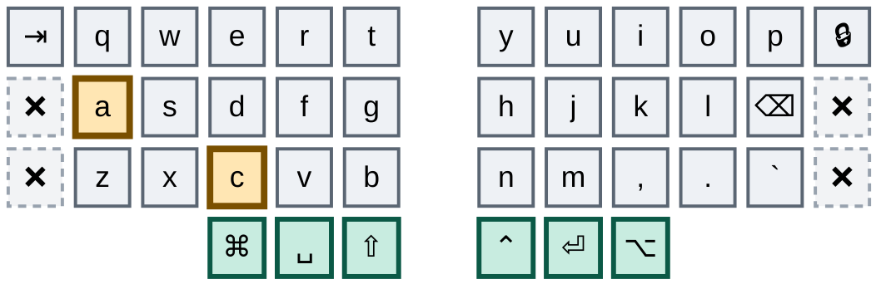

The diagonal below left click, one row down on the same two columns.

## Layer access

A uniform pair per layer: three keys for momentary, the same three plus `a` for locked. Identical on both keyboards. Layer 4 is the exception — sticky, with no locked form.

### `s`+`e`+`f` → nav, while held

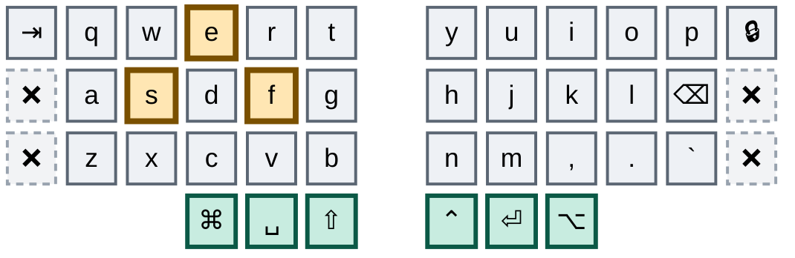

The dash combo plus `e`. Every layer is a three-key momentary combo and a four-key locked one, and the fourth key is always `a`.

### `a`+`s`+`e`+`f` → nav, locked

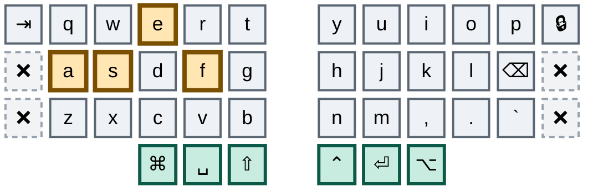

Adding `a` to the momentary form locks the layer. Return with `TO0`, which every non-base layer carries in its top-left corner.

### `s`+`d`+`f` → numbers, while held

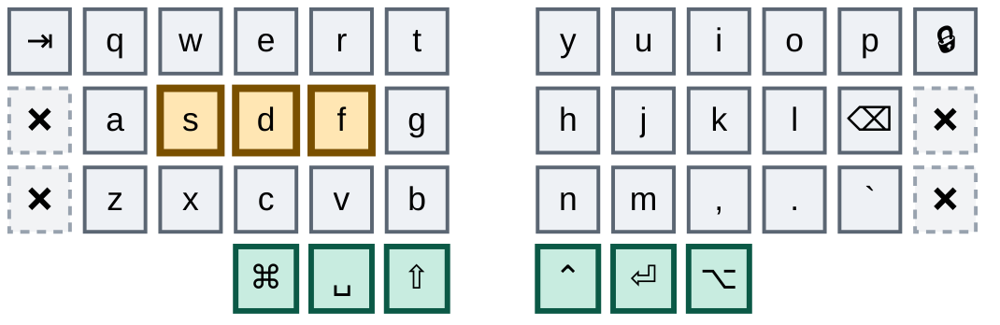

Three adjacent home-row keys. The dash combo `s`+`f` is a strict subset of this one; both QMK and ZMK prefer the longer match, so the cost is a slow-roll timing tax, not a collision.

### `a`+`s`+`d`+`f` → numbers, locked

```mermaid
%%{init: {'theme':'base','themeVariables':{'primaryColor':'#eef1f5','primaryTextColor':'#0b0f14','primaryBorderColor':'#5b6673','nodeTextColor':'#0b0f14','textColor':'#0b0f14','mainBkg':'#eef1f5','fontSize':'18px'}}}%%
block
columns 13

  tab["⇥"] q w e r t space y u i o p lock["🔒"]
  x4["❌"] a s d f g space h j k l bspc["⌫"] x1["❌"]
  x2["❌"] z x c v b space n m cma[","] dot["."] grv[" `"] x3["❌"]
  space:3 cmd["⌘"] spc["␣"] sft["⇧"] space ctl["⌃"] ent["⏎"] alt["⌥"] space:3

  classDef anchor fill:#bfe6f0,stroke:#0a4f63,stroke-width:4px,color:#04222b
  classDef trig fill:#ffe6b3,stroke:#7a5000,stroke-width:4px,color:#2e1e00
  classDef core fill:#eef1f5,stroke:#5b6673,stroke-width:2px,color:#0b0f14
  classDef thumb fill:#c8ece0,stroke:#0b5946,stroke-width:3px,color:#06241c
  classDef dead fill:#f2f3f5,stroke:#98a2ae,stroke-width:2px,stroke-dasharray:5 4,color:#5b6673

  class a,s,d,f trig
  class tab,q,w,e,r,t,y,u,i,o,p,lock,g,h,j,k,l,bspc,z,x,c,v,b,n,m,cma,dot,grv core
  class cmd,spc,sft,ctl,ent,alt thumb
  class x1,x2,x3,x4 dead
```

The whole left home row. The locked form of the numpad, for entering more than a couple of digits.

### `x`+`c`+`v` → layer 5, while held

```mermaid
%%{init: {'theme':'base','themeVariables':{'primaryColor':'#eef1f5','primaryTextColor':'#0b0f14','primaryBorderColor':'#5b6673','nodeTextColor':'#0b0f14','textColor':'#0b0f14','mainBkg':'#eef1f5','fontSize':'18px'}}}%%
block
columns 13

  tab["⇥"] q w e r t space y u i o p lock["🔒"]
  x4["❌"] a s d f g space h j k l bspc["⌫"] x1["❌"]
  x2["❌"] z x c v b space n m cma[","] dot["."] grv[" `"] x3["❌"]
  space:3 cmd["⌘"] spc["␣"] sft["⇧"] space ctl["⌃"] ent["⏎"] alt["⌥"] space:3

  classDef anchor fill:#bfe6f0,stroke:#0a4f63,stroke-width:4px,color:#04222b
  classDef trig fill:#ffe6b3,stroke:#7a5000,stroke-width:4px,color:#2e1e00
  classDef core fill:#eef1f5,stroke:#5b6673,stroke-width:2px,color:#0b0f14
  classDef thumb fill:#c8ece0,stroke:#0b5946,stroke-width:3px,color:#06241c
  classDef dead fill:#f2f3f5,stroke:#98a2ae,stroke-width:2px,stroke-dasharray:5 4,color:#5b6673

  class x,c,v trig
  class tab,q,w,e,r,t,y,u,i,o,p,lock,a,s,d,f,g,h,j,k,l,bspc,z,b,n,m,cma,dot,grv core
  class cmd,spc,sft,ctl,ent,alt thumb
  class x1,x2,x3,x4 dead
```

Three adjacent bottom-row keys. This is the only way onto layer 5 now that the thumb tap-dances are gone — the bootloader, soft off and Studio unlock all live behind it.

### `z`+`x`+`c`+`v` → layer 5, locked

```mermaid
%%{init: {'theme':'base','themeVariables':{'primaryColor':'#eef1f5','primaryTextColor':'#0b0f14','primaryBorderColor':'#5b6673','nodeTextColor':'#0b0f14','textColor':'#0b0f14','mainBkg':'#eef1f5','fontSize':'18px'}}}%%
block
columns 13

  tab["⇥"] q w e r t space y u i o p lock["🔒"]
  x4["❌"] a s d f g space h j k l bspc["⌫"] x1["❌"]
  x2["❌"] z x c v b space n m cma[","] dot["."] grv[" `"] x3["❌"]
  space:3 cmd["⌘"] spc["␣"] sft["⇧"] space ctl["⌃"] ent["⏎"] alt["⌥"] space:3

  classDef anchor fill:#bfe6f0,stroke:#0a4f63,stroke-width:4px,color:#04222b
  classDef trig fill:#ffe6b3,stroke:#7a5000,stroke-width:4px,color:#2e1e00
  classDef core fill:#eef1f5,stroke:#5b6673,stroke-width:2px,color:#0b0f14
  classDef thumb fill:#c8ece0,stroke:#0b5946,stroke-width:3px,color:#06241c
  classDef dead fill:#f2f3f5,stroke:#98a2ae,stroke-width:2px,stroke-dasharray:5 4,color:#5b6673

  class z,x,c,v trig
  class tab,q,w,e,r,t,y,u,i,o,p,lock,a,s,d,f,g,h,j,k,l,bspc,b,n,m,cma,dot,grv core
  class cmd,spc,sft,ctl,ent,alt thumb
  class x1,x2,x3,x4 dead
```

The whole left bottom row, following the same add-one-key-to-the-left rule as the other locked layers.

### `j`+`k`+`l` → function, sticky

```mermaid
%%{init: {'theme':'base','themeVariables':{'primaryColor':'#eef1f5','primaryTextColor':'#0b0f14','primaryBorderColor':'#5b6673','nodeTextColor':'#0b0f14','textColor':'#0b0f14','mainBkg':'#eef1f5','fontSize':'18px'}}}%%
block
columns 13

  tab["⇥"] q w e r t space y u i o p lock["🔒"]
  x4["❌"] a s d f g space h j k l bspc["⌫"] x1["❌"]
  x2["❌"] z x c v b space n m cma[","] dot["."] grv[" `"] x3["❌"]
  space:3 cmd["⌘"] spc["␣"] sft["⇧"] space ctl["⌃"] ent["⏎"] alt["⌥"] space:3

  classDef anchor fill:#bfe6f0,stroke:#0a4f63,stroke-width:4px,color:#04222b
  classDef trig fill:#ffe6b3,stroke:#7a5000,stroke-width:4px,color:#2e1e00
  classDef core fill:#eef1f5,stroke:#5b6673,stroke-width:2px,color:#0b0f14
  classDef thumb fill:#c8ece0,stroke:#0b5946,stroke-width:3px,color:#06241c
  classDef dead fill:#f2f3f5,stroke:#98a2ae,stroke-width:2px,stroke-dasharray:5 4,color:#5b6673

  class j,k,l trig
  class tab,q,w,e,r,t,y,u,i,o,p,lock,a,s,d,f,g,h,bspc,z,x,c,v,b,n,m,cma,dot,grv core
  class cmd,spc,sft,ctl,ent,alt thumb
  class x1,x2,x3,x4 dead
```

Right home row, the mirror of the numpad combo. Function is sticky rather than momentary: it fires for exactly one key and then releases.

### `m`+`,`+`.` → function, sticky

```mermaid
%%{init: {'theme':'base','themeVariables':{'primaryColor':'#eef1f5','primaryTextColor':'#0b0f14','primaryBorderColor':'#5b6673','nodeTextColor':'#0b0f14','textColor':'#0b0f14','mainBkg':'#eef1f5','fontSize':'18px'}}}%%
block
columns 13

  tab["⇥"] q w e r t space y u i o p lock["🔒"]
  x4["❌"] a s d f g space h j k l bspc["⌫"] x1["❌"]
  x2["❌"] z x c v b space n m cma[","] dot["."] grv[" `"] x3["❌"]
  space:3 cmd["⌘"] spc["␣"] sft["⇧"] space ctl["⌃"] ent["⏎"] alt["⌥"] space:3

  classDef anchor fill:#bfe6f0,stroke:#0a4f63,stroke-width:4px,color:#04222b
  classDef trig fill:#ffe6b3,stroke:#7a5000,stroke-width:4px,color:#2e1e00
  classDef core fill:#eef1f5,stroke:#5b6673,stroke-width:2px,color:#0b0f14
  classDef thumb fill:#c8ece0,stroke:#0b5946,stroke-width:3px,color:#06241c
  classDef dead fill:#f2f3f5,stroke:#98a2ae,stroke-width:2px,stroke-dasharray:5 4,color:#5b6673

  class m,cma,dot trig
  class tab,q,w,e,r,t,y,u,i,o,p,lock,a,s,d,f,g,h,j,k,l,bspc,z,x,c,v,b,n,grv core
  class cmd,spc,sft,ctl,ent,alt thumb
  class x1,x2,x3,x4 dead
```

The same sticky function layer from the row below, for when the home row is already busy. Function has no locked form on purpose — one-shot is the point, and a lock would be a trap.

## Bluetooth

Sixteen combos on one shared anchor, and the only part of the keymap with no Ximi2 equivalent — the work board is wired.

`o`+`p` is the anchor, drawn in cyan below. Every Bluetooth combo holds it, and a third key names the profile. The row the third key sits on picks the verb: **top row selects, home row disconnects, bottom row clears.** So the whole radio is one posture with fifteen destinations, plus a sixth-key escalation to clear everything.

**ZMK counts profiles from 0.** The five keys of a row are profiles 0 through 4, so the first key of a row is profile 0, not profile 1.

Bluetooth exists nowhere else in the keymap. There are no radio keys on any layer, which is what lets layer 5 hand its left half back to `&trans` and match the Ximi2 position for position. The trade is stated plainly: if a combo ever stops firing — a debounce change, a timeout change, a dead switch under `o` or `p` — there is no keymap position to fall back on, and re-pairing needs the physical reset button.

The anchor has a cost that has to be paid explicitly. `o` and `p` are adjacent columns of the same hand, which is exactly the pattern the rest of this document avoids, and `t`-`o`-`p` is a combo triple that "top" and "stop" both roll straight through. So every Bluetooth combo carries `require-prior-idle-ms = <250>`: it will not fire unless the keyboard was already idle, which mid-word it never is. Deliberate presses start from a standing stop and are unaffected.

### `o`+`p`+`q` → profile 0

```mermaid
%%{init: {'theme':'base','themeVariables':{'primaryColor':'#eef1f5','primaryTextColor':'#0b0f14','primaryBorderColor':'#5b6673','nodeTextColor':'#0b0f14','textColor':'#0b0f14','mainBkg':'#eef1f5','fontSize':'18px'}}}%%
block
columns 13

  tab["⇥"] q w e r t space y u i o p lock["🔒"]
  x4["❌"] a s d f g space h j k l bspc["⌫"] x1["❌"]
  x2["❌"] z x c v b space n m cma[","] dot["."] grv[" `"] x3["❌"]
  space:3 cmd["⌘"] spc["␣"] sft["⇧"] space ctl["⌃"] ent["⏎"] alt["⌥"] space:3

  classDef anchor fill:#bfe6f0,stroke:#0a4f63,stroke-width:4px,color:#04222b
  classDef trig fill:#ffe6b3,stroke:#7a5000,stroke-width:4px,color:#2e1e00
  classDef core fill:#eef1f5,stroke:#5b6673,stroke-width:2px,color:#0b0f14
  classDef thumb fill:#c8ece0,stroke:#0b5946,stroke-width:3px,color:#06241c
  classDef dead fill:#f2f3f5,stroke:#98a2ae,stroke-width:2px,stroke-dasharray:5 4,color:#5b6673

  class o,p anchor
  class q trig
  class tab,w,e,r,t,y,u,i,lock,a,s,d,f,g,h,j,k,l,bspc,z,x,c,v,b,n,m,cma,dot,grv core
  class cmd,spc,sft,ctl,ent,alt thumb
  class x1,x2,x3,x4 dead
```

Top row selects. The anchor picks the verb's row and the third key picks the profile.

### `o`+`p`+`w` → profile 1

```mermaid
%%{init: {'theme':'base','themeVariables':{'primaryColor':'#eef1f5','primaryTextColor':'#0b0f14','primaryBorderColor':'#5b6673','nodeTextColor':'#0b0f14','textColor':'#0b0f14','mainBkg':'#eef1f5','fontSize':'18px'}}}%%
block
columns 13

  tab["⇥"] q w e r t space y u i o p lock["🔒"]
  x4["❌"] a s d f g space h j k l bspc["⌫"] x1["❌"]
  x2["❌"] z x c v b space n m cma[","] dot["."] grv[" `"] x3["❌"]
  space:3 cmd["⌘"] spc["␣"] sft["⇧"] space ctl["⌃"] ent["⏎"] alt["⌥"] space:3

  classDef anchor fill:#bfe6f0,stroke:#0a4f63,stroke-width:4px,color:#04222b
  classDef trig fill:#ffe6b3,stroke:#7a5000,stroke-width:4px,color:#2e1e00
  classDef core fill:#eef1f5,stroke:#5b6673,stroke-width:2px,color:#0b0f14
  classDef thumb fill:#c8ece0,stroke:#0b5946,stroke-width:3px,color:#06241c
  classDef dead fill:#f2f3f5,stroke:#98a2ae,stroke-width:2px,stroke-dasharray:5 4,color:#5b6673

  class o,p anchor
  class w trig
  class tab,q,e,r,t,y,u,i,lock,a,s,d,f,g,h,j,k,l,bspc,z,x,c,v,b,n,m,cma,dot,grv core
  class cmd,spc,sft,ctl,ent,alt thumb
  class x1,x2,x3,x4 dead
```

Profile 1, on the second key of the row.

### `o`+`p`+`e` → profile 2

```mermaid
%%{init: {'theme':'base','themeVariables':{'primaryColor':'#eef1f5','primaryTextColor':'#0b0f14','primaryBorderColor':'#5b6673','nodeTextColor':'#0b0f14','textColor':'#0b0f14','mainBkg':'#eef1f5','fontSize':'18px'}}}%%
block
columns 13

  tab["⇥"] q w e r t space y u i o p lock["🔒"]
  x4["❌"] a s d f g space h j k l bspc["⌫"] x1["❌"]
  x2["❌"] z x c v b space n m cma[","] dot["."] grv[" `"] x3["❌"]
  space:3 cmd["⌘"] spc["␣"] sft["⇧"] space ctl["⌃"] ent["⏎"] alt["⌥"] space:3

  classDef anchor fill:#bfe6f0,stroke:#0a4f63,stroke-width:4px,color:#04222b
  classDef trig fill:#ffe6b3,stroke:#7a5000,stroke-width:4px,color:#2e1e00
  classDef core fill:#eef1f5,stroke:#5b6673,stroke-width:2px,color:#0b0f14
  classDef thumb fill:#c8ece0,stroke:#0b5946,stroke-width:3px,color:#06241c
  classDef dead fill:#f2f3f5,stroke:#98a2ae,stroke-width:2px,stroke-dasharray:5 4,color:#5b6673

  class o,p anchor
  class e trig
  class tab,q,w,r,t,y,u,i,lock,a,s,d,f,g,h,j,k,l,bspc,z,x,c,v,b,n,m,cma,dot,grv core
  class cmd,spc,sft,ctl,ent,alt thumb
  class x1,x2,x3,x4 dead
```

Profile 2, on the third key of the row.

### `o`+`p`+`r` → profile 3

```mermaid
%%{init: {'theme':'base','themeVariables':{'primaryColor':'#eef1f5','primaryTextColor':'#0b0f14','primaryBorderColor':'#5b6673','nodeTextColor':'#0b0f14','textColor':'#0b0f14','mainBkg':'#eef1f5','fontSize':'18px'}}}%%
block
columns 13

  tab["⇥"] q w e r t space y u i o p lock["🔒"]
  x4["❌"] a s d f g space h j k l bspc["⌫"] x1["❌"]
  x2["❌"] z x c v b space n m cma[","] dot["."] grv[" `"] x3["❌"]
  space:3 cmd["⌘"] spc["␣"] sft["⇧"] space ctl["⌃"] ent["⏎"] alt["⌥"] space:3

  classDef anchor fill:#bfe6f0,stroke:#0a4f63,stroke-width:4px,color:#04222b
  classDef trig fill:#ffe6b3,stroke:#7a5000,stroke-width:4px,color:#2e1e00
  classDef core fill:#eef1f5,stroke:#5b6673,stroke-width:2px,color:#0b0f14
  classDef thumb fill:#c8ece0,stroke:#0b5946,stroke-width:3px,color:#06241c
  classDef dead fill:#f2f3f5,stroke:#98a2ae,stroke-width:2px,stroke-dasharray:5 4,color:#5b6673

  class o,p anchor
  class r trig
  class tab,q,w,e,t,y,u,i,lock,a,s,d,f,g,h,j,k,l,bspc,z,x,c,v,b,n,m,cma,dot,grv core
  class cmd,spc,sft,ctl,ent,alt thumb
  class x1,x2,x3,x4 dead
```

Profile 3, on the fourth key of the row.

### `o`+`p`+`t` → profile 4

```mermaid
%%{init: {'theme':'base','themeVariables':{'primaryColor':'#eef1f5','primaryTextColor':'#0b0f14','primaryBorderColor':'#5b6673','nodeTextColor':'#0b0f14','textColor':'#0b0f14','mainBkg':'#eef1f5','fontSize':'18px'}}}%%
block
columns 13

  tab["⇥"] q w e r t space y u i o p lock["🔒"]
  x4["❌"] a s d f g space h j k l bspc["⌫"] x1["❌"]
  x2["❌"] z x c v b space n m cma[","] dot["."] grv[" `"] x3["❌"]
  space:3 cmd["⌘"] spc["␣"] sft["⇧"] space ctl["⌃"] ent["⏎"] alt["⌥"] space:3

  classDef anchor fill:#bfe6f0,stroke:#0a4f63,stroke-width:4px,color:#04222b
  classDef trig fill:#ffe6b3,stroke:#7a5000,stroke-width:4px,color:#2e1e00
  classDef core fill:#eef1f5,stroke:#5b6673,stroke-width:2px,color:#0b0f14
  classDef thumb fill:#c8ece0,stroke:#0b5946,stroke-width:3px,color:#06241c
  classDef dead fill:#f2f3f5,stroke:#98a2ae,stroke-width:2px,stroke-dasharray:5 4,color:#5b6673

  class o,p anchor
  class t trig
  class tab,q,w,e,r,y,u,i,lock,a,s,d,f,g,h,j,k,l,bspc,z,x,c,v,b,n,m,cma,dot,grv core
  class cmd,spc,sft,ctl,ent,alt thumb
  class x1,x2,x3,x4 dead
```

Profile 4, on the fifth key of the row.

### `o`+`p`+`a` → disconnect profile 0

```mermaid
%%{init: {'theme':'base','themeVariables':{'primaryColor':'#eef1f5','primaryTextColor':'#0b0f14','primaryBorderColor':'#5b6673','nodeTextColor':'#0b0f14','textColor':'#0b0f14','mainBkg':'#eef1f5','fontSize':'18px'}}}%%
block
columns 13

  tab["⇥"] q w e r t space y u i o p lock["🔒"]
  x4["❌"] a s d f g space h j k l bspc["⌫"] x1["❌"]
  x2["❌"] z x c v b space n m cma[","] dot["."] grv[" `"] x3["❌"]
  space:3 cmd["⌘"] spc["␣"] sft["⇧"] space ctl["⌃"] ent["⏎"] alt["⌥"] space:3

  classDef anchor fill:#bfe6f0,stroke:#0a4f63,stroke-width:4px,color:#04222b
  classDef trig fill:#ffe6b3,stroke:#7a5000,stroke-width:4px,color:#2e1e00
  classDef core fill:#eef1f5,stroke:#5b6673,stroke-width:2px,color:#0b0f14
  classDef thumb fill:#c8ece0,stroke:#0b5946,stroke-width:3px,color:#06241c
  classDef dead fill:#f2f3f5,stroke:#98a2ae,stroke-width:2px,stroke-dasharray:5 4,color:#5b6673

  class o,p anchor
  class a trig
  class tab,q,w,e,r,t,y,u,i,lock,s,d,f,g,h,j,k,l,bspc,z,x,c,v,b,n,m,cma,dot,grv core
  class cmd,spc,sft,ctl,ent,alt thumb
  class x1,x2,x3,x4 dead
```

Home row disconnects without forgetting the pairing — the host can reconnect.

### `o`+`p`+`s` → disconnect profile 1

```mermaid
%%{init: {'theme':'base','themeVariables':{'primaryColor':'#eef1f5','primaryTextColor':'#0b0f14','primaryBorderColor':'#5b6673','nodeTextColor':'#0b0f14','textColor':'#0b0f14','mainBkg':'#eef1f5','fontSize':'18px'}}}%%
block
columns 13

  tab["⇥"] q w e r t space y u i o p lock["🔒"]
  x4["❌"] a s d f g space h j k l bspc["⌫"] x1["❌"]
  x2["❌"] z x c v b space n m cma[","] dot["."] grv[" `"] x3["❌"]
  space:3 cmd["⌘"] spc["␣"] sft["⇧"] space ctl["⌃"] ent["⏎"] alt["⌥"] space:3

  classDef anchor fill:#bfe6f0,stroke:#0a4f63,stroke-width:4px,color:#04222b
  classDef trig fill:#ffe6b3,stroke:#7a5000,stroke-width:4px,color:#2e1e00
  classDef core fill:#eef1f5,stroke:#5b6673,stroke-width:2px,color:#0b0f14
  classDef thumb fill:#c8ece0,stroke:#0b5946,stroke-width:3px,color:#06241c
  classDef dead fill:#f2f3f5,stroke:#98a2ae,stroke-width:2px,stroke-dasharray:5 4,color:#5b6673

  class o,p anchor
  class s trig
  class tab,q,w,e,r,t,y,u,i,lock,a,d,f,g,h,j,k,l,bspc,z,x,c,v,b,n,m,cma,dot,grv core
  class cmd,spc,sft,ctl,ent,alt thumb
  class x1,x2,x3,x4 dead
```

Profile 1, on the second key of the row.

### `o`+`p`+`d` → disconnect profile 2

```mermaid
%%{init: {'theme':'base','themeVariables':{'primaryColor':'#eef1f5','primaryTextColor':'#0b0f14','primaryBorderColor':'#5b6673','nodeTextColor':'#0b0f14','textColor':'#0b0f14','mainBkg':'#eef1f5','fontSize':'18px'}}}%%
block
columns 13

  tab["⇥"] q w e r t space y u i o p lock["🔒"]
  x4["❌"] a s d f g space h j k l bspc["⌫"] x1["❌"]
  x2["❌"] z x c v b space n m cma[","] dot["."] grv[" `"] x3["❌"]
  space:3 cmd["⌘"] spc["␣"] sft["⇧"] space ctl["⌃"] ent["⏎"] alt["⌥"] space:3

  classDef anchor fill:#bfe6f0,stroke:#0a4f63,stroke-width:4px,color:#04222b
  classDef trig fill:#ffe6b3,stroke:#7a5000,stroke-width:4px,color:#2e1e00
  classDef core fill:#eef1f5,stroke:#5b6673,stroke-width:2px,color:#0b0f14
  classDef thumb fill:#c8ece0,stroke:#0b5946,stroke-width:3px,color:#06241c
  classDef dead fill:#f2f3f5,stroke:#98a2ae,stroke-width:2px,stroke-dasharray:5 4,color:#5b6673

  class o,p anchor
  class d trig
  class tab,q,w,e,r,t,y,u,i,lock,a,s,f,g,h,j,k,l,bspc,z,x,c,v,b,n,m,cma,dot,grv core
  class cmd,spc,sft,ctl,ent,alt thumb
  class x1,x2,x3,x4 dead
```

Profile 2, on the third key of the row.

### `o`+`p`+`f` → disconnect profile 3

```mermaid
%%{init: {'theme':'base','themeVariables':{'primaryColor':'#eef1f5','primaryTextColor':'#0b0f14','primaryBorderColor':'#5b6673','nodeTextColor':'#0b0f14','textColor':'#0b0f14','mainBkg':'#eef1f5','fontSize':'18px'}}}%%
block
columns 13

  tab["⇥"] q w e r t space y u i o p lock["🔒"]
  x4["❌"] a s d f g space h j k l bspc["⌫"] x1["❌"]
  x2["❌"] z x c v b space n m cma[","] dot["."] grv[" `"] x3["❌"]
  space:3 cmd["⌘"] spc["␣"] sft["⇧"] space ctl["⌃"] ent["⏎"] alt["⌥"] space:3

  classDef anchor fill:#bfe6f0,stroke:#0a4f63,stroke-width:4px,color:#04222b
  classDef trig fill:#ffe6b3,stroke:#7a5000,stroke-width:4px,color:#2e1e00
  classDef core fill:#eef1f5,stroke:#5b6673,stroke-width:2px,color:#0b0f14
  classDef thumb fill:#c8ece0,stroke:#0b5946,stroke-width:3px,color:#06241c
  classDef dead fill:#f2f3f5,stroke:#98a2ae,stroke-width:2px,stroke-dasharray:5 4,color:#5b6673

  class o,p anchor
  class f trig
  class tab,q,w,e,r,t,y,u,i,lock,a,s,d,g,h,j,k,l,bspc,z,x,c,v,b,n,m,cma,dot,grv core
  class cmd,spc,sft,ctl,ent,alt thumb
  class x1,x2,x3,x4 dead
```

Profile 3, on the fourth key of the row.

### `o`+`p`+`g` → disconnect profile 4

```mermaid
%%{init: {'theme':'base','themeVariables':{'primaryColor':'#eef1f5','primaryTextColor':'#0b0f14','primaryBorderColor':'#5b6673','nodeTextColor':'#0b0f14','textColor':'#0b0f14','mainBkg':'#eef1f5','fontSize':'18px'}}}%%
block
columns 13

  tab["⇥"] q w e r t space y u i o p lock["🔒"]
  x4["❌"] a s d f g space h j k l bspc["⌫"] x1["❌"]
  x2["❌"] z x c v b space n m cma[","] dot["."] grv[" `"] x3["❌"]
  space:3 cmd["⌘"] spc["␣"] sft["⇧"] space ctl["⌃"] ent["⏎"] alt["⌥"] space:3

  classDef anchor fill:#bfe6f0,stroke:#0a4f63,stroke-width:4px,color:#04222b
  classDef trig fill:#ffe6b3,stroke:#7a5000,stroke-width:4px,color:#2e1e00
  classDef core fill:#eef1f5,stroke:#5b6673,stroke-width:2px,color:#0b0f14
  classDef thumb fill:#c8ece0,stroke:#0b5946,stroke-width:3px,color:#06241c
  classDef dead fill:#f2f3f5,stroke:#98a2ae,stroke-width:2px,stroke-dasharray:5 4,color:#5b6673

  class o,p anchor
  class g trig
  class tab,q,w,e,r,t,y,u,i,lock,a,s,d,f,h,j,k,l,bspc,z,x,c,v,b,n,m,cma,dot,grv core
  class cmd,spc,sft,ctl,ent,alt thumb
  class x1,x2,x3,x4 dead
```

Profile 4, on the fifth key of the row.

### `o`+`p`+`z` → clear profile 0

```mermaid
%%{init: {'theme':'base','themeVariables':{'primaryColor':'#eef1f5','primaryTextColor':'#0b0f14','primaryBorderColor':'#5b6673','nodeTextColor':'#0b0f14','textColor':'#0b0f14','mainBkg':'#eef1f5','fontSize':'18px'}}}%%
block
columns 13

  tab["⇥"] q w e r t space y u i o p lock["🔒"]
  x4["❌"] a s d f g space h j k l bspc["⌫"] x1["❌"]
  x2["❌"] z x c v b space n m cma[","] dot["."] grv[" `"] x3["❌"]
  space:3 cmd["⌘"] spc["␣"] sft["⇧"] space ctl["⌃"] ent["⏎"] alt["⌥"] space:3

  classDef anchor fill:#bfe6f0,stroke:#0a4f63,stroke-width:4px,color:#04222b
  classDef trig fill:#ffe6b3,stroke:#7a5000,stroke-width:4px,color:#2e1e00
  classDef core fill:#eef1f5,stroke:#5b6673,stroke-width:2px,color:#0b0f14
  classDef thumb fill:#c8ece0,stroke:#0b5946,stroke-width:3px,color:#06241c
  classDef dead fill:#f2f3f5,stroke:#98a2ae,stroke-width:2px,stroke-dasharray:5 4,color:#5b6673

  class o,p anchor
  class z trig
  class tab,q,w,e,r,t,y,u,i,lock,a,s,d,f,g,h,j,k,l,bspc,x,c,v,b,n,m,cma,dot,grv core
  class cmd,spc,sft,ctl,ent,alt thumb
  class x1,x2,x3,x4 dead
```

Bottom row forgets the pairing. Each of these is a macro, not a bare behavior: ZMK's `BT_CLR` clears whichever profile is current, so the macro selects the profile first and then clears it.

### `o`+`p`+`x` → clear profile 1

```mermaid
%%{init: {'theme':'base','themeVariables':{'primaryColor':'#eef1f5','primaryTextColor':'#0b0f14','primaryBorderColor':'#5b6673','nodeTextColor':'#0b0f14','textColor':'#0b0f14','mainBkg':'#eef1f5','fontSize':'18px'}}}%%
block
columns 13

  tab["⇥"] q w e r t space y u i o p lock["🔒"]
  x4["❌"] a s d f g space h j k l bspc["⌫"] x1["❌"]
  x2["❌"] z x c v b space n m cma[","] dot["."] grv[" `"] x3["❌"]
  space:3 cmd["⌘"] spc["␣"] sft["⇧"] space ctl["⌃"] ent["⏎"] alt["⌥"] space:3

  classDef anchor fill:#bfe6f0,stroke:#0a4f63,stroke-width:4px,color:#04222b
  classDef trig fill:#ffe6b3,stroke:#7a5000,stroke-width:4px,color:#2e1e00
  classDef core fill:#eef1f5,stroke:#5b6673,stroke-width:2px,color:#0b0f14
  classDef thumb fill:#c8ece0,stroke:#0b5946,stroke-width:3px,color:#06241c
  classDef dead fill:#f2f3f5,stroke:#98a2ae,stroke-width:2px,stroke-dasharray:5 4,color:#5b6673

  class o,p anchor
  class x trig
  class tab,q,w,e,r,t,y,u,i,lock,a,s,d,f,g,h,j,k,l,bspc,z,c,v,b,n,m,cma,dot,grv core
  class cmd,spc,sft,ctl,ent,alt thumb
  class x1,x2,x3,x4 dead
```

Profile 1, on the second key of the row.

### `o`+`p`+`c` → clear profile 2

```mermaid
%%{init: {'theme':'base','themeVariables':{'primaryColor':'#eef1f5','primaryTextColor':'#0b0f14','primaryBorderColor':'#5b6673','nodeTextColor':'#0b0f14','textColor':'#0b0f14','mainBkg':'#eef1f5','fontSize':'18px'}}}%%
block
columns 13

  tab["⇥"] q w e r t space y u i o p lock["🔒"]
  x4["❌"] a s d f g space h j k l bspc["⌫"] x1["❌"]
  x2["❌"] z x c v b space n m cma[","] dot["."] grv[" `"] x3["❌"]
  space:3 cmd["⌘"] spc["␣"] sft["⇧"] space ctl["⌃"] ent["⏎"] alt["⌥"] space:3

  classDef anchor fill:#bfe6f0,stroke:#0a4f63,stroke-width:4px,color:#04222b
  classDef trig fill:#ffe6b3,stroke:#7a5000,stroke-width:4px,color:#2e1e00
  classDef core fill:#eef1f5,stroke:#5b6673,stroke-width:2px,color:#0b0f14
  classDef thumb fill:#c8ece0,stroke:#0b5946,stroke-width:3px,color:#06241c
  classDef dead fill:#f2f3f5,stroke:#98a2ae,stroke-width:2px,stroke-dasharray:5 4,color:#5b6673

  class o,p anchor
  class c trig
  class tab,q,w,e,r,t,y,u,i,lock,a,s,d,f,g,h,j,k,l,bspc,z,x,v,b,n,m,cma,dot,grv core
  class cmd,spc,sft,ctl,ent,alt thumb
  class x1,x2,x3,x4 dead
```

Profile 2, on the third key of the row.

### `o`+`p`+`v` → clear profile 3

```mermaid
%%{init: {'theme':'base','themeVariables':{'primaryColor':'#eef1f5','primaryTextColor':'#0b0f14','primaryBorderColor':'#5b6673','nodeTextColor':'#0b0f14','textColor':'#0b0f14','mainBkg':'#eef1f5','fontSize':'18px'}}}%%
block
columns 13

  tab["⇥"] q w e r t space y u i o p lock["🔒"]
  x4["❌"] a s d f g space h j k l bspc["⌫"] x1["❌"]
  x2["❌"] z x c v b space n m cma[","] dot["."] grv[" `"] x3["❌"]
  space:3 cmd["⌘"] spc["␣"] sft["⇧"] space ctl["⌃"] ent["⏎"] alt["⌥"] space:3

  classDef anchor fill:#bfe6f0,stroke:#0a4f63,stroke-width:4px,color:#04222b
  classDef trig fill:#ffe6b3,stroke:#7a5000,stroke-width:4px,color:#2e1e00
  classDef core fill:#eef1f5,stroke:#5b6673,stroke-width:2px,color:#0b0f14
  classDef thumb fill:#c8ece0,stroke:#0b5946,stroke-width:3px,color:#06241c
  classDef dead fill:#f2f3f5,stroke:#98a2ae,stroke-width:2px,stroke-dasharray:5 4,color:#5b6673

  class o,p anchor
  class v trig
  class tab,q,w,e,r,t,y,u,i,lock,a,s,d,f,g,h,j,k,l,bspc,z,x,c,b,n,m,cma,dot,grv core
  class cmd,spc,sft,ctl,ent,alt thumb
  class x1,x2,x3,x4 dead
```

Profile 3, on the fourth key of the row.

### `o`+`p`+`b` → clear profile 4

```mermaid
%%{init: {'theme':'base','themeVariables':{'primaryColor':'#eef1f5','primaryTextColor':'#0b0f14','primaryBorderColor':'#5b6673','nodeTextColor':'#0b0f14','textColor':'#0b0f14','mainBkg':'#eef1f5','fontSize':'18px'}}}%%
block
columns 13

  tab["⇥"] q w e r t space y u i o p lock["🔒"]
  x4["❌"] a s d f g space h j k l bspc["⌫"] x1["❌"]
  x2["❌"] z x c v b space n m cma[","] dot["."] grv[" `"] x3["❌"]
  space:3 cmd["⌘"] spc["␣"] sft["⇧"] space ctl["⌃"] ent["⏎"] alt["⌥"] space:3

  classDef anchor fill:#bfe6f0,stroke:#0a4f63,stroke-width:4px,color:#04222b
  classDef trig fill:#ffe6b3,stroke:#7a5000,stroke-width:4px,color:#2e1e00
  classDef core fill:#eef1f5,stroke:#5b6673,stroke-width:2px,color:#0b0f14
  classDef thumb fill:#c8ece0,stroke:#0b5946,stroke-width:3px,color:#06241c
  classDef dead fill:#f2f3f5,stroke:#98a2ae,stroke-width:2px,stroke-dasharray:5 4,color:#5b6673

  class o,p anchor
  class b trig
  class tab,q,w,e,r,t,y,u,i,lock,a,s,d,f,g,h,j,k,l,bspc,z,x,c,v,n,m,cma,dot,grv core
  class cmd,spc,sft,ctl,ent,alt thumb
  class x1,x2,x3,x4 dead
```

Profile 4, on the fifth key of the row.

### `o`+`p`+`z`+`x`+`c`+`v` → clear every profile

```mermaid
%%{init: {'theme':'base','themeVariables':{'primaryColor':'#eef1f5','primaryTextColor':'#0b0f14','primaryBorderColor':'#5b6673','nodeTextColor':'#0b0f14','textColor':'#0b0f14','mainBkg':'#eef1f5','fontSize':'18px'}}}%%
block
columns 13

  tab["⇥"] q w e r t space y u i o p lock["🔒"]
  x4["❌"] a s d f g space h j k l bspc["⌫"] x1["❌"]
  x2["❌"] z x c v b space n m cma[","] dot["."] grv[" `"] x3["❌"]
  space:3 cmd["⌘"] spc["␣"] sft["⇧"] space ctl["⌃"] ent["⏎"] alt["⌥"] space:3

  classDef anchor fill:#bfe6f0,stroke:#0a4f63,stroke-width:4px,color:#04222b
  classDef trig fill:#ffe6b3,stroke:#7a5000,stroke-width:4px,color:#2e1e00
  classDef core fill:#eef1f5,stroke:#5b6673,stroke-width:2px,color:#0b0f14
  classDef thumb fill:#c8ece0,stroke:#0b5946,stroke-width:3px,color:#06241c
  classDef dead fill:#f2f3f5,stroke:#98a2ae,stroke-width:2px,stroke-dasharray:5 4,color:#5b6673

  class o,p anchor
  class z,x,c,v trig
  class tab,q,w,e,r,t,y,u,i,lock,a,s,d,f,g,h,j,k,l,bspc,b,n,m,cma,dot,grv core
  class cmd,spc,sft,ctl,ent,alt thumb
  class x1,x2,x3,x4 dead
```

The whole bottom row plus the anchor — six keys, the largest combo in the keymap, and the only one that needs the per-combo key limit raised to six. It forgets all five pairings at once, which is the reset of last resort.

---

## Overlaps

Many of these combos are subsets of each other — `s`+`f` inside all four of the nav and numpad combos, `x`+`c`+`v` inside `z`+`x`+`c`+`v`, `j`+`k`+`l` overlapping `j`+`l`, and the four bottom-row Bluetooth clears inside clear-everything. That is accepted, not a defect. Both QMK and ZMK resolve in favour of the longest match, so an overlap costs a slow-roll timing tax rather than producing an always-on collision. In particular, do not "fix" `s`+`f` out of the layer-access family: the subset relationship is what makes the layer combos reachable from the same finger posture as the dash.

Two budgets had to be raised in `corne.conf` for the Bluetooth grid. `p` now sits in seventeen combos, past the default of five per key, and clear-everything needs six keys, past the default of four per combo.

## Related

- [`README.md`](README.md) — the full keymap, layer by layer
- [`32-keys.md`](32-keys.md) — why the layout is shrinking to 36 keys
- ZMK combos reference — <https://zmk.dev/docs/keymaps/combos>
